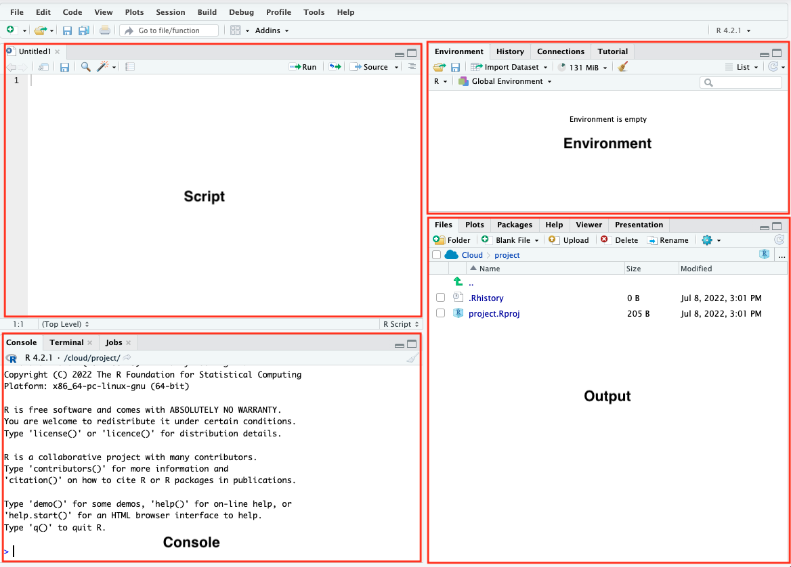
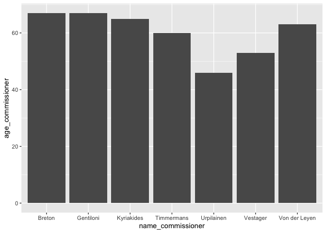
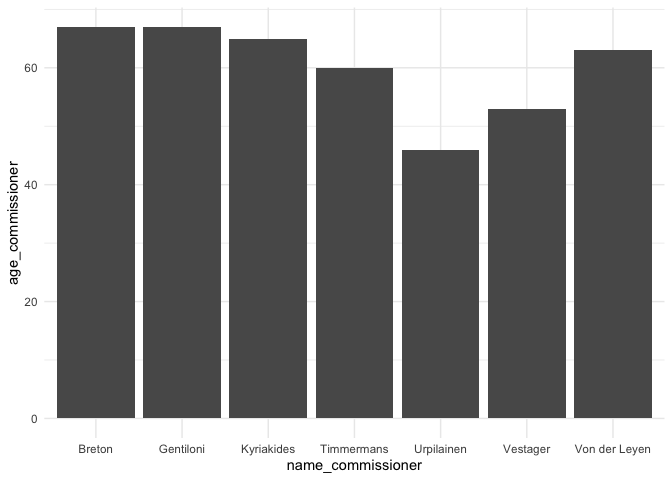

## Introduction

In order to analyze text, we will use the `R` statistical language, a
versatile tool for doing all sorts of analyses, whether it is
statistical analysis, text analysis, or otherwise. Today we will
practice using `R`. For this we’ll use RStudio Cloud, a programme that
makes it much easier to work in `R`using just a browser.

First, have a look at the image below It shows the interface of a
typical RStudio session. When typing in commands in R, you will use the
`Console` panel. The `Script` panel can contain files with pre-written
lines of code (for example in an R Markdown file), which you can
copy-paste into the `Console`. The `Environment` panel displays objects
that you created during your R session. The `output` panel displays
function outputs such as figures.

<figure>

<figcaption aria-hidden="true">Graphical interface in
RStudio</figcaption>
</figure>

R can serve many different purposes. For instance, we can use R as a
calculator. Give it a try by typing the following commands in the
`Console`. **NB**: in these documents, you have to type in the commands
appearing the grey blocks (so called `code snippets`). What comes after
the two pound signs (##) on the following line is the output that `R`
produces after you press enter.

``` r
#addition
2+2
```

    ## [1] 4

``` r
#exponentiation
3**2 
```

    ## [1] 9

``` r
#subtraction
4-5
```

    ## [1] -1

See, for example,
[here](http://mercury.webster.edu/aleshunas/R_learning_infrastructure/Using%20R%20as%20a%20calculator.html)
for more on `R` as a calculator.

You can also do conduct more advanced operations, such as taking the
average of two numbers, or finding the `median` of three numbers. For
this we use the `mean()` function, and the `median()` function
respectively. R contains a lot of functions like this.

**NB** Functions in `R` are denoted with round brackets. What’s in
between the round brackets is the argument that the function is being
applied to.

We can also create a so-called `vector` of numbers using the `c()`
function (which stands for concatenate). A vector is just a row of
observations. For example, `c(2,4)` is just a vector of numbers 2 and 4.
`c("A", "B", "F")` is a vector of three capitalized letters.
`c("John", "Paul", "George", "Ringo")` is a vector with the first names
of the Beatles.

``` r
#take the mean of 2 and 4
mean(c(2,4))
```

    ## [1] 3

``` r
#take the median (the middle value) of 2, 4 and 100
median(c(2, 4, 100))
```

    ## [1] 4

We can create objects in `R` using the assign operator (`<-`). For
example, let’s create an object `x` which in fact is a vector of numbers
2, 3 and 4:

``` r
x <- c(2,3,10)
```

This is useful, because we can now take the mean of `x`:

``` r
mean(x)
```

    ## [1] 5

Check the `Environment` pane. It now contains the object `x` and you can
use it for all kinds of operations.

We can also create an object called Beatles with the first names of the
Beatles members.

``` r
beatles <- c("John", "Paul", "George", "Ringo")
```

What happens if we take the mean of the beatles object?

``` r
mean(beatles)
```

    ## [1] NA

The output is `NA`, which is `R` speak for a missing value, which makes
sense, because taking the mean requires numerical input. The mean of a
set of names does not exist.

**Question**: Write some code to find the mean of the numbers 4, 5, 6
and 7 and call it y. The calculate x + y. What is the output you get?
Why is this?

``` r
#your answer here
```

## Libraries

So far you have used some functions that are built-in to `R`. However, a
lot of the functionality of `R` comes from using so-called `libraries`
(aka `packages`). These libraries are sets of functions and objects to
do particular analyses in `R`. They are in continuous development by
active users of `R` who use the language to do particular types of
analyses. By using these libraries you can build on their work. NB: it’s
good practice to cite a package you have used for your data analysis. If
you don’t know how to cite a package, just type citation(package =
“here”) in the console, replacing “here” with the package you have used.

Today we will use 3 packages: `quanteda`, `ggplot2` and `stringr`. These
packages will allow us to do various cool things in `R`

For example `quanteda` is a library that contains functions related to
quantitative text analysis. In order to use the functions in these
libraries, you will need to 1) install them, using the
`install.packages()` function, and 2) load them using the `library()`
function.

However, I have installed these libraries already in the current Rstudio
project, so all you need to do is to load them from memory using the
`library()` function

``` r
library(quanteda)
library(stringr)
library(ggplot2)
```

## Text as strings

So what this have to do with quantitative text analysis?

Well, text can be read into `R` as a character object or character
vector, which we can examine using various functions available to us in
the various libraries.

But before we get to that, let’s keep things simple first. Let’s say we
have a `vector` with European Commissioners (this example follows
Chapter 2 of [*Quantative Politics in R*](http://qpolr.com/basics.html).
Let’s call this string commissioners.

``` r
commissioners <- c("Von der Leyen", 
                   "Timmermans", 
                   "Vestager", 
                   "Gentiloni", 
                   "Breton", 
                   "Kyriakides", 
                   "Urpilainen") 
```

To access individual Commissioners in this `commissioners` vector, we
can use the square brackets. For example, if we type in
`commissioners[1]`, `R` will return the content of first element of
`commissioners`, if we type in `comissioners[5],`R\` will return the 5th
element of commissioners. Just try it out.

``` r
commissioners[1]
```

    ## [1] "Von der Leyen"

``` r
commissioners[5]
```

    ## [1] "Breton"

Data in `R` can be of different `types` (`numeric`, `logical`,
`character`, and `factor`). For example, a vector of numbers is an
object of type `numeric`, and a vector of words like commissioners is of
type `character` (it is a so-called character string), and we can also
have logical vectors in which element is either `TRUE` or `FALSE`.

Depending on the type of object you are dealing with, you can do
different things in R. For example, if you want to multiply elements in
a character string `R` will throw you an error, simply because, say, Von
der Leyen times Timmermans is a meaningless statement, whereas 2^3 (see
above) is 8. We can check the type of an object using the class()
function:

``` r
class(commissioners)
```

    ## [1] "character"

When data is of type character (which text data like media content
always is), we can use the `stringr()` library for some useful
functions. For example, in case we want to have the party names in all
caps, we can use the `str_to_upper()` function from the `stringr`
library

``` r
str_to_upper(commissioners)
```

    ## [1] "VON DER LEYEN" "TIMMERMANS"    "VESTAGER"      "GENTILONI"     "BRETON"        "KYRIAKIDES"    "URPILAINEN"

**Question**: how would you create a vector with all string characters
lower cased? If you don’t know, google `stringr` and `lowercasing`.
Figure out want function you would need to use.

``` r
str_to_lower(commissioners)
```

    ## [1] "von der leyen" "timmermans"    "vestager"      "gentiloni"     "breton"        "kyriakides"    "urpilainen"

We can also count the length of the vector elements:

``` r
str_count(commissioners)
```

    ## [1] 13 10  8  9  6 10 10

**Question**: Von der Leyen has 11 letters but the `str_count` function
returns 13. Why is that?

We order the elements of a string vector using the `str_sort()`:

``` r
str_sort(commissioners, decreasing = TRUE)
```

    ## [1] "Von der Leyen" "Vestager"      "Urpilainen"    "Timmermans"    "Kyriakides"    "Gentiloni"     "Breton"

``` r
str_sort(commissioners, decreasing = FALSE)
```

    ## [1] "Breton"        "Gentiloni"     "Kyriakides"    "Timmermans"    "Urpilainen"    "Vestager"      "Von der Leyen"

We can also detect the presence or absence of a pattern in a string.
This returns a logical vector for which elements are TRUE when a pattern
is detected, and false when a pattern is not detected. For example, we
can ask `R` which commissioners have an `a` in them:

``` r
str_detect(commissioners, "a")
```

    ## [1] FALSE  TRUE  TRUE FALSE FALSE  TRUE  TRUE

**Question**: Write some code to detect whether the sequence `mm` occurs
in any of the commissioner names

``` r
str_detect(commissioners, "mm")
```

    ## [1] FALSE  TRUE FALSE FALSE FALSE FALSE FALSE

**Bonus question**: Use the `str_replace()` function to replace the
sequence `mm` with `xx`. The syntax of this function is slightly
different from these earlier functions. Use Google to try and figure out
how it works.

``` r
str_replace(commissioners, "mm", "xx")
```

    ## [1] "Von der Leyen" "Tixxermans"    "Vestager"      "Gentiloni"     "Breton"        "Kyriakides"    "Urpilainen"

## Dataframes

A different object in `R` is a so called dataframe. A dataframe contains
multiple vectors which together construct a set variables for cases (a
dataset) The nice thing about a `dataframe` is that these vectors can
contain values of different types (character, numeric, logical, factor).
This is different from other objects, such as a `matrix` which can only
contain one particular object type.

In order to create a dataframe we can use the \`data.frame()’ function.

Let’s the age of these commissioners. We’ll put this data in a numerical
variable called polls

``` r
age <- c(63, 60, 53, 67, 67, 65, 46)
```

We can now use the data.frame() to create a dataframe, which we’ll call
data. This dataframe has two variables: the name of the commissioner and
their age.

``` r
data <- data.frame(name_commissioner = commissioners, 
                   age_commissioner = age)
print(data)
```

    ##   name_commissioner age_commissioner
    ## 1     Von der Leyen               63
    ## 2        Timmermans               60
    ## 3          Vestager               53
    ## 4         Gentiloni               67
    ## 5            Breton               67
    ## 6        Kyriakides               65
    ## 7        Urpilainen               46

Now that we have the data in this format, we can plot it. We’ll use the
`ggplot2()` library to create a plot. Since we loaded it in memory
before we can use its functions. Let’s create a bar plot using the
`geom_bar()` function from ggplot.

NB: No worries if you don’t yet understand this syntax – this is a
practice exercise

``` r
plot <- ggplot(data = data, 
               aes(x = name_commissioner, y = age_commissioner)) +
  geom_bar(stat= "identity")

print(plot)
```



Let’s make this plot a bit nicer by adding a theme

``` r
plot <- ggplot(data = data, aes(x = name_commissioner, 
                                y = age_commissioner)) +
  geom_bar(stat= "identity") +
  theme_minimal() 
print(plot)
```



**Question** How would you make this plot nicer? What aspects would you
change?

## Practice excercises

1)  Create a character vector of countries (in the same order as
    `commissioners`) and call this vector `countries`. Append this
    variable to the `data` object as a new variable

``` r
countries <- c("Germany", "Netherlands", "Denmark", "Italy", "France", "Greece", "Finland")
  
data <- cbind(data, countries)

head(data)
```

    ##   name_commissioner age_commissioner   countries
    ## 1     Von der Leyen               63     Germany
    ## 2        Timmermans               60 Netherlands
    ## 3          Vestager               53     Denmark
    ## 4         Gentiloni               67       Italy
    ## 5            Breton               67      France
    ## 6        Kyriakides               65      Greece

2)  Look up some data on these countries that you find interesting.
    Perhaps their GDP per capita or something else. Plot this
    information using the ggplot code above.

``` r
#your answer here
```
