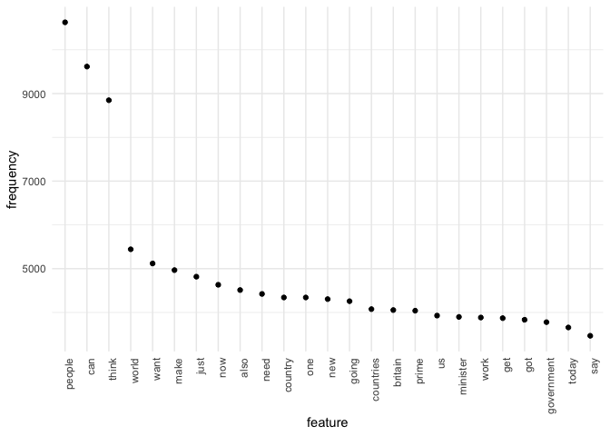
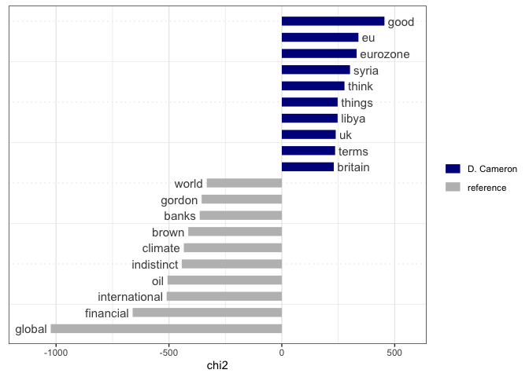

QTA Day 3: Reading in text data. Inspecting a dfm.
================

In this document we will go through the steps of going from raw texts to
a document term matrix that can be analyzed.

## Load libraries

``` r
library(quanteda)
library(stringr)
library(quanteda.textstats)
library(quanteda.textplots)
library(tidyverse)
```

## Reading in data

Let’s take a look a set of UK prime minister speeches from the
[EUSpeech](https://dataverse.harvard.edu/dataverse/euspeech) dataset.

Read in the speeches as follows using the `read.csv()` function from
base `R`:

``` r
speeches <- read.csv(file = "speeches_uk.csv", 
                     header = TRUE, 
                     stringsAsFactors = FALSE, 
                     sep = ",", 
                     encoding = "UTF-8")
```

This `read.csv()` call tells `R` that:

- the file is called “speeches_uk.csv”
- the first row contains the column names
- the columns are separated by commas
- the encoding is UTF-8
- we don’t want to turn strings into factors, which is a different data
  type in `R` that is not useful for text analysis

Let’s take a look at the structure of this dataset:

``` r
str(speeches)
```

    ## 'data.frame':    787 obs. of  6 variables:
    ##  $ id     : int  1 2 3 4 5 6 7 8 9 10 ...
    ##  $ text   : chr  "<p>This European Council has focused on 3 issues – the UK renegotiation, migration and terrorism.</p><p>I talke"| __truncated__ "<p>Thank you Prime Minister for welcoming me here to Warsaw.</p><p>It is an honour to be the first leader to ma"| __truncated__ "<p>Thank you President Iohannis for welcoming me to Bucharest today. It’s a pleasure to be here and to have had"| __truncated__ "<p>This is a government that delivers</p><p>Thank you very much for that brief introduction. It’s great to be h"| __truncated__ ...
    ##  $ title  : chr  "EU Council: PM press conference" "PM statement in Poland: 10 December 2015" "PM statement on talks in Romania, 9 December 2015" "PM Speech: This is a government that delivers" ...
    ##  $ date   : chr  "18-12-2015" "10-12-2015" "09-12-2015" "07-12-2015" ...
    ##  $ country: chr  "Great Britain" "Great Britain" "Great Britain" "Great Britain" ...
    ##  $ speaker: chr  "D. Cameron" "D. Cameron" "D. Cameron" "D. Cameron" ...

As you can see, the corpus contains 787 speeches and variables
containing meta data like speaker, country, date, etc. Take a look at a
few speeches. Let’s do some very light cleaning on these speeches, using
the `stringr` library, in particular the `str_replace_all()` we learned
about yesterday.

``` r
#remove html tags

speeches$text <- str_replace_all(speeches$text, "<.*?>", " ")

#replace multiple white spaces with a single white space

speeches$text <- str_squish(speeches$text)
```

Our speeches object is currently a dataframe. To be able to apply
functions in `quanteda` on this object it needs to recognize it as a
corpus object. To do this we can use the `corpus()` function. We point
to the `text` variable in the dataframe that contains the text data
using the `text_field` argument. By default the text_field argument
assumes that the text data is stored in a variable called “text”. If
this is not the case, you need to specify the name of the variable that
contains the text data.

``` r
corpus_speeches <- corpus(speeches, 
                          text_field = "text")

#the ndoc function displays the number of documents in the corpus

ndoc(corpus_speeches)
```

    ## [1] 787

Metadata such as speaker, date, etc. are stored in a corpus object as
docvars, and can be accessed like so (we’ll use the `head()` function to
limit the output):

``` r
#date
head(docvars(corpus_speeches, "date"), 10)
```

    ##  [1] "18-12-2015" "10-12-2015" "09-12-2015" "07-12-2015" "07-12-2015"
    ##  [6] "01-12-2015" "28-11-2015" "23-11-2015" "19-11-2015" "16-11-2015"

``` r
#speaker
head(docvars(corpus_speeches, "speaker"), 10)
```

    ##  [1] "D. Cameron" "D. Cameron" "D. Cameron" "D. Cameron" "D. Cameron"
    ##  [6] "D. Cameron" "D. Cameron" "D. Cameron" "D. Cameron" "D. Cameron"

``` r
#number of speeches per speaker

table(docvars(corpus_speeches, "speaker"))
```

    ## 
    ## D. Cameron   G. Brown   T. Blair 
    ##        493        283         11

Let’s tokenize this corpus. We’ll use the argument `padding=TRUE` to
leave an empty string where the removed tokens previously existed. This
is useful if a positional match is needed between the pre- and
post-selected tokens, for instance if collocations need to be computed.

``` r
tokens_speech <- corpus_speeches %>%
  tokens(what = "word",
         remove_punct = TRUE, 
         padding = TRUE,
         remove_symbols = TRUE, 
         remove_numbers = FALSE,
         remove_url = TRUE,
         remove_separators = TRUE,
         split_hyphens = FALSE) %>%
  tokens_remove(stopwords("en")) 
```

Let’s check the most occurring collocations (this may take a few
seconds). In order to speed things up, we can sample a subset of the
tokens object by using the `tokens_sample()` function.

``` r
collocations <- tokens_speech %>%
  #tokens_sample(size = 10, replace = FALSE) %>%
  textstat_collocations(min_count = 10) %>%
  arrange(-lambda)

head(collocations, 10)
```

    ##         collocation count count_nested length   lambda         z
    ## 4233     anita rani    56            0      2 18.35487 11.202897
    ## 5055      sinn fein    13            0      2 18.02196  8.928687
    ## 5073    magna carta    12            0      2 17.94500  8.884100
    ## 5091 PRIME MINISTER    11            0      2 17.86162  8.835291
    ## 5110 CHECK DELIVERY    10            0      2 17.77065  8.781400
    ## 4412   sierra leone    25            0      2 17.55933 10.674645
    ## 4500     konnie huq    18            0      2 17.23843 10.450946
    ## 4635      hong kong    11            0      2 16.76301 10.101821
    ## 4657  amy winehouse    10            0      2 16.67204 10.031926
    ## 4323    rolls royce    24            0      2 16.42071 10.915557

We may also focus on proper names only by looking for collocations of
adjacent words that both start with capital letters. We can do this by
using the `tokens_select()` function with the `pattern` argument set to
a regular expression that matches capital letters.

``` r
collocations_names <- tokens_select(tokens_speech, 
                                    pattern = "[A-Z]", 
                                    valuetype = "regex", 
                                    case_insensitive = FALSE, 
                                    padding = TRUE) %>%
  textstat_collocations(min_count = 10,
                        tolower = FALSE)
head(collocations_names, 20)
```

    ##          collocation count count_nested length    lambda         z
    ## 1     Prime Minister  4722            0      2 11.700254 120.58679
    ## 2     European Union   961            0      2  9.083945  84.18653
    ## 3   Northern Ireland   420            0      2 10.701788  73.24571
    ## 4       Gordon Brown   270            0      2 10.415701  67.57215
    ## 5   European Council   219            0      2  5.527418  66.27404
    ## 6    President Obama   251            0      2  7.599443  63.92949
    ## 7   Security Council   186            0      2  8.373149  63.24294
    ## 8         World Bank   132            0      2  7.441485  62.79308
    ## 9      David Cameron   133            0      2  8.286021  61.81150
    ## 10    Health Service   175            0      2 10.135930  61.30426
    ## 11     United States   325            0      2  8.795153  60.11721
    ## 12   National Health   120            0      2  7.979117  60.04263
    ## 13      Bank England   111            0      2  7.685862  58.97230
    ## 14         World War   132            0      2  8.632801  57.57488
    ## 15      South Africa   100            0      2  7.344950  54.27977
    ## 16        Mr Speaker   269            0      2  9.637184  53.79388
    ## 17      Mr President   135            0      2  4.989427  51.45508
    ## 18 Secretary General    85            0      2  7.915188  51.40328
    ## 19       UN Security    73            0      2  7.544899  50.05751
    ## 20   Secretary State    79            0      2  7.943002  49.55369

If we want to add the most occurring collocations to the tokens object,
we can use the `tokens_compound()` function. This function takes a
tokens object and a vector of collocations, and returns a new tokens
object where the collocations are combined into single tokens.

``` r
collocations <- collocations %>%
  filter(lambda > 10) %>%
  pull(collocation) %>%
  phrase()

tokens_speech <- tokens_compound(tokens_speech, collocations)
```

Let’s create a new tokens object, but this time we group it by speaker
by applying `tokens_group(groups = speaker)`. This concatenates the
tokens in the speeches of all 3 speakers. We thus end up with a tokens
object that consists of 3 documents.

``` r
tokens_speech_speaker <- corpus_speeches %>%
  tokens(what = "word",
         remove_punct = TRUE, 
         padding = FALSE,
         remove_symbols = TRUE, 
         remove_numbers = FALSE,
         remove_url = TRUE,
         remove_separators = TRUE,
         split_hyphens = FALSE) %>%
  tokens_remove(stopwords("en")) %>%
  tokens_group(groups = speaker)

ndoc(tokens_speech_speaker)
```

    ## [1] 3

Now let’s construct a dfm from this tokens object.

``` r
speeches_dfm_speaker <- dfm(tokens_speech_speaker)
```

It’s straightforward in **quanteda** to inspect a dfm. For example, the
`topfeatures()` function displays the most occurring features:

``` r
topfeatures(speeches_dfm_speaker, 20)
```

    ##    people       can     think     world       now      want  minister      make 
    ##     10889      9791      8865      5901      5460      5150      5105      5006 
    ##     prime      just   country      it’s      also       one      need   britain 
    ##      4984      4953      4673      4561      4541      4500      4480      4320 
    ##       new     going countries     today 
    ##      4320      4276      4212      4170

You can check the number of features in the dfm using the dim()
function:

``` r
dim(speeches_dfm_speaker)
```

    ## [1]     3 26395

There are over 26,000 features in this dfm. Let’s select those tokens
that appear at least 10 times by using the `dfm_trim()` function

``` r
speeches_dfm_speaker = dfm_trim(speeches_dfm_speaker, min_termfreq = 10)
dim(speeches_dfm_speaker)
```

    ## [1]    3 6938

As you can see, this reduces the size of the dfm considerably. However,
be mindful that applying such arbitrary cutoffs may remove meaningful
features.

*NB:* Because most words don’t occur in most documents, a dfm often
contains many zeroes (sparse). Internally, `quanteda` stores the dfm in
a sparse format, which means that the zeroes are not stored, so you can
create a dfm of many documents and many words without running into
memory problems.

## Visualization in **quanteda**

**quanteda** contains some very useful functions to plot your corpus in
order get a feel for what is going on For example, it is easy to
construct a wordcloud to see which features appear most often in your
corpus.

``` r
textplot_wordcloud(speeches_dfm_speaker, max_words=50)
```

<!-- -->

A slightly more informative frequency plot can be constructed as follows
(using the **ggplot2** library):

``` r
speeches_dfm_features <- textstat_frequency(speeches_dfm_speaker, n = 25)

# Sort by reverse frequency order
speeches_dfm_features$feature <- with(speeches_dfm_features, reorder(feature, -frequency))

ggplot(speeches_dfm_features, aes(x = feature, y = frequency)) +
    geom_point() + theme_minimal() + 
    theme(axis.text.x = element_text(angle = 90, hjust = 1))
```

<!-- -->

*NB* **ggplot2** is a really nice library for making plots and figures.
If you have some time after this course is over, I strongly recommend
Kieran Healy’s [book](https://socviz.co/) on Data Visualization for
learning more about effective data viz. 

Let’s say we are interested in which words are spoken relatively more
often by David Cameron than by Tony Blair and Gordon Brown. For this we
can use `textstat_keyness()` and `textplot_keyness()` functions.

``` r
head(textstat_keyness(speeches_dfm_speaker, target = "D. Cameron"), 10)
```

    ##     feature      chi2 p n_target n_reference
    ## 1      it’s 1393.8768 0     3845         716
    ## 2     we’re  877.6312 0     2339         416
    ## 3     we’ve  688.7697 0     2483         608
    ## 4    that’s  589.8813 0     1811         380
    ## 5       i’m  500.8595 0     1548         327
    ## 6      good  421.5894 0     2035         618
    ## 7   there’s  370.5170 0      935         154
    ## 8  eurozone  340.5584 0      490          11
    ## 9        eu  328.4241 0      810         129
    ## 10   you’re  327.3597 0      826         136

``` r
textplot_keyness(textstat_keyness(speeches_dfm_speaker, target = "D. Cameron"), n = 10)
```

<!-- -->

## Exercises

Display the most occurring three-word-collocations

``` r
collocations_3 <- tokens_speech %>%
  textstat_collocations(size = 3,
                        min_count = 10) %>%
  arrange(-lambda)

head(collocations_3, 10)
```

    ##                      collocation count count_nested length    lambda        z
    ## 54          make poverty history    13            0      3 10.135847 4.789791
    ## 89                free point use    10            0      3  8.466052 4.072751
    ## 116           trade asia morning    11            0      3  8.111782 3.716923
    ## 57                can trade asia    10            0      3  7.998508 4.717630
    ## 117        good friday agreement    14            0      3  7.693211 3.707898
    ## 47                every step way    18            0      3  7.626483 4.938842
    ## 82           points based system    20            0      3  7.403933 4.189878
    ## 93     foreign direct investment    16            0      3  7.313750 3.964987
    ## 96  office budget responsibility    14            0      3  7.259011 3.931831
    ## 133           low pay commission    10            0      3  7.219026 3.471963

Display the most occurring three-word-collocations that are also proper
names

``` r
collocations_names_3 <- tokens_select(tokens_speech, 
                                    pattern = "[A-Z]", 
                                    valuetype = "regex", 
                                    case_insensitive = FALSE, 
                                    padding = TRUE) %>%
  textstat_collocations(min_count = 10,
                        size = 3,
                        tolower = FALSE)
head(collocations_names_3, 10)
```

    ##                      collocation count count_nested length   lambda        z
    ## 1            Royal Bank Scotland    21            0      3 2.375177 2.283830
    ## 2              London South East    10            0      3 3.600874 2.147695
    ## 3           United Arab Emirates    14            0      3 4.582727 1.839229
    ## 4                First World War    47            0      3 3.619868 1.798926
    ## 5          European Central Bank    14            0      3 2.623707 1.712462
    ## 6         European Court Justice    13            0      3 3.517653 1.710239
    ## 7   Prime_Minister David Cameron    38            0      3 1.206099 1.582414
    ## 8  President European Commission    13            0      3 1.960575 1.342544
    ## 9                 IMF World Bank    22            0      3 2.654519 1.316689
    ## 10           UN Security Council    72            0      3 2.121903 1.289961

Apply `kwic()` to `tokens_speech` object and look up “european_union”.
Inspect the context in which the EU is mentioned.

``` r
kwic(tokens_speech, "european_union")
```

    ## Keyword-in-context with 0 matches.

Create a dfm from `tokens_speech` and call it `speeches_dfm`:

``` r
speeches_dfm <- dfm(tokens_speech)
```

Check how many documents and features `speeches_dfm` has.

``` r
dim(speeches_dfm) 
```

    ## [1]   787 26513

Trim `speeches_dfm` so that it only contains words that appear in at
least 20 speeches. Inspect the number of features.

``` r
speeches_dfm <- dfm_trim(speeches_dfm, 
                         min_docfreq = 20)

dim(speeches_dfm)
```

    ## [1]  787 3960

Apply `textstat_keyness` to the `speeches_dfm_speaker` object to display
5 the most distinctive features for Gordon Brown

``` r
head(textstat_keyness(speeches_dfm_speaker, target = "G. Brown"), 5)
```

    ##     feature      chi2 p n_target n_reference
    ## 1    global 1169.8481 0     2001         710
    ## 2 financial  739.1996 0     1129         351
    ## 3     prime  610.3728 0     2925        2059
    ## 4  minister  591.5349 0     2972        2133
    ## 5       oil  570.2759 0      677         143
