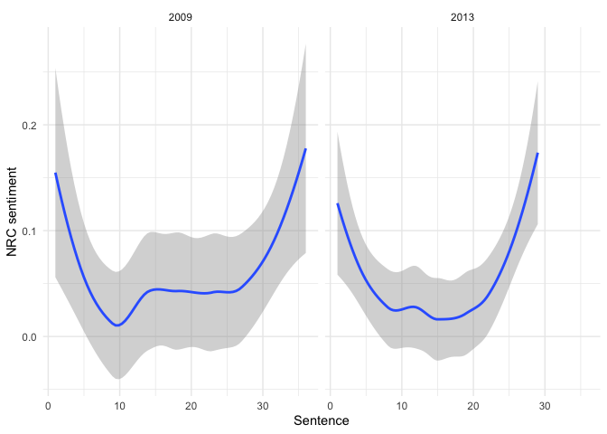
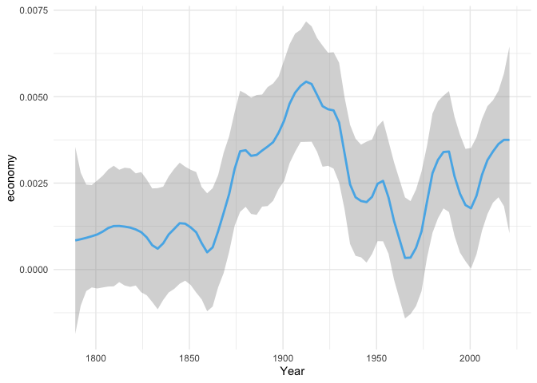

Categorizing text using dictionaries
================
12 July, 2024

This document describes how to use dictionary methods in **quanteda**.
Let’s first load the required libraries. If you haven’t installed
**quanteda.sentiment** yet, you can do so by running
`remotes::install_github("quanteda/quanteda.sentiment")`, since this
package is not yet on CRAN, so you need to install it from the GitHub
page of the developer.

``` r
library(quanteda)
library(stringr)
library(tidyverse)
library(quanteda.sentiment)
```

Let’s save the inaugural speeches as an object `speeches_inaugural` just
like we did in the previous lab session.

``` r
speeches_inaugural <- data_corpus_inaugural
```

We’ll first tokenize this corpus and create a dfm called dfm_inaugural.

``` r
tokens_inuagural <- tokens(speeches_inaugural,
                           what = "word",
                           remove_punct = TRUE, 
                           remove_symbols = TRUE, 
                           remove_numbers = FALSE,
                           remove_url = TRUE,
                           remove_separators = TRUE,
                           split_hyphens = FALSE,
                           padding = FALSE
                       )

dfm_inaugural <- dfm(tokens_inuagural)
```

## Off-the shelf dictionaries

**quanteda.sentiment** contains a number of off-the-shelf sentiment
dictionaries that allow you to assess the sentiment of a text. These
dictionaries are stored as dictionary objects. Let’s take a look at the
Lexicoder Sentiment Dictionary (LSD) from Young and Soroka (2012) and
the NRC Word-Emotion Association Lexicon from Mohammad and Turney
(2013). They are stored in `quanteda.sentiment` as dictionary object
under `data_dictionary_LSD2015` and `data_dictionary_NRC` respectively.

``` r
summary(data_dictionary_LSD2015)
```

    ##              Length Class  Mode     
    ## negative     2858   -none- character
    ## positive     1709   -none- character
    ## neg_positive 1721   -none- character
    ## neg_negative 2860   -none- character

``` r
print(data_dictionary_LSD2015, max_nval = 5)
```

    ## Dictionary object with 4 key entries.
    ## Polarities: pos = "positive", "neg_negative"; neg = "negative", "neg_positive" 
    ## - [negative]:
    ##   - a lie, abandon*, abas*, abattoir*, abdicat* [ ... and 2,853 more ]
    ## - [positive]:
    ##   - ability*, abound*, absolv*, absorbent*, absorption* [ ... and 1,704 more ]
    ## - [neg_positive]:
    ##   - best not, better not, no damag*, no no, not ability* [ ... and 1,716 more ]
    ## - [neg_negative]:
    ##   - not a lie, not abandon*, not abas*, not abattoir*, not abdicat* [ ... and 2,855 more ]

We can use `dfm_lookup` to apply it to our dfm containing inaugural
speeches. This results in a dfm with the same number of rows as the
original dfm, but with the columns containing the number of positive and
negative sentiment words (and their negations)

``` r
dfm_inaugural_LSD <- dfm_lookup(dfm_inaugural, 
                                dictionary = data_dictionary_LSD2015)

head(dfm_inaugural_LSD)
```

    ## Document-feature matrix of: 6 documents, 4 features (50.00% sparse) and 4 docvars.
    ##                  features
    ## docs              negative positive neg_positive neg_negative
    ##   1789-Washington       43      121            0            0
    ##   1793-Washington        3       10            0            0
    ##   1797-Adams            61      238            0            0
    ##   1801-Jefferson        70      177            0            0
    ##   1805-Jefferson        95      164            0            0
    ##   1809-Madison          62      138            0            0

*Question*: The columns that contain negations of positive sentiment and
of negative sentiment contain zeroes. Why is this?

We can calculate the relative fraction of negative sentiment tokens to
positive sentiment tokens in each speech by dividing the number of
sentiment tokens by the total number of tokens in the speech. We can
save this as a variable in the docvars of the dfm object.

``` r
#fraction of negative words
docvars(dfm_inaugural, "neg_words") <- as.numeric(dfm_inaugural_LSD[,1])

#fraction of positive words
docvars(dfm_inaugural, "pos_words") <- as.numeric(dfm_inaugural_LSD[,2])

#sentiment score
docvars(dfm_inaugural, "LSD_sentiment")  <-  (docvars(dfm_inaugural, "pos_words") - docvars(dfm_inaugural, "neg_words"))/ntoken(dfm_inaugural)

docvars(dfm_inaugural, c("President", "LSD_sentiment"))
```

    ##     President LSD_sentiment
    ## 1  Washington   0.054545455
    ## 2  Washington   0.051851852
    ## 3       Adams   0.076358930
    ## 4   Jefferson   0.061993048
    ## 5   Jefferson   0.031855956
    ## 6     Madison   0.064680851
    ## 7     Madison   0.014876033
    ## 8      Monroe   0.063501484
    ## 9      Monroe   0.043400447
    ## 10      Adams   0.048370497
    ## 11    Jackson   0.070035461
    ## 12    Jackson   0.049319728
    ## 13  Van Buren   0.043761396
    ## 14   Harrison   0.033033389
    ## 15       Polk   0.044555486
    ## 16     Taylor   0.098345588
    ## 17     Pierce   0.064506451
    ## 18   Buchanan   0.046033994
    ## 19    Lincoln   0.013483764
    ## 20    Lincoln  -0.008583691
    ## 21      Grant   0.057675244
    ## 22      Grant   0.045590433
    ## 23      Hayes   0.062801932
    ## 24   Garfield   0.036302521
    ## 25  Cleveland   0.073677956
    ## 26   Harrison   0.044915641
    ## 27  Cleveland   0.046176763
    ## 28   McKinley   0.064312736
    ## 29   McKinley   0.048824593
    ## 30  Roosevelt   0.041666667
    ## 31       Taft   0.034076257
    ## 32     Wilson   0.035314891
    ## 33     Wilson   0.045127534
    ## 34    Harding   0.047790803
    ## 35   Coolidge   0.054980276
    ## 36     Hoover   0.051714446
    ## 37  Roosevelt   0.040957447
    ## 38  Roosevelt   0.039269912
    ## 39  Roosevelt   0.041014169
    ## 40  Roosevelt   0.062836625
    ## 41     Truman   0.087147887
    ## 42 Eisenhower   0.067644662
    ## 43 Eisenhower   0.055455093
    ## 44    Kennedy   0.024890190
    ## 45    Johnson   0.020819342
    ## 46      Nixon   0.047551789
    ## 47      Nixon   0.068257492
    ## 48     Carter   0.089869281
    ## 49     Reagan   0.039473684
    ## 50     Reagan   0.053042122
    ## 51       Bush   0.060854553
    ## 52    Clinton   0.030037547
    ## 53    Clinton   0.034770515
    ## 54       Bush   0.054924242
    ## 55       Bush   0.060840174
    ## 56      Obama   0.030962343
    ## 57      Obama   0.043395327
    ## 58      Trump   0.052595156
    ## 59      Biden   0.024873524

Let’s do the same, but this time with the NRC Word-Emotion Association
Lexicon

``` r
dfm_inaugural_NRC <- dfm_lookup(dfm_inaugural, 
                                dictionary = data_dictionary_NRC)

#fraction of negative words (NB: these are stored in the 6th column in the dfm)
docvars(dfm_inaugural, "neg_NRC_words") <- as.numeric(dfm_inaugural_NRC[,6])

#fraction of positive words (NB: these are stored in the 7th column in the dfm)
docvars(dfm_inaugural, "pos_NRC_words") <- as.numeric(dfm_inaugural_NRC[,7])

#sentiment score
docvars(dfm_inaugural, "NRC_sentiment")  <- (docvars(dfm_inaugural, "pos_NRC_words") - docvars(dfm_inaugural, "neg_NRC_words"))/ntoken(dfm_inaugural)

head(docvars(dfm_inaugural, c("President", "NRC_sentiment")))
```

    ##    President NRC_sentiment
    ## 1 Washington    0.05454545
    ## 2 Washington    0.09629630
    ## 3      Adams    0.07031924
    ## 4  Jefferson    0.05735805
    ## 5  Jefferson    0.06094183
    ## 6    Madison    0.06638298

Let’s plot the correlation between the two sentiment measures.

``` r
cor(docvars(dfm_inaugural, "LSD_sentiment"), docvars(dfm_inaugural, "NRC_sentiment"))
```

    ## [1] 0.7606124

``` r
correlation_plot_LSD_NRC <- ggplot(docvars(dfm_inaugural), aes(LSD_sentiment, NRC_sentiment)) + 
  geom_point(pch = 21, fill = "gray25", color = "white", size = 2.5) +
  scale_x_continuous(name = "NRC sentiment") +
  scale_y_continuous(name = "LSD sentiment") +
  theme_minimal()

print(correlation_plot_LSD_NRC)
```

<!-- -->

The correlation of 0.76 is reassuring since both measures should be
capturing the same construct

As a last step we’ll inspect if Presidents make use of narrative arches
in their speeches. For example, they may start a speech more subdued and
end on a more positive note. Or they may start positive and end
positive. Let’s first create a paragraph-based dfm of Obama’s inaugural
speeches

``` r
obama_corpus <- corpus_subset(speeches_inaugural, President == "Obama") %>%
  corpus_reshape(to =  "paragraph")

ndoc(obama_corpus)
```

    ## [1] 65

``` r
obama_tokens <- tokens(obama_corpus,
                           what = "word",
                           remove_punct = TRUE, 
                           remove_symbols = TRUE, 
                           remove_numbers = FALSE,
                           remove_url = TRUE,
                           remove_separators = TRUE,
                           split_hyphens = FALSE,
                           padding = FALSE
                       )

obama_dfm <- dfm(obama_tokens)
```

Let’s apply the NRC dictionary to this dfm object.

``` r
obama_dfm_NRC <- dfm_lookup(obama_dfm, 
                                dictionary = data_dictionary_NRC)

docvars(obama_dfm, "neg_words") <- as.numeric(obama_dfm_NRC[,6])

docvars(obama_dfm, "pos_words") <- as.numeric(obama_dfm_NRC[,7])

#sentiment score
docvars(obama_dfm, "NRC_sentiment")  <-  (docvars(obama_dfm, "pos_words") - docvars(obama_dfm, "neg_words"))/ ntoken(obama_dfm)
```

Let’s plot this information over time

``` r
table(docvars(obama_dfm, "Year"))
```

    ## 
    ## 2009 2013 
    ##   36   29

``` r
#the following code will create a variable sentence in the docvars of obama_dfm that contains a paragraph counter

docvars(obama_dfm, "sentence") <- NA
docvars(obama_dfm, "sentence")[1:36] <- 1:36
docvars(obama_dfm, "sentence")[37:65] <- 1:29

obama_plot <- ggplot(docvars(obama_dfm), aes(sentence, NRC_sentiment)) + 
  geom_smooth() +
  scale_x_continuous(name = "Sentence") +
  scale_y_continuous(name = "NRC sentiment") +
  theme_minimal() + facet_grid(~Year)

print(obama_plot)
```

<!-- -->

## Self made dictionaries

When working with your own dictionary, most of the work will go into
evaluating its validity and reliability in order to make sure that it
captures the construct that you are looking for. However, once you have
settled on a dictionary, it is easy in **quanteda** to apply it to a
corpus.

Let’s say where are interested in how often these presidents refer to
the economy. Let’s create a dictionary object `econ_dict` that contains
words that are related to the economy. A dictionary object is a list
object with the key being the category and the values being the words
that belong to that category, represented as a character vector. The
asterisk is a wildcard that allows you to match words that start with
the same letters.

``` r
#create a dictionary
econ_dict <- dictionary(list(Economy = c("econ*", "job*", "employ*", "industr*", "business*", "market*")))

econ_dict_dfm <- dfm_lookup(dfm_inaugural, 
                            dictionary = econ_dict)

dim(econ_dict_dfm)
```

    ## [1] 59  1

``` r
tail(econ_dict_dfm)
```

    ## Document-feature matrix of: 6 documents, 1 feature (0.00% sparse) and 10 docvars.
    ##             features
    ## docs         Economy
    ##   2001-Bush        2
    ##   2005-Bush        2
    ##   2009-Obama      11
    ##   2013-Obama       9
    ##   2017-Trump       8
    ##   2021-Biden       5

If we want to average the average number of mentions per speaker we can
save these dictionary results as a variable in our corpus object. Let’s
call it `economy`.

``` r
docvars(speeches_inaugural, "economy") <- as.numeric(econ_dict_dfm) / ntoken(dfm_inaugural)
```

Let’s plot the fraction of economy words over time. We’ll add a smooth
line to the plot to make the trend more visible.

``` r
lineplot_economy <- ggplot(docvars(speeches_inaugural),
                                aes(x = Year, y = economy)) +
  geom_smooth(method = "loess",
              span = 0.2,
              color = "#56B4E9") + 
  theme_minimal()


print(lineplot_economy)
```

<!-- -->

## Excercise

Create a dictionary titled `threat_dictionary`, with threat as a key and
threat, peril, risk, danger as values

``` r
#your answer here
```

Apply this dictionary to `dfm_inaugural` and call the resulting object
`dfm_inaugural_threat`. Append the results in the docvars of
`speeches_inaugural` as a variable `threat` containing the fraction of
threat words in each speech

``` r
#your answer here
```

Plot the fraction of threat words over time

``` r
#your answer here
```

Apply the NRC emotion detection lexicon to `dfm_inaugural` and append a
varioble called nrc_fear as metadata to `speeches_inaugural` that
contains the fraction of NRC fear words in each speech.

``` r
#your answer here
```

Plot the fraction of fear words over time

``` r
#your answer here
```

Calculate the correlation between nrc.fear and threat, and produce a
scatterplot

``` r
#your answer here
```

Reflect on these results

``` r
#your answer here
```
