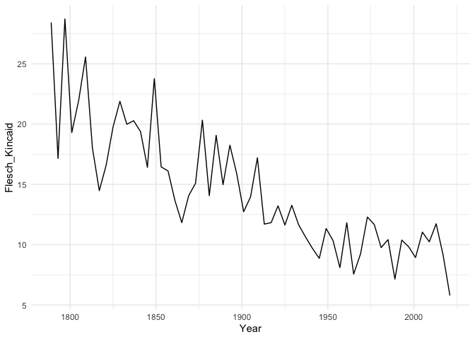
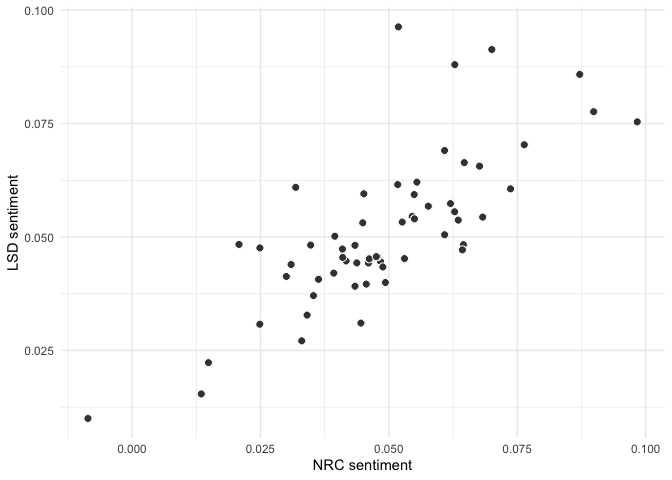
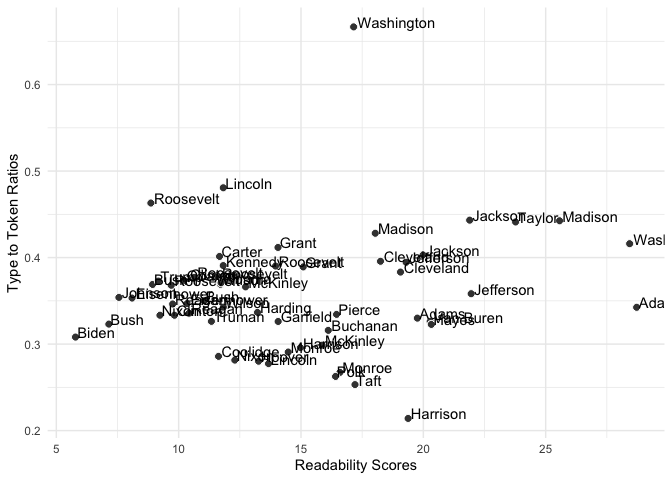
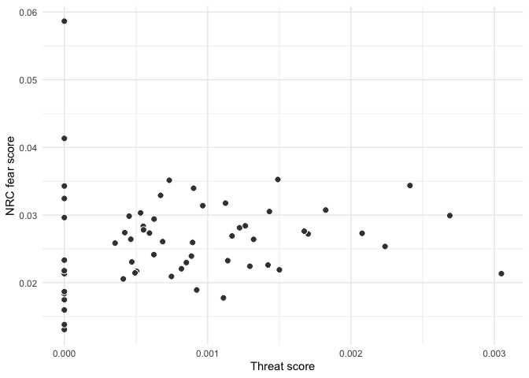
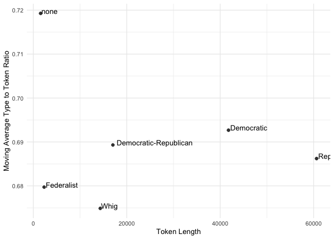
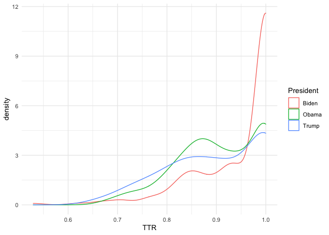

## Reading in data

``` r
#load libraries
library(quanteda)
library(stringr)
library(ggplot2)
library(quanteda.textmodels)
library(quanteda.textstats)
library(tidyverse)


speeches_inaugural <- data_corpus_inaugural
```

## Describing text

Let’s first take a look at language readability, as measured by Flesch
Kincaid. `Quanteda` contains quite a number of readability indices,
which can be called with the `textstat_readability()` function. Since
Flesch Kincaid is a weighted average of word length and sentence length
it requires the corpus to contain interpunction.

``` r
docvars(speeches_inaugural, "Flesch_Kincaid") <- textstat_readability(speeches_inaugural, "Flesch.Kincaid")[,2]
```

Let’s plot readability of inaugural speeches over time:

``` r
#make a time series plot using ggplot
complexity_plot <- ggplot(docvars(speeches_inaugural), 
                          aes(x = Year, 
                              y = Flesch_Kincaid)) +
  geom_line() + theme_minimal()

print(complexity_plot)
```

<!-- -->

*Question*: How would you interpret this plot? Does it make sense to
apply a readability measure to a delivered speech?

We can use the `kwic()` to function to obtain the context in which
certain keywords appear. Let’s take a look at how Presidents talked
about peace:

``` r
tokens_inuagural <- tokens(speeches_inaugural,
                           what = "word",
                           remove_punct = TRUE, 
                           remove_symbols = TRUE, 
                           remove_numbers = FALSE,
                           remove_url = FALSE,
                           remove_separators = TRUE,
                           split_hyphens = FALSE,
                           padding = FALSE
                       )


peace_kwic <- kwic(tokens_inuagural, 'peace')
nrow(peace_kwic)
```

    ## [1] 258

``` r
head(peace_kwic)
```

    ## Keyword-in-context with 6 matches.                                                                                                             
    ##       [1797-Adams, 772]                 in its effects upon the | peace | order prosperity and happiness of  
    ##      [1797-Adams, 1334]          of liberty to independence and | peace | to increasing wealth and unexampled
    ##      [1797-Adams, 1441]         secret enemies of his country's | peace | This example has been recommended  
    ##      [1797-Adams, 1823] an inflexible determination to maintain | peace | and inviolable faith with all      
    ##      [1797-Adams, 2038]             to all nations and maintain | peace | friendship and benevolence with all
    ##  [1801-Jefferson, 1096]    or persuasion religious or political | peace | commerce and honest friendship with

The search for keywords can be generalized using wild card expressions
for pattern matches using `valuetype = "glob`. The search string can
also contain regular expressions. In that case use `valuetype = "regex`.

``` r
peace_kwic <- kwic(tokens_inuagural, 'peace*', valuetype = "glob")
nrow(peace_kwic)
```

    ## [1] 295

``` r
head(peace_kwic)
```

    ## Keyword-in-context with 6 matches.                                                                                                               
    ##      [1797-Adams, 772]                 in its effects upon the |  peace   | order prosperity and happiness of  
    ##     [1797-Adams, 1334]          of liberty to independence and |  peace   | to increasing wealth and unexampled
    ##     [1797-Adams, 1441]         secret enemies of his country's |  peace   | This example has been recommended  
    ##     [1797-Adams, 1823] an inflexible determination to maintain |  peace   | and inviolable faith with all      
    ##     [1797-Adams, 2038]             to all nations and maintain |  peace   | friendship and benevolence with all
    ##  [1801-Jefferson, 519]             reach even this distant and | peaceful | shore that this should be

Using `kwic(tokens_inuagural, 'peace*', valuetype = "glob")`, the number
of hits increases considerably, now including different types of
references to peace.

``` r
table(peace_kwic$keyword)
```

    ## 
    ##        peace        Peace        PEACE peace-loving    peaceable    peaceably     peaceful   peacefully   peacemaker 
    ##          250            7            1            1            1            4           28            2            1

Another measure of textual complexity is the type to token ratio; this
measure relies on the extent to which speeches contain many unique words
(high type to token ratio) or contain a lot of repetition (low type to
token ratio). We can calculate the type to token ratio on a tokens
object of our corpus.

``` r
docvars(speeches_inaugural, "TTR") <- textstat_lexdiv(tokens_inuagural, measure = "TTR")[,2]
```

Let’s plot the type to token ratio over time

``` r
#make a time series plot using ggplot
ttr_plot <- ggplot(docvars(speeches_inaugural), 
                          aes(x = Year, 
                              y = TTR)) +
  geom_line() + theme_minimal()

print(ttr_plot)
```

<!-- -->

``` r
which.min(docvars(speeches_inaugural, "TTR"))
```

    ## [1] 14

``` r
docvars(speeches_inaugural, "President")[14]
```

    ## [1] "Harrison"

``` r
which.max(docvars(speeches_inaugural, "TTR"))
```

    ## [1] 2

``` r
docvars(speeches_inaugural, "President")[2]
```

    ## [1] "Washington"

To what extent do readability and the TTR correlate with each other?

``` r
correlation_plot <- ggplot(docvars(speeches_inaugural), aes(Flesch_Kincaid, TTR)) + 
  geom_point(pch = 21, fill = "gray25", color = "white", size = 2.5) +
  geom_text(label= docvars(speeches_inaugural, "President"), hjust = -0.05, vjust = 0.05) +
  scale_x_continuous(name = "Readability Scores") +
  scale_y_continuous(name = "Type to Token Ratios") +
  theme_minimal()

print(correlation_plot)
```

<!-- -->

Well, not so much.

Let’s turn the corpus into a dfm using the `dfm()` function in
`quanteda`:

``` r
inaugural_speeches_dfm <- dfm(tokens_inuagural)
```

Let’s select those tokens that appear in at least 10 documents

``` r
inaugural_speeches_dfm = dfm_trim(inaugural_speeches_dfm, 
                                 min_docfreq = 10)
inaugural_speeches_dfm
```

    ## Document-feature matrix of: 59 documents, 1,157 features (63.26% sparse) and 5 docvars.
    ##                  features
    ## docs              fellow-citizens  of the and representatives among to life no could
    ##   1789-Washington               1  71 116  48               2     1 48    1  8     3
    ##   1793-Washington               0  11  13   2               0     0  5    0  0     0
    ##   1797-Adams                    3 140 163 130               2     4 72    2  6     1
    ##   1801-Jefferson                2 104 130  81               0     1 61    1  1     0
    ##   1805-Jefferson                0 101 143  93               0     7 83    2  7     2
    ##   1809-Madison                  1  69 104  43               0     0 61    1  2     1
    ## [ reached max_ndoc ... 53 more documents, reached max_nfeat ... 1,147 more features ]

The `textstat_simil()` function lets you calculate the cosine similarity
between individual speeches.

``` r
cosine <- textstat_simil(inaugural_speeches_dfm, 
                         margin = "documents" , 
                         method = "cosine")
```

You can also use vector correlations as a similarity measure:

``` r
correlation <- textstat_simil(inaugural_speeches_dfm, 
                              margin = "documents" , 
                              method = "correlation")
```

Let’s find the speeches most similar to the first speech using cosine
similarity

``` r
doc_similarity_cosine <- textstat_simil(inaugural_speeches_dfm, 
                                        inaugural_speeches_dfm["2017-Trump", ],                        
                                        margin = "documents", 
                                        method = "cosine")

doc_similarity_cosine <- as.data.frame(as.matrix(doc_similarity_cosine)) %>%
  rename(cosine = '2017-Trump') %>%
  arrange(-cosine)

head(doc_similarity_cosine)
```

    ##                 cosine
    ## 2017-Trump   1.0000000
    ## 2009-Obama   0.9200393
    ## 1993-Clinton 0.9124736
    ## 2013-Obama   0.9121256
    ## 1985-Reagan  0.9093425
    ## 1981-Reagan  0.9091284

Let’s find the speeches most similar to the first speech using
correlation

``` r
doc_similarity_correlation <- textstat_simil(inaugural_speeches_dfm, 
                                        inaugural_speeches_dfm["2017-Trump", ],                        
                                        margin = "documents", 
                                        method = "correlation")

doc_similarity_correlation <- as.data.frame(as.matrix(doc_similarity_correlation)) %>%
  rename(correlation = '2017-Trump') %>%
  arrange(-correlation)

head(doc_similarity_correlation)
```

    ##              correlation
    ## 2017-Trump     1.0000000
    ## 2009-Obama     0.9159996
    ## 1993-Clinton   0.9079885
    ## 2013-Obama     0.9076743
    ## 1985-Reagan    0.9046160
    ## 1981-Reagan    0.9043757

``` r
tail(doc_similarity_correlation)
```

    ##                 correlation
    ## 1869-Grant        0.7584016
    ## 1809-Madison      0.7577131
    ## 1865-Lincoln      0.7436412
    ## 1841-Harrison     0.7436193
    ## 1789-Washington   0.7357178
    ## 1793-Washington   0.5949739

For more similarity or distance measures check the `textstat_simil` and
`textstat_dist` reference manual by typing `?textstat_simil` or
`?textstat_dist` in your console.

## Exercises

Create a new tokens object, using `tokens_inaugural` as a starting point
but grouped by Party, and call it `tokens_inaugural_party`

``` r
tokens_inuagural_party <- tokens_inuagural %>%
  tokens_group(groups = Party)

ndoc(tokens_inuagural_party)
```

    ## [1] 6

Calculate the TTR for each party and save it as a variable in the
docvars called `TTR` (keeping in mind that `textstat_lexdiv()` returns a
dataframe of two variables of which you only need one)

``` r
docvars(tokens_inuagural_party, "TTR") <- textstat_lexdiv(tokens_inuagural_party, 
                                                          measure = "TTR")[,2]
```

The TTR is quite different across parties. Why do you think this might
be the case?

``` r
#your answer here
```

Use the `ntoken()` function to display the number of tokens for each
Party, and save it as a variable in the docvars titled `ntoken()`

``` r
ntoken(tokens_inuagural_party)
```

    ##            Democratic Democratic-Republican            Federalist                  none            Republican                  Whig 
    ##                 41776                 17032                  2318                  1565                 60626                 14337

``` r
docvars(tokens_inuagural_party, "ntoken") <- ntoken(tokens_inuagural_party)
```

Produce a correlation plot with the `TTR` variable on the Y-axis and the
`ntoken` variable on the x-axis

``` r
correlation_plot <- ggplot(docvars(tokens_inuagural_party), aes(ntoken, TTR)) + 
  geom_point(pch = 21, fill = "gray25", color = "white", size = 2.5) +
  geom_text(label= docvars(tokens_inuagural_party, "Party"), hjust = -0.05, vjust = 0.05) +
  scale_x_continuous(name = "Token Length") +
  scale_y_continuous(name = "Type to Token Ratios") +
  theme_minimal()

print(correlation_plot)
```

<!-- -->

Calculate the moving-average-type-to-token-ratio to token ratio for all
parties and store it as a variable titled `MATTR` (check
`?textstat_lexdiv` for the precise function call to obtain this measure)

``` r
docvars(tokens_inuagural_party, "MATTR") <- textstat_lexdiv(tokens_inuagural_party, 
                                                          measure = "MATTR")[,2]
```

Produce a correlation plot with the `MATTR` variable on the Y-axis and
the `ntoken` variable on the x-axis

``` r
correlation_plot <- ggplot(docvars(tokens_inuagural_party), aes(ntoken, MATTR)) + 
  geom_point(pch = 21, fill = "gray25", color = "white", size = 2.5) +
  geom_text(label= docvars(tokens_inuagural_party, "Party"), hjust = -0.05, vjust = 0.05) +
  scale_x_continuous(name = "Token Length") +
  scale_y_continuous(name = "Moving Average Type to Token Ratio") +
  theme_minimal()

print(correlation_plot)
```

<!-- -->

## Advanced

Try out to the following.

1)  Construct a corpus that consists of the inaugural speeches of Obama
    (2), Trump and Biden.
2)  Use `corpus_reshape` to then break down the corpus on a sentence to
    sentence basis
3)  Calculate the TTR for each sentence in the corpus
4)  Visualise the distribution of the TTR for each speaker.

``` r
#create corpus
speeches_inaugural_OBT <- corpus_subset(speeches_inaugural, President %in% c("Obama", "Biden", "Trump"))

#sentence corpus
speeches_inaugural_OBT <- corpus_reshape(speeches_inaugural_OBT, to = "sentences")


#create dfm
dfm_speeches_inaugural_OBT <- dfm(speeches_inaugural_OBT)


#calculate type to token ratios for each sentence
TTR <- textstat_lexdiv(dfm_speeches_inaugural_OBT, "TTR")

#append ttr to docvars
docvars(dfm_speeches_inaugural_OBT, "TTR") <- TTR[,2] 


#plot density
plot <- ggplot(docvars(dfm_speeches_inaugural_OBT), aes(x = TTR, col = President)) + 
  geom_density() + theme_minimal()

print(plot)
```

<!-- -->
