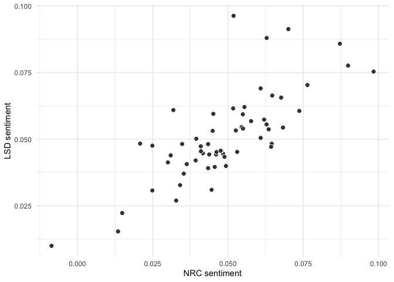
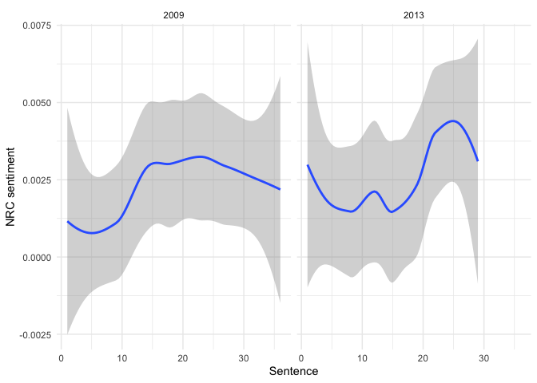
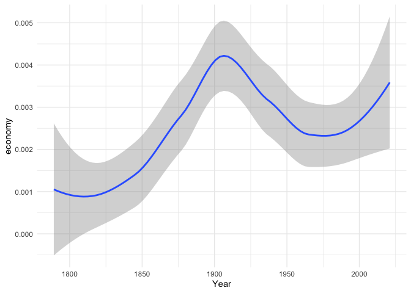

Categorizing text using dictionaries
================
14 July, 2023

This document describes how to use dictionary methods in **quanteda**.
Let’s first load the required libraries.

``` r
library(quanteda)
library(stringr)
library(tidyverse)
library(quanteda.sentiment)
```

Let’s save the inaugural speeches as an object `speeches_inaugural`

``` r
speeches_inaugural <- data_corpus_inaugural
```

We’ll first tokenize this corpus and create a dfm

``` r
tokens_inuagural <- tokens(speeches_inaugural,
                           what = "word",
                           remove_punct = TRUE, 
                           remove_symbols = TRUE, 
                           remove_numbers = FALSE,
                           remove_url = TRUE,
                           remove_separators = TRUE,
                           split_hyphens = FALSE,
                           padding = FALSE
                       )

dfm_inaugural <- dfm(tokens_inuagural)
```

## Off-the shelf dictionaries

**quanteda.sentiment** contains a number of off-the-shelf sentiment
dictionaries. Let’s take a look at the Lexicoder Sentiment Dictionary
from Young and Soroka (2012). It’s stored in `quanteda.textmodels` as a
dictionary object under `data_dictionary_LSD2015`.

``` r
summary(data_dictionary_LSD2015)
```

    ##              Length Class  Mode     
    ## negative     2858   -none- character
    ## positive     1709   -none- character
    ## neg_positive 1721   -none- character
    ## neg_negative 2860   -none- character

``` r
print(data_dictionary_LSD2015, max_nval = 5)
```

    ## Dictionary object with 4 key entries.
    ## Polarities: pos = "positive", "neg_negative"; neg = "negative", "neg_positive" 
    ## - [negative]:
    ##   - a lie, abandon*, abas*, abattoir*, abdicat* [ ... and 2,853 more ]
    ## - [positive]:
    ##   - ability*, abound*, absolv*, absorbent*, absorption* [ ... and 1,704 more ]
    ## - [neg_positive]:
    ##   - best not, better not, no damag*, no no, not ability* [ ... and 1,716 more ]
    ## - [neg_negative]:
    ##   - not a lie, not abandon*, not abas*, not abattoir*, not abdicat* [ ... and 2,855 more ]

We can use `dfm_lookup` to apply it to the inaugural speeches:

``` r
dfm_inaugural_LSD <- dfm_lookup(dfm_inaugural, 
                                dictionary = data_dictionary_LSD2015)

head(dfm_inaugural_LSD)
```

    ## Document-feature matrix of: 6 documents, 4 features (50.00% sparse) and 4 docvars.
    ##                  features
    ## docs              negative positive neg_positive neg_negative
    ##   1789-Washington       43      121            0            0
    ##   1793-Washington        3       10            0            0
    ##   1797-Adams            61      238            0            0
    ##   1801-Jefferson        70      177            0            0
    ##   1805-Jefferson        95      164            0            0
    ##   1809-Madison          62      138            0            0

*Question*: The columns that contain negations of positive sentiment and
of negative sentiment contain zeroes. Why is this?

We can calculate the relative fraction of negative sentiment tokens to
positive sentiment tokens in each speech as follows:

``` r
#fraction of negative words
docvars(dfm_inaugural, "neg_words") <- as.numeric(dfm_inaugural_LSD[,1])

#fraction of positive words
docvars(dfm_inaugural, "pos_words") <- as.numeric(dfm_inaugural_LSD[,2])

#sentiment score
docvars(dfm_inaugural, "LSD_sentiment")  <-  (docvars(dfm_inaugural, "pos_words") - docvars(dfm_inaugural, "neg_words"))/ntoken(dfm_inaugural)

docvars(dfm_inaugural, c("President", "LSD_sentiment"))
```

    ##     President LSD_sentiment
    ## 1  Washington   0.054545455
    ## 2  Washington   0.051851852
    ## 3       Adams   0.076358930
    ## 4   Jefferson   0.061993048
    ## 5   Jefferson   0.031855956
    ## 6     Madison   0.064680851
    ## 7     Madison   0.014876033
    ## 8      Monroe   0.063501484
    ## 9      Monroe   0.043400447
    ## 10      Adams   0.048370497
    ## 11    Jackson   0.070035461
    ## 12    Jackson   0.049319728
    ## 13  Van Buren   0.043761396
    ## 14   Harrison   0.032796590
    ## 15       Polk   0.044555486
    ## 16     Taylor   0.098345588
    ## 17     Pierce   0.064506451
    ## 18   Buchanan   0.046033994
    ## 19    Lincoln   0.013483764
    ## 20    Lincoln  -0.008583691
    ## 21      Grant   0.057675244
    ## 22      Grant   0.045590433
    ## 23      Hayes   0.062801932
    ## 24   Garfield   0.036302521
    ## 25  Cleveland   0.073677956
    ## 26   Harrison   0.044915641
    ## 27  Cleveland   0.046176763
    ## 28   McKinley   0.064312736
    ## 29   McKinley   0.048824593
    ## 30  Roosevelt   0.041666667
    ## 31       Taft   0.034076257
    ## 32     Wilson   0.035314891
    ## 33     Wilson   0.045127534
    ## 34    Harding   0.047790803
    ## 35   Coolidge   0.054980276
    ## 36     Hoover   0.051714446
    ## 37  Roosevelt   0.040957447
    ## 38  Roosevelt   0.039269912
    ## 39  Roosevelt   0.041014169
    ## 40  Roosevelt   0.062836625
    ## 41     Truman   0.087147887
    ## 42 Eisenhower   0.067644662
    ## 43 Eisenhower   0.055455093
    ## 44    Kennedy   0.024890190
    ## 45    Johnson   0.020819342
    ## 46      Nixon   0.047551789
    ## 47      Nixon   0.068257492
    ## 48     Carter   0.089869281
    ## 49     Reagan   0.039473684
    ## 50     Reagan   0.053042122
    ## 51       Bush   0.060854553
    ## 52    Clinton   0.030037547
    ## 53    Clinton   0.034770515
    ## 54       Bush   0.054924242
    ## 55       Bush   0.060840174
    ## 56      Obama   0.030962343
    ## 57      Obama   0.043395327
    ## 58      Trump   0.052595156
    ## 59      Biden   0.024873524

Let’s do the same, but this time with the NRC Word-Emotion Association
Lexicon

``` r
dfm_inaugural_NRC <- dfm_lookup(dfm_inaugural, 
                                dictionary = data_dictionary_NRC)


#fraction of negative words (NB: located in the 6th column in the dfm)
docvars(dfm_inaugural, "neg_NRC_words") <- as.numeric(dfm_inaugural_NRC[,6])

#fraction of positive words (NB: located in the 7th column in the dfm)
docvars(dfm_inaugural, "pos_NRC_words") <- as.numeric(dfm_inaugural_NRC[,7])

#sentiment score
docvars(dfm_inaugural, "NRC_sentiment")  <- (docvars(dfm_inaugural, "pos_NRC_words") - docvars(dfm_inaugural, "neg_NRC_words"))/ntoken(dfm_inaugural)

head(docvars(dfm_inaugural, c("President", "NRC_sentiment")))
```

    ##    President NRC_sentiment
    ## 1 Washington    0.05454545
    ## 2 Washington    0.09629630
    ## 3      Adams    0.07031924
    ## 4  Jefferson    0.05735805
    ## 5  Jefferson    0.06094183
    ## 6    Madison    0.06638298

Let’s plot the correlation

``` r
cor(docvars(dfm_inaugural, "LSD_sentiment"), docvars(dfm_inaugural, "NRC_sentiment"))
```

    ## [1] 0.7607552

``` r
correlation_plot_LSD_NRC <- ggplot(docvars(dfm_inaugural), aes(LSD_sentiment, NRC_sentiment)) + 
  geom_point(pch = 21, fill = "gray25", color = "white", size = 2.5) +
  scale_x_continuous(name = "NRC sentiment") +
  scale_y_continuous(name = "LSD sentiment") +
  theme_minimal()

print(correlation_plot_LSD_NRC)
```

<!-- -->

The correlation of 0.76 is pretty good since both measures intend to
capture the same construct

As a last step we’ll inspect if Presidents make use of narrative arches
in their speeches. For example, they may start a speech more subdued and
end on a more positive note. Or they may start positive and end
positive. Let’s first create a paragraph-based dfm of Obama’s inaugural
speeches

``` r
obama_corpus <- corpus_subset(speeches_inaugural, President == "Obama") %>%
  corpus_reshape(to =  "paragraph")

ndoc(obama_corpus)
```

    ## [1] 65

``` r
obama_tokens <- tokens(obama_corpus,
                           what = "word",
                           remove_punct = TRUE, 
                           remove_symbols = TRUE, 
                           remove_numbers = FALSE,
                           remove_url = TRUE,
                           remove_separators = TRUE,
                           split_hyphens = FALSE,
                           padding = FALSE
                       )

obama_dfm <- dfm(obama_tokens)
```

Let’s apply the NRC dictionary to this dfm

``` r
obama_dfm_NRC <- dfm_lookup(obama_dfm, 
                                dictionary = data_dictionary_NRC)

docvars(obama_dfm, "neg_words") <- as.numeric(obama_dfm_NRC[,6])

docvars(obama_dfm, "pos_words") <- as.numeric(obama_dfm_NRC[,7])

#sentiment score
docvars(obama_dfm, "NRC_sentiment")  <-  (docvars(obama_dfm, "pos_words") - docvars(obama_dfm, "neg_words"))/nfeat(obama_dfm)
```

Let’s plot this

``` r
table(docvars(obama_dfm, "Year"))
```

    ## 
    ## 2009 2013 
    ##   36   29

``` r
docvars(obama_dfm, "sentence") <- NA
docvars(obama_dfm, "sentence")[1:36] <- 1:36
docvars(obama_dfm, "sentence")[37:65] <- 1:29

obama_plot <- ggplot(docvars(obama_dfm), aes(sentence, NRC_sentiment)) + 
  geom_smooth() +
  scale_x_continuous(name = "Sentence") +
  scale_y_continuous(name = "NRC sentiment") +
  theme_minimal() + facet_grid(~Year)

print(obama_plot)
```

<!-- -->

## Self made dictionaries

When working with your own dictionary, most of the work will go into
evaluating its validity and reliability in order to make sure that it
captures the construct that you are looking for. However, once you have
settled on a dictionary, it is easy in **quanteda** to apply it to a
corpus.

Let’s say where are interested in how often these presidents refer to
the economy

``` r
#create a dictionary
econ_dict <- dictionary(list(Economy = c("econ*", "job*", "employ*", "industr*", "business*", "market*")))

econ_dict_dfm <- dfm_lookup(dfm_inaugural, 
                            dictionary = econ_dict)

dim(econ_dict_dfm)
```

    ## [1] 59  1

``` r
head(econ_dict_dfm)
```

    ## Document-feature matrix of: 6 documents, 1 feature (16.67% sparse) and 10 docvars.
    ##                  features
    ## docs              Economy
    ##   1789-Washington       2
    ##   1793-Washington       0
    ##   1797-Adams            1
    ##   1801-Jefferson        4
    ##   1805-Jefferson        2
    ##   1809-Madison          1

If we want to average the average number of mentions per speaker we can
save these dictionary results as a variable in our corpus object. Let’s
call it `economy`.

``` r
docvars(speeches_inaugural, "economy") <- as.numeric(econ_dict_dfm) / ntoken(dfm_inaugural)


lineplot_economy <- ggplot(docvars(speeches_inaugural),
                                aes(x = Year, y = economy)) +
  geom_smooth() + theme_minimal()


print(lineplot_economy)
```

<!-- -->

## Excercise

Create a dictionary titled `threat_dictionary`, with threat as a key and
threat, peril, risk, danger as values

``` r
#your answer here
```

Apply this dictionary to `dfm_inaugural` and call the resulting object
`dfm_inaugural_threat`. Append the results in the docvars of
`speeches_inaugural` as a variable `threat` containing the fraction of
threat words in each speech

``` r
#your answer here
```

Plot the fraction of threat words over time

``` r
#your answer here
```

Apply the NRC emotion detection lexicon to `dfm_inaugural` and append a
varioble called nrc_fear as metadata to `speeches_inaugural` that
contains the fraction of NRC fear words in each speech.

``` r
#your answer here
```

Plot the fraction of fear words over time

``` r
#your answer here
```

Calculate the correlation between nrc.fear and threat, and produce a
scatterplot

``` r
#your answer here
```

Reflect on these results

``` r
#your answer here
```
