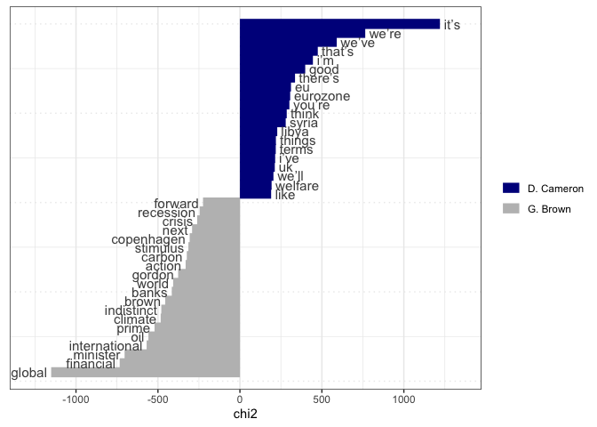

Supervised machine learning
================
15 July, 2024

This document walks you through an example of supervised machine
learning to predict which UK prime minister delivered a speech. For this
we’ll use UK prime minister speeches from the
[EUSpeech](https://dataverse.harvard.edu/dataverse/euspeech) dataset.

For the supervised machine learning exercise you will need to install
the `quanteda.textmodels`, `quanteda.textplots` and the
`quanteda.textstats` libraries. We will also use the `tidyverse` library
to create training and test sets. Furthermore, we will use the `caret`
library to produce a confusion matrix. This library requires some
dependencies (i.e., functions from other libraries), so if you are
working from your computer will need install it like so:
`install.packages('caret', dependencies = TRUE)`.

``` r
#load libraries
library(quanteda)
library(quanteda.textmodels)
library(quanteda.textplots)
library(quanteda.textstats)
library(tidyverse)
library(caret)
```

Let’s read in the speeches using the `read.csv()` function. We’ll also
construct a corpus and select speeches from Gordon Brown and David
Cameron.

``` r
speeches <- read.csv(file = "speeches_uk.csv", 
                     header = TRUE, 
                     stringsAsFactors = FALSE, 
                     sep = ",", 
                     encoding = "UTF-8")

#construct a corpus
corpus_pm <- corpus(speeches)
#select speeches from Cameron and Brown
corpus_brown_cameron <- corpus_subset(corpus_pm, speaker != "T. Blair")
```

In a next step, we’ll turn the date variable in a date format instead of
character format. We can use the `as.Date()` function to convert a
character string to a date. %d-%m-%Y is the format of the date in the
speeches, denoting day-month-year.

``` r
docvars(corpus_brown_cameron, "date") <- as.Date(docvars(corpus_brown_cameron, "date"), "%d-%m-%Y")
```

Let’s tokenise this corpus and create a dfm called dfm_brown_cameron.
We’ll remove punctuation, symbols, numbers, urls, separators, and split
hyphens. We’ll also remove stopwords.

``` r
tokens_brown_cameron <- tokens(corpus_brown_cameron,
                            what = "word",
                            remove_punct = TRUE, 
                            remove_symbols = TRUE, 
                            remove_numbers = TRUE,
                            remove_url = TRUE,
                            remove_separators = TRUE,
                            split_hyphens = FALSE,
                            padding = FALSE
                            ) %>%
  tokens_remove(stopwords("en"))
```

In order to make this dfm less sparse, we will only select features that
appear in at least 2% of speeches

``` r
dfm_brown_cameron <- dfm(tokens_brown_cameron ) %>%
  dfm_trim(min_docfreq = 0.02, docfreq_type = "prop")

dim(dfm_brown_cameron)
```

    ## [1]  776 4411

We now have a dfm containing 776 speeches delivered by either Gordon
Brown or David Cameron and approximately 4400 tokens.

## Naive Bayes

Let’s see if we can build a classifier to predict if a speech is
delivered by Cameron or Brown. First, we’ll generate a vector of 250
random numbers selected from the vector 1:776. We’ll also append an id
variable`id_numeric` to our dfm.

**NB**: The `set.seed()` function makes sure that you can reproduce your
random samples.

``` r
#set.seed() allows us to reproduce randomly generated results 
set.seed(2)

#generate a sample of 250 numbers without replacement from 1 to 776

id_train <- sample(1:nrow(dfm_brown_cameron), 250, replace = FALSE)
head(id_train, 10)
```

    ##  [1] 710 774 416 392 273 349 204 381 297 690

``` r
#create id variable
docvars(dfm_brown_cameron, "id_numeric") <- 1:ndoc(dfm_brown_cameron)

#take note of how many speeches were delivered by either Brown or Cameron
table(docvars(dfm_brown_cameron, "speaker"))
```

    ## 
    ## D. Cameron   G. Brown 
    ##        493        283

We then take a sample of 250 speeches as our training data and turn it
into a dfm. The `%in%` operator produces a logical vector of the same
length as id_numeric, and contains a TRUE if `id_numeric[i]` appears in
id_train and FALSE otherwise.

``` r
# create a training set: a dfm of 250 documents with row numbers included in id_train
train_dfm <- dfm_subset(dfm_brown_cameron, id_numeric %in% id_train)

#create a test set: a dfm of 100 documents whose row numbers are *not* included in id_train by using the negation operator `!`
test_dfm <- dfm_subset(dfm_brown_cameron, !id_numeric %in% id_train)
test_dfm <- dfm_sample(test_dfm, 100, replace = FALSE)

#check whether there is no overlap between the train set and the test set using the which() function
which((docvars(train_dfm, "id_numeric")  %in% docvars(test_dfm, "id_numeric")))
```

    ## integer(0)

We can now train a Naive Bayes classifier on the training set using the
`textmodel_nb()` function. We’ll use the `smooth` argument to apply
Laplace smoothing. This is a technique to avoid zero probabilities in
the model. The `smooth` argument specifies the smoothing parameter,
which is usually set to 1. We’ll also use the `prior` argument to
specify the prior distribution of the classes; “docfreq” denotes the
prior probability of each class is the proportion of documents in the
training set that belong to that class. This is the default setting in
`textmodel_nb()`. The `distribution` argument specifies the distribution
of the features.

``` r
speaker_classifier_nb <- textmodel_nb(train_dfm, 
                                      y = docvars(train_dfm, "speaker"), 
                                      smooth = 1,
                                      prior = "docfreq",
                                      distribution = "multinomial")

summary(speaker_classifier_nb)
```

    ## 
    ## Call:
    ## textmodel_nb.dfm(x = train_dfm, y = docvars(train_dfm, "speaker"), 
    ##     smooth = 1, prior = "docfreq", distribution = "multinomial")
    ## 
    ## Class Priors:
    ## (showing first 2 elements)
    ## D. Cameron   G. Brown 
    ##        0.6        0.4 
    ## 
    ## Estimated Feature Scores:
    ##            european   council   focused   issues        uk migration    talked
    ## D. Cameron 0.002113 0.0010938 0.0002424 0.001032 0.0016345 1.678e-04 0.0002424
    ## G. Brown   0.001811 0.0006657 0.0001598 0.001757 0.0005725 3.329e-05 0.0007256
    ##                last     night     come     back   shortly    first afternoon
    ## D. Cameron 0.002063 0.0003232 0.001902 0.002306 3.729e-05 0.003356 0.0002051
    ## G. Brown   0.002576 0.0002263 0.002576 0.001851 6.657e-05 0.003588 0.0001731
    ##            discussed   ongoing    crisis    facing    winter     still     many
    ## D. Cameron 0.0004599 6.215e-05 0.0004599 0.0001989 4.972e-05 0.0013424 0.002722
    ## G. Brown   0.0004993 4.660e-05 0.0017641 0.0004460 2.663e-05 0.0009986 0.002909
    ##             migrants   coming   europe   around  arriving       via   eastern
    ## D. Cameron 5.593e-05 0.001175 0.001939 0.001429 4.972e-05 1.864e-05 1.243e-04
    ## G. Brown   1.465e-04 0.001212 0.001385 0.001438 1.997e-05 3.329e-05 6.657e-05
    ##            mediterranean     route
    ## D. Cameron     6.215e-05 0.0001367
    ## G. Brown       6.657e-06 0.0001465

Let’s analyze if we can predict whether a speech in the test set is from
Cameron or Brown in our test set. We’ll use the `predict()` function to
predict the class of the test

``` r
#Naive Bayes can only take features that occur both in the training set and the test set. We can make the features identical by passing train_dfm to dfm_match() as a pattern.

matched_dfm <- dfm_match(test_dfm, features = featnames(train_dfm))

#predict speaker 
pred_speaker_classifier_nb <- predict(speaker_classifier_nb, 
                                      newdata = matched_dfm, 
                                      type = "class")

head(pred_speaker_classifier_nb)
```

    ##    text121    text748    text629    text326    text722    text228 
    ## D. Cameron   G. Brown   G. Brown D. Cameron   G. Brown D. Cameron 
    ## Levels: D. Cameron G. Brown

We could also predict the probability the model assigns to each class.
We could use this to create an ROC curve.

``` r
#predict probability of speaker
pred_prob_classifier_nb <- predict(speaker_classifier_nb, 
                                   newdata = matched_dfm, 
                                   type = "probability")
```

Let’s see how well our classifier did by producing a confusion matrix. A
confusion matrix is a table that is often used to describe the
performance of a classification model on a set of test data for which
the true values are known.

``` r
tab_class_nb <- table(predicted_speaker_nb = pred_speaker_classifier_nb, 
                      actual_speaker = docvars(test_dfm, "speaker"))

print(tab_class_nb)
```

    ##                     actual_speaker
    ## predicted_speaker_nb D. Cameron G. Brown
    ##           D. Cameron         54        0
    ##           G. Brown           12       34

So it appears we are somewhat successful at predicting whether a speech
is delivered by Cameron or Brown. Our accuracy is 90%.

Let’s have a look at the most predictive features for Cameron in the
complete corpus.

``` r
dfm_brown_cameron_grouped <- tokens_brown_cameron %>%
  tokens_group(groups = speaker) %>%
  dfm()

keyness <- textstat_keyness(dfm_brown_cameron_grouped, target = "D. Cameron")
textplot_keyness(keyness)
```

<!-- -->

We can also display the most occurring features for Brown and Cameron
but without account for their `keyness`:

``` r
topfeatures(dfm_brown_cameron, groups = speaker, n = 50)
```

    ## $`D. Cameron`
    ##      think     people        can       it’s       want       make       just 
    ##       5761       5754       5176       3631       3279       3185       2978 
    ##       need    country    britain      going        one government        get 
    ##       2806       2795       2766       2675       2657       2510       2448 
    ##      world       also      we’ve       work        now      we’re        new 
    ##       2404       2384       2372       2348       2275       2238       2213 
    ##      today       like      right        say         us       good        got 
    ##       2095       2086       2084       2053       2003       1972       1931 
    ##  countries   minister      first       know    british        see     things 
    ##       1928       1869       1855       1784       1728       1711       1710 
    ##       much      prime       take     that’s       well        way       time 
    ##       1707       1706       1653       1642       1623       1616       1613 
    ##       said  important   european      years       sure        i’m       help 
    ##       1567       1554       1525       1485       1479       1469       1468 
    ##      great 
    ##       1450 
    ## 
    ## $`G. Brown`
    ##        people           can         world      minister         think 
    ##          4687          4430          2983          2894          2823 
    ##         prime           now     countries          also           new 
    ##          2477          2269          2113          2067          2037 
    ##        global            us           got          want          just 
    ##          1999          1862          1838          1770          1765 
    ##          make           one          need          time         going 
    ##          1725          1612          1556          1542          1526 
    ##       economy         today       country          work        future 
    ##          1518          1509          1500          1462          1439 
    ##          know       believe international           get           say 
    ##          1386          1356          1350          1346          1325 
    ##         first       britain    government          help          take 
    ##          1323          1274          1225          1221          1221 
    ##          next      together         years          well          must 
    ##          1219          1204          1201          1193          1174 
    ##          year     financial         every           see          last 
    ##          1137          1127          1123          1103          1074 
    ##          said           way        system       support        change 
    ##          1050          1046          1037          1022          1014

In order to improve on our predictions, we may think of other ways to
represent our documents. A common approach is to produce a
feature-weighted dfm by calculating the term-frequency-inverse document
frequency (tfidf) for each token. The intuition behind this
transformation is that it gives a higher weight to tokens that occur
often in a particular document but not much in other documents,
comppared to tokens that occur often in a particular document but also
in other documents. Tf-idf weighting is done through `dfm_tfidf()`.

``` r
train_dfm_weighted <- dfm_tfidf(train_dfm)
matched_dfm_weighted <- dfm_tfidf(matched_dfm)

speaker_classifier_weighted_nb <- textmodel_nb(train_dfm_weighted, 
                                               y = docvars(train_dfm_weighted, "speaker"), 
                                               smooth = 1,
                                               prior = "docfreq",
                                               distribution = "multinomial")

pred_speaker_classifier_weigthed_nb <- predict(speaker_classifier_weighted_nb, 
                                               newdata = matched_dfm_weighted, 
                                               type = "class")

tab_class_weighted_nb <- table(predicted_speaker_nb = pred_speaker_classifier_weigthed_nb, 
                               actual_speaker = docvars(test_dfm, "speaker"))

print(tab_class_weighted_nb)
```

    ##                     actual_speaker
    ## predicted_speaker_nb D. Cameron G. Brown
    ##           D. Cameron         54        3
    ##           G. Brown           12       31

We’ll, we actually did a bit worse this time. Let’s see if we can
improve our predictions by using a different classifier.

## Logistic regression

Let’s try a different classifier, a logistic regression. This regression
is not any different a logistic regression you may have come across
estimating a regression model for a binary dependent variable, but this
time we use it solely for prediction purposes.

``` r
speaker_classifier_lr <- textmodel_lr(train_dfm, 
                                      y = docvars(train_dfm, "speaker"))

#predict speaker 
pred_speaker_classifier_lr <- predict(speaker_classifier_lr, 
                                   newdata = matched_dfm, 
                                   type = "class")

#confusion matrix
tab_class_lr <- table(predicted_speaker_lr = pred_speaker_classifier_lr, 
                       actual_speaker = docvars(test_dfm, "speaker"))
print(tab_class_lr)
```

    ##                     actual_speaker
    ## predicted_speaker_lr D. Cameron G. Brown
    ##           D. Cameron         65        5
    ##           G. Brown            1       29

We now need to decide which of these classifiers works best for us. As
discussed in class we would need to check precision, recall and F1
scores. The `confusionMatrix()` function in the `caret` package does
exactly that.

``` r
confusionMatrix(tab_class_nb, mode = "prec_recall")
```

    ## Confusion Matrix and Statistics
    ## 
    ##                     actual_speaker
    ## predicted_speaker_nb D. Cameron G. Brown
    ##           D. Cameron         54        0
    ##           G. Brown           12       34
    ##                                           
    ##                Accuracy : 0.88            
    ##                  95% CI : (0.7998, 0.9364)
    ##     No Information Rate : 0.66            
    ##     P-Value [Acc > NIR] : 4.427e-07       
    ##                                           
    ##                   Kappa : 0.7537          
    ##                                           
    ##  Mcnemar's Test P-Value : 0.001496        
    ##                                           
    ##               Precision : 1.0000          
    ##                  Recall : 0.8182          
    ##                      F1 : 0.9000          
    ##              Prevalence : 0.6600          
    ##          Detection Rate : 0.5400          
    ##    Detection Prevalence : 0.5400          
    ##       Balanced Accuracy : 0.9091          
    ##                                           
    ##        'Positive' Class : D. Cameron      
    ## 

``` r
confusionMatrix(tab_class_lr, mode = "prec_recall")
```

    ## Confusion Matrix and Statistics
    ## 
    ##                     actual_speaker
    ## predicted_speaker_lr D. Cameron G. Brown
    ##           D. Cameron         65        5
    ##           G. Brown            1       29
    ##                                          
    ##                Accuracy : 0.94           
    ##                  95% CI : (0.874, 0.9777)
    ##     No Information Rate : 0.66           
    ##     P-Value [Acc > NIR] : 2.279e-11      
    ##                                          
    ##                   Kappa : 0.8624         
    ##                                          
    ##  Mcnemar's Test P-Value : 0.2207         
    ##                                          
    ##               Precision : 0.9286         
    ##                  Recall : 0.9848         
    ##                      F1 : 0.9559         
    ##              Prevalence : 0.6600         
    ##          Detection Rate : 0.6500         
    ##    Detection Prevalence : 0.7000         
    ##       Balanced Accuracy : 0.9189         
    ##                                          
    ##        'Positive' Class : D. Cameron     
    ## 

Based on the F1 score, our logistic regression classifier is performing
slightly better than predictions from our Naive Bayes classifier, so,
all else equal we would go with logistic regression.

## Exercises

For this set of exercises we will use the `data_corpus_moviereviews`
corpus that is stored in **quanteda**. This dataset contains 2000 move
reviews which are labeled as positive or negative. We’ll try to predict
these labels using supervised machine learning.

Apply `table()` to the sentiment variable appended to
`data_corpus_moviereviews` to inspect how many reviews are labelled
positive and negative.

Check the distribution of the number of tokens across reviews by
applying `ntoken()` to the corpus and then produce a histogram using
`hist()` .

Tokenise the corpus and save it as `tokens_reviews`.

Create a document-feature matrix and call it `dfm_reviews`

Apply `topfeatures()` to this dfm and get the 50 most frequent features.

**Optional** Repeat this step, but get the 25 most frequent features
from reviews labelled as “pos” and “neg”.

## Supervised Machine Learning

Set a seed (`set.seed()`) to ensure reproducibility.

Create a new dfm with a random sample of 1500 reviews. We will use this
dfm as a training set. Call it `train_movies_dfm`. Use the sampling code
we used above.

Create another dfm with the remaining 500 reviews. Call it
`test_movies_dfm`. This will be our test set.

Apply `textmodel_nb()` to the dfm consisting of 1500 documents. Use
“sentiment” to train the classifier. Call the output `tmod_nb`

Predict the sentiment of the remaining 500 documents by using
`predict()`. Call the output `prediction`.

Create a cross-table/confusion matrix to assess the classification
performance using `table()`.
