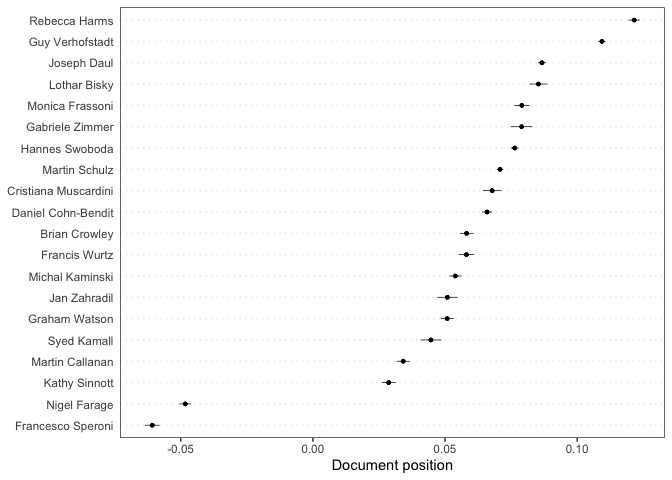
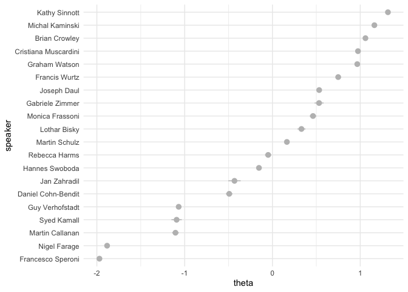
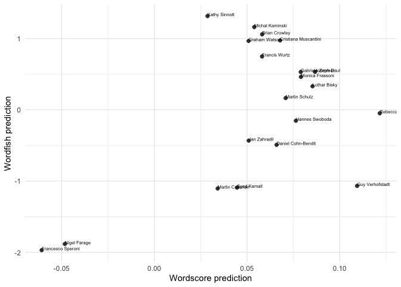
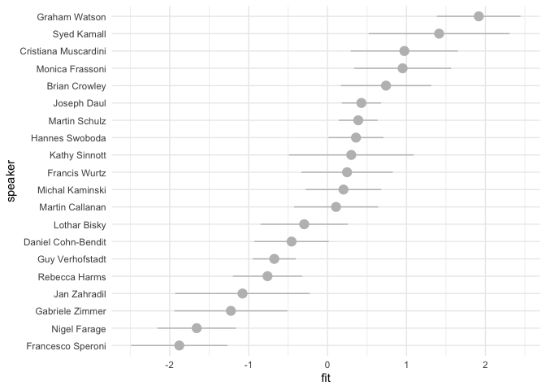
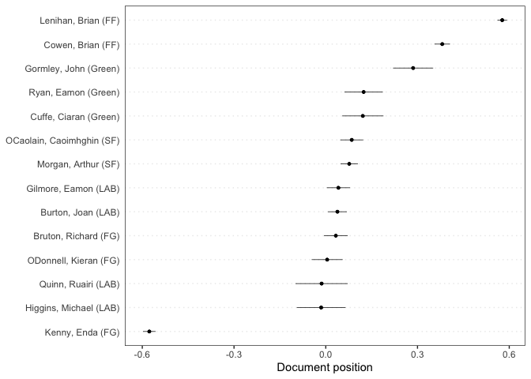
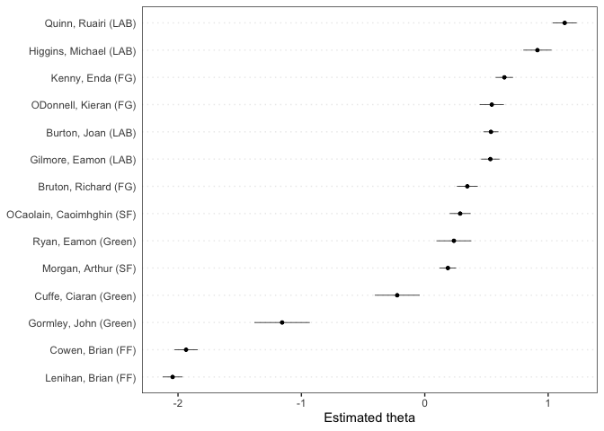

QTA Day 6: Scaling methods
================
16 July, 2024

This document gives some examples of how to apply scaling methods
(Wordscores, Wordfish, LSS) in **quanteda**. For these examples, we use
the (English) speeches of EP group leaders that are part of the
[EUSpeech](https://dataverse.harvard.edu/dataverse/euspeech) dataset.

The **quanteda**, **quanteda.textmodels**, **quanteda.textstats**,
**quanteda.textplots**, **ggplot2** and **tidyverse** packages are
familiar at this point. The **quanteda.corpora** package can be
downloaded as follows:
`devtools::install_github("quanteda/quanteda.corpora")`. The **LSX**
package can be downloaded using `install.packages("LSX")`

``` r
#load libraries
library(quanteda)
library(quanteda.textmodels)
library(quanteda.textplots)
library(quanteda.corpora)
library(quanteda.textstats)
library(ggplot2)
library(tidyverse)
library(LSX)

#read in the EP speeches
speeches <- read.csv(file = "speeches_ep.csv", 
                     header = TRUE, 
                     stringsAsFactors = FALSE, 
                     sep = ",", 
                     encoding = "UTF-8")
```

Inspect how many unique speakers there are in the dataset.

``` r
unique(speeches$speaker)
```

    ##  [1] "Lothar Bisky"         "Martin Callanan"      "Daniel Cohn-Bendit"  
    ##  [4] "Brian Crowley"        "Joseph Daul"          "Nigel Farage"        
    ##  [7] "Monica Frassoni"      "Rebecca Harms"        "Syed Kamall"         
    ## [10] "Michal Kaminski"      "Cristiana Muscardini" "Martin Schulz"       
    ## [13] "Kathy Sinnott"        "Francesco Speroni"    "Hannes Swoboda"      
    ## [16] "Guy Verhofstadt"      "Graham Watson"        "Francis Wurtz"       
    ## [19] "Jan Zahradil"         "Gabriele Zimmer"

Let’s first merge the speeches for each speaker using some tidyverse
data-wrangling. The %\>%, group_by(), summarise() and ungroup()
functions are used to concatenate the speeches for each speaker. The
`%>%` command is the pipe function and helps us with a chain of
functions. Think of it as a way to pass the output of one function to
the next function. The paste() function concatenates the speeches for
each speaker.

``` r
speeches <- speeches %>%
  group_by(speaker) %>%
  summarise(text = paste(text, collapse = " ")) %>%
  ungroup()

#confirm that you have a total of 20 (very long) concatenated speeches, 1 for each EP speaker
dim(speeches)
```

    ## [1] 20  2

Let’s create a corpus and tokenize it. We will remove punctuation,
symbols, numbers, urls, and separators. We will also remove stopwords
and split hyphens.

``` r
#create a corpus object

corpus_speeches <- corpus(speeches,
                          text_field = "text")

#tokenise the corpus
tokens_speeches <- tokens(corpus_speeches,
                          what = "word",
                          remove_punct = TRUE, 
                          remove_symbols = TRUE, 
                          remove_numbers = TRUE,
                          remove_url = TRUE,
                          remove_separators = TRUE,
                          split_hyphens = FALSE,
                          ) %>%
  tokens_remove(stopwords(source = "smart"), padding = TRUE)
```

MEP speeches are full of jargon and references to politicians. Let’s
append bigram collocations to our tokens object to account for this.

``` r
collocations <- tokens_speeches %>%
  tokens_sample(size = 10, replace = FALSE) %>%
  textstat_collocations(min_count = 20,
                        size = 2:3) %>%
  arrange(-lambda)

head(collocations, 20)
```

    ##                  collocation count count_nested length    lambda         z
    ## 124               van rompuy   125          123      2 16.514180 11.231754
    ## 127             derek roland    24           24      2 16.347160  9.934803
    ## 128             roland clark    24           24      2 16.347160  9.934803
    ## 129            gerard batten    20           19      2 16.168922  9.812060
    ## 126             nigel farage    85           85      2 15.987392 10.915930
    ## 133              john bufton    22           22      2 13.864073  9.555630
    ## 110               tony blair    20            9      2 13.260186 16.698298
    ## 96  medium-sized enterprises    31            5      2 12.791768 20.554385
    ## 134           united kingdom    49            3      2 12.299235  8.640956
    ## 69           baroness ashton    45           25      2 12.221169 24.829187
    ## 135          transaction tax    33           33      2 11.950050  8.375213
    ## 121           global warming    24           10      2 10.921917 12.904838
    ## 11            prime minister   181          134      2 10.753392 42.568593
    ## 31       christian democrats    80           80      2 10.637030 32.184448
    ## 35               middle east    43           11      2 10.366676 31.211473
    ## 21            speaker agreed    89            0      2 10.360538 37.967245
    ## 33           party christian    80           80      2 10.132848 31.637782
    ## 26               EUR billion    58           26      2 10.095212 35.095805
    ## 24                farage EFD    57           57      2  9.801836 35.899482
    ## 118    financial transaction    31           31      2  9.593017 14.548668

Let’s also append collocations of names to our tokens object.

``` r
collocations_names <- tokens_select(tokens_speeches, 
                                    pattern = "[A-Z]", 
                                    valuetype = "regex", 
                                    case_insensitive = FALSE, 
                                    padding = TRUE) %>%
  textstat_collocations(min_count = 10,
                        tolower = FALSE)

head(collocations_names, 20)
```

    ##            collocation count count_nested length    lambda         z
    ## 1         Mr President  2002            0      2  5.838233 151.82831
    ## 2       European Union  1624            0      2  6.409185 125.46152
    ## 3        Member States  1030            0      2  9.641637 100.29248
    ## 4  European Parliament   629            0      2  4.513421  87.99237
    ## 5           Mr Barroso   685            0      2  7.000140  68.13384
    ## 6          Applause Mr   328            0      2  4.479798  64.41126
    ## 7     European Council   368            0      2  3.752149  62.44155
    ## 8        United States   167            0      2  6.741955  58.45611
    ## 9         Member State   138            0      2  6.113949  55.08553
    ## 10       Lisbon Treaty   122            0      2  6.098099  54.74999
    ## 11          Mrs Merkel    82            0      2  8.049259  49.83637
    ## 12     Party Christian   116            0      2 10.413769  48.13534
    ## 13        Central Bank   115            0      2 10.493916  48.11377
    ## 14 Christian Democrats   122            0      2 10.179057  47.33390
    ## 15     Madam President   303            0      2  7.892003  41.96895
    ## 16      Prime Minister   384            0      2 12.421610  40.99329
    ## 17          Farage EFD    57            0      2  9.840650  40.57992
    ## 18   Chancellor Merkel    46            0      2  8.452911  39.84559
    ## 19      Stability Pact    45            0      2  9.204751  39.63545
    ## 20              Mr Van   186            0      2  6.550445  38.77489

If we want to add the most surprising collocations to our tokens object
we can do so using `tokens_compund`. We’ll include only collocations
with a lambda score higher than 5.

``` r
collocations <- collocations %>%
  filter(lambda > 5) %>%
  pull(collocation) %>%
  phrase()

tokens_speeches <- tokens_compound(tokens_speeches, collocations)

collocations_names <- collocations_names %>%
  filter(lambda > 5) %>%
  pull(collocation) %>%
  phrase()

tokens_speeches <- tokens_compound(tokens_speeches, collocations_names)
```

Create a dfm, and change the document names to the speaker names.

``` r
dfm_speeches <- dfm(tokens_speeches)
docnames(dfm_speeches) <- docvars(dfm_speeches, "speaker")
```

## Wordscores

Let’s see if we can use Wordscores to locate these speakers on a
pro-anti EU dimension. We’ll first need to determine reference texts to
anchor this dimension. On the anti-EU side we’ll locate Francesco
Speroni and Nigel Farage, leaders of the then European Freedom and
Democracy group, a Eurosceptic outlet. On the pro-EU dimension we’ll
locate Guy Verhofstadt, leader of the liberal ALDE group, and a pro-EU
voice, as well as Rebecca Harms, the leader of the Greens:

``` r
#append an empty reference_score variable to the speeches_dfm docvars
docvars(dfm_speeches, "reference_score") <- NA

#locate which rows correspond with Guy Verhofstadt and Rebecca Harms (pro_eu) and Francesco Speroni and Nigel Farage (anti_eu)
pro_eu <- which(docvars(dfm_speeches) == "Guy Verhofstadt" | docvars(dfm_speeches) == "Rebecca Harms")
anti_eu <- which(docvars(dfm_speeches) == "Francesco Speroni" |
                 docvars(dfm_speeches) == "Nigel Farage" )

#assign reference scores to Guy Verhofstadt and Rebecca Harms (1) and Francesco Speroni and Nigel Farage (-1)
docvars(dfm_speeches, "reference_score")[pro_eu] <- 1
docvars(dfm_speeches, "reference_score")[anti_eu] <- -1

#inspects the reference_score variable:
docvars(dfm_speeches, "reference_score")
```

    ##  [1] NA NA NA -1 NA NA NA  1 NA NA NA NA NA NA NA NA NA -1  1 NA

``` r
#implement wordscores as per Laver, Benoit, Garry (2003)
speeches_ws <- textmodel_wordscores(dfm_speeches, 
                                    y = docvars(dfm_speeches, "reference_score"), 
                                    scale = c("linear"), 
                                    smooth = 1)
summary(speeches_ws, 10)
```

    ## 
    ## Call:
    ## textmodel_wordscores.dfm(x = dfm_speeches, y = docvars(dfm_speeches, 
    ##     "reference_score"), scale = c("linear"), smooth = 1)
    ## 
    ## Reference Document Statistics:
    ##                      score  total min   max   mean median
    ## Brian Crowley           NA  31865   0 19693 1.6586      0
    ## Cristiana Muscardini    NA  17303   0 10020 0.9006      0
    ## Daniel Cohn-Bendit      NA  44063   0 28970 2.2935      0
    ## Francesco Speroni       -1  35127   0 22680 1.8284      0
    ## Francis Wurtz           NA  23883   0 14093 1.2431      0
    ## Gabriele Zimmer         NA  12019   0  7486 0.6256      0
    ## Graham Watson           NA  33812   0 19169 1.7599      0
    ## Guy Verhofstadt          1 100218   0 65963 5.2164      0
    ## Hannes Swoboda          NA  76981   0 50470 4.0069      0
    ## Jan Zahradil            NA  12500   0  8069 0.6506      0
    ## Joseph Daul             NA  85134   0 51801 4.4313      0
    ## Kathy Sinnott           NA  29799   0 17592 1.5511      0
    ## Lothar Bisky            NA  19704   0 11716 1.0256      0
    ## Martin Callanan         NA  33843   0 21180 1.7616      0
    ## Martin Schulz           NA 125814   0 80209 6.5487      0
    ## Michal Kaminski         NA  41097   0 23806 2.1391      0
    ## Monica Frassoni         NA  24270   0 15369 1.2633      0
    ## Nigel Farage            -1  54497   0 35348 2.8366      0
    ## Rebecca Harms            1  41785   0 26841 2.1749      0
    ## Syed Kamall             NA  14279   0  8981 0.7432      0
    ## 
    ## Wordscores:
    ## (showing first 10 elements)
    ##                            mr_president president-in-office             council 
    ##             0.05050             0.02531             0.40330             0.85698 
    ##           president          commission             meeting               place 
    ##             0.02744             0.50788             0.65332            -0.25655 
    ##               month               focus 
    ##            -0.32991             0.74541

``` r
#sort most discriminant words:

#anti-EU words
head(sort(speeches_ws$wordscores), 10)
```

    ##       referendum     nation_state nigel_farage_efd             ukip 
    ##       -0.9382025       -0.9332120       -0.9311296       -0.9099393 
    ##           anthem              gbp      referendums          frankly 
    ##       -0.9097581       -0.9008272       -0.9006400       -0.8962228 
    ##          croatia          peoples 
    ##       -0.8951303       -0.8930559

``` r
#pro-EU words
tail(sort(speeches_ws$wordscores), 10)
```

    ##         plants        council        reforms     copenhagen     discussion 
    ##      0.8555133      0.8569844      0.8628832      0.8681926      0.8690477 
    ##          japan     colleagues        finally           task responsibility 
    ##      0.8724119      0.8777835      0.8945840      0.8958405      0.9370049

``` r
#histogram of wordscores
hist(speeches_ws$wordscore, col = "red", border = 0)
```

<!-- -->

Let’s use the Wordscores model to predict the document scores of the
speeches of the remaining group leaders

``` r
speeches_wordscores_predict <- predict(speeches_ws,
                                       newdata = dfm_speeches, 
                                       se = TRUE)
```

Which speakers are most like Farage and Speroni?

``` r
sort(speeches_wordscores_predict$fit, decreasing = FALSE)[1:5]
```

    ## Francesco Speroni      Nigel Farage     Kathy Sinnott   Martin Callanan 
    ##       -0.06077517       -0.04828463        0.02867394        0.03416424 
    ##       Syed Kamall 
    ##        0.04463704

This lists Kathy Sinnott (I&D), Martin Callanan (ECR) and Syed Kamall
(ECR) as the most anti-EU speakers.

Which speakers are most like Verhofstadt and Harms?

``` r
sort(speeches_wordscores_predict$fit, decreasing = TRUE)[1:5]
```

    ##   Rebecca Harms Guy Verhofstadt     Joseph Daul    Lothar Bisky Monica Frassoni 
    ##      0.12158999      0.10937878      0.08667851      0.08532492      0.07907956

This lists Joseph Daul (EPP), Lothar Bisky (Party of the European Left)
and Monica Frassoni (Green Party) as the most pro-EU speakers.

Visualize the document scores in a plot:

``` r
textplot_scale1d(speeches_wordscores_predict)
```

<!-- -->

## Wordfish

Estimate a Wordfish model and inspect its output. Using the argument
`dir=c(4,8)` set the direction of the dimension so that the document
score for Francesco Speroni (speaker 4) is smaller than the document
score for Guy Verhofdstadt (speaker 8)

``` r
speeches_wf <- textmodel_wordfish(dfm_speeches,
                                  dir = c(4,8))
summary(speeches_wf)
```

    ## 
    ## Call:
    ## textmodel_wordfish.dfm(x = dfm_speeches, dir = c(4, 8))
    ## 
    ## Estimated Document Positions:
    ##                         theta       se
    ## Brian Crowley         1.05930 0.009462
    ## Cristiana Muscardini  0.97431 0.014385
    ## Daniel Cohn-Bendit   -0.49232 0.019147
    ## Francesco Speroni    -1.97078 0.008471
    ## Francis Wurtz         0.74894 0.015624
    ## Gabriele Zimmer       0.53129 0.026214
    ## Graham Watson         0.96608 0.010398
    ## Guy Verhofstadt      -1.06820 0.011407
    ## Hannes Swoboda       -0.15360 0.013942
    ## Jan Zahradil         -0.43248 0.035869
    ## Joseph Daul           0.53230 0.009845
    ## Kathy Sinnott         1.31551 0.006306
    ## Lothar Bisky          0.33041 0.023117
    ## Martin Callanan      -1.10462 0.019331
    ## Martin Schulz         0.16462 0.009883
    ## Michal Kaminski       1.16130 0.007128
    ## Monica Frassoni       0.46199 0.019312
    ## Nigel Farage         -1.88346 0.007890
    ## Rebecca Harms        -0.04885 0.018443
    ## Syed Kamall          -1.09173 0.029917
    ## 
    ## Estimated Feature Scores:
    ##              mr_president president-in-office council president commission
    ## beta -0.4774      -0.4309              0.5503 -0.3839    -0.455     -0.493
    ## psi   9.9712       4.3804              1.9982  4.2531     3.806      4.302
    ##      meeting   place   month  focus economic affairs european_union proposals
    ## beta -0.3997 -0.4004 -0.7121 0.0313   -0.439 -0.3363        -0.4289   -0.3807
    ## psi   2.1565  2.9958  0.9787 1.6557    3.730  1.1282         4.1720    2.3698
    ##      created  return economy previous   state implemented immediately restart
    ## beta  -0.346 -0.3598 -0.2739  -0.2962 -0.4995     -0.2587     -0.4798 -0.2358
    ## psi    1.338  1.6434  2.6163   1.1792  3.1292      1.0744      1.2834 -1.2712
    ##        today    speak  future  europe  people   claim    care situation
    ## beta -0.5754 -0.03215 -0.1983 -0.4299 -0.6234 -0.4093 -0.1107   -0.2704
    ## psi   3.8915  2.22078  3.3098  4.8974  4.4408  0.6307  1.1771    3.2092

Let’s take out the word level parameters beta and psi. Beta is the
estimated word position on the underlying dimension and psi is the word
fixed effect.

``` r
wordfish_word_data <- data.frame(beta = speeches_wf$beta,
                            psi = speeches_wf$psi,
                            features = speeches_wf$features)

dim(wordfish_word_data)
```

    ## [1] 19212     3

``` r
head(wordfish_word_data)
```

    ##         beta      psi            features
    ## 1 -0.4773739 9.971234                    
    ## 2 -0.4309443 4.380415        mr_president
    ## 3  0.5503065 1.998207 president-in-office
    ## 4 -0.3839094 4.253148             council
    ## 5 -0.4549696 3.805817           president
    ## 6 -0.4930113 4.302175          commission

``` r
word_plot <- ggplot(data = wordfish_word_data, aes(x = beta, y = psi)) +
    geom_point(pch = 21, fill = "gray", color = "white", size = 0.75) +
  labs(x = "Beta", y = "Psi") + guides(size = "none", color = guide_legend("")) + 
  theme_minimal() +
  geom_text(data=subset(wordfish_word_data, beta > 7 | beta < -4.5 | psi > 4.5),  
            aes(x = beta, y = psi, label = features))

print(word_plot)
```

<!-- -->

Plot the document positions generated by Wordfish. Alpha is the document
position on the dimension and theta is the document fixed effect.

``` r
#generate a dataframe with document level alpha beta and omega
wordfish_document_data <- data.frame(alpha = speeches_wf$alpha,
                                     theta = speeches_wf$theta,
                                     se = speeches_wf$se.theta,
                                     speaker = speeches_wf$docs)

#order the speaker factor by theta
wordfish_document_data$speaker <- reorder(wordfish_document_data$speaker, 
                                           wordfish_document_data$theta)


#plot wordfish results using ggplot2
wordfish_plot <- ggplot(wordfish_document_data, 
                        aes(x= speaker, 
                            y = theta,
                            ymin = theta -1.96*se,
                            ymax = theta + 1.96*se)) +
  geom_pointrange(fill = "gray", color = "gray", size = .5) +
  theme_minimal() + coord_flip()
print(wordfish_plot)
```

<!-- -->

Both Wordscores and Wordfish are scaling models and if they pick up on
the same dimension they should give us similar results. Let’s see if
this indeed the case.

``` r
scaling_data <- rbind(data.frame(speeches_wordscores_predict, wordfish_document_data))

scaling_plot <- ggplot(scaling_data, aes(x = fit, 
                                         y = theta, 
                                         label = speaker)) +
  geom_point(pch = 21, fill = "gray25", color = "white", size = 2.5) +
  scale_x_continuous(name = "Wordscore prediction") +
  scale_y_continuous(name = "Wordfish prediction") +
  theme_minimal() + geom_text(aes(label=speaker), 
                                        hjust=0, 
                                        vjust=0, 
                                        size = 2)
  
print(scaling_plot)
```

<!-- -->

``` r
correlation <- cor.test(x=scaling_data$fit, 
                        y=scaling_data$theta,
                        method = 'pearson')
print(correlation)
```

    ## 
    ##  Pearson's product-moment correlation
    ## 
    ## data:  scaling_data$fit and scaling_data$theta
    ## t = 2.4667, df = 18, p-value = 0.0239
    ## alternative hypothesis: true correlation is not equal to 0
    ## 95 percent confidence interval:
    ##  0.07730637 0.77317862
    ## sample estimates:
    ##       cor 
    ## 0.5026323

## Latent semantic scaling (LSS)

In a third step, we’ll apply Latent Semantic Scaling (LSS) to the
speeches. LSS is a scaling method that uses a seed list of sentiment
words as a starting point. It then relies on word embeddings to find
nearest neighbors to these seed words. From this information it
calculates `polarity scores` for each word.

In order to apply LSS to the corpus we first need to transform the
corpus at the sentence level and tokenize it

``` r
corpus_speeches_sent <- corpus_reshape(corpus_speeches, to =  "sentences")

tokens_speeches_sent <- tokens(corpus_speeches_sent,
                               what = "word",
                               remove_punct = TRUE, 
                               remove_symbols = TRUE, 
                               remove_numbers = TRUE,
                               remove_url = TRUE,
                               remove_separators = TRUE,
                               split_hyphens = FALSE,
                          ) %>%
  tokens_remove(stopwords(source = "smart"), padding = FALSE)


tokens_speeches_sent <- tokens_compound(tokens_speeches_sent, collocations)
tokens_speeches_sent <- tokens_compound(tokens_speeches_sent, collocations_names)

dfmat_speeches_sent <- tokens_speeches_sent %>% 
  dfm()

topfeatures(dfmat_speeches_sent, 20)
```

    ##       european         europe         people   mr_president     parliament 
    ##           3644           3357           2203           2002           1872 
    ##     commission        council european_union         crisis      countries 
    ##           1866           1756           1625           1409           1394 
    ##           time             eu          today           make             mr 
    ##           1359           1317           1257           1175           1145 
    ##          group      president       economic  member_states       applause 
    ##           1139           1130           1046           1032           1030

In this case we rely on the short list of sentiment words as a seed list

``` r
seed <- as.seedwords(data_dictionary_sentiment)
print(seed)
```

    ##        good        nice   excellent    positive   fortunate     correct 
    ##           1           1           1           1           1           1 
    ##    superior         bad       nasty        poor    negative unfortunate 
    ##           1          -1          -1          -1          -1          -1 
    ##       wrong    inferior 
    ##          -1          -1

Using the seed words, LSS computes polarity of words frequent in the
context of `europe*` (which in this example should denote how positive
or negative words are around references of membership). We’ll set the
p-value to 0.05, which means that only words that are significantly more
frequent in the context of `europe*` than in the rest of the corpus will
be included in the analysis.

``` r
# identify context words 
europe <- char_context(tokens_speeches_sent, pattern = "europe*", p = 0.05)
```

In a next step we run the LSS model. We set the number of embeddings
dimensions to 300 and cache the results, which speeds up the process.

``` r
tmod_lss <- textmodel_lss(dfmat_speeches_sent, 
                          seeds = seed,
                          terms = europe, 
                          k = 300, 
                          cache = TRUE)
```

Display the most positive words that appear in the context of Europe

``` r
head(coef(tmod_lss), 20)
```

    ##   convention  enlargement        build     interest  coordinated      succeed 
    ##   0.11211194   0.09132568   0.08214385   0.08051896   0.07981119   0.07738754 
    ##  cooperation         rome    effective    incapable        works       manage 
    ##   0.07488911   0.07293746   0.07031747   0.06464459   0.06403627   0.06208166 
    ##       closer   foundation       spirit         show      focused     socially 
    ##   0.06085726   0.06047601   0.05880338   0.05598031   0.05554651   0.05494942 
    ##  involvement member_state 
    ##   0.05400626   0.05395453

Most negative words that appear in the context of Europe

``` r
tail(coef(tmod_lss), 20)
```

    ##             run     nationalism    undemocratic         federal            idea 
    ##     -0.04016139     -0.04037484     -0.04058162     -0.04102045     -0.04106704 
    ##       influence           shape            mark         adopted         balkans 
    ##     -0.04178270     -0.04186131     -0.04240867     -0.04269171     -0.04596377 
    ##          values     development         schuman       elections           trend 
    ##     -0.04711428     -0.04717276     -0.04792642     -0.04803023     -0.04965957 
    ##             big    civilisation            rest             row political_class 
    ##     -0.05049622     -0.05089363     -0.05743158     -0.05823850     -0.06482544

To obtain document-level scores, we use the `dfm_group()` to re-assemble
the sentence-level dfm back at the document-level. We then use
`predict()` to make document level LSS predictions.

``` r
dfmat_doc <- dfm_group(dfmat_speeches_sent)
dat <- docvars(dfmat_doc)
dat$fit <- unlist(predict(tmod_lss, 
                          newdata = dfmat_doc, 
                          se = TRUE)[1])
dat$se <- unlist(predict(tmod_lss, 
                         newdata = dfmat_doc, 
                         se = TRUE)[2])
```

We then plot these predictions, ordering speakers from most positive to
most negative on Europe.

``` r
dat$speaker <- with(dat, reorder(speaker, fit))


lss_plot <- ggplot(arrange(dat, fit), 
                        aes(x= speaker, 
                            y = fit,
                            ymin = fit -1.96*se,
                            ymax = fit + 1.96*se)) +
  geom_pointrange(pch = 21, fill = "gray", color = "gray", size = 0.75) +
  theme_minimal() + coord_flip()
print(lss_plot)
```

<!-- -->

## Exercises

For this set of exercises we will use `data_corpus_irishbudget2010` a
corpus that consists of 2010 budget speeches in Ireland. The dataset is
included in the quanteda package.

1.  Tokenize `data_corpus_irishbudget2010`, remove stopwords,
    punctuation characters, and create a dfm called `dfm_budget_debates`

``` r
dfm_budget_debates <- data_corpus_irishbudget2010 %>%
  tokens(remove_punct = TRUE) %>% 
  tokens_remove(pattern = stopwords("en")) %>% 
  dfm()
```

2.  Create a binary variable `ref_score` that equals 1 if the speaker’s
    name is “Lenihan” (i.e., the Minister of Finance at the time) and -1
    if the speaker’s name is “Kenny” (Enda Kenny was leader of the
    opposition at the time). For all other speakers, assign the value
    NA.

``` r
ref_score <- rep(NA, nrow(dfm_budget_debates))

government <- which(docvars(dfm_budget_debates, "name") == "Lenihan")
opposition <- which(docvars(dfm_budget_debates, "name") == "Kenny")

ref_score[government] = 1
ref_score[opposition] = -1
```

3.  Apply a Wordscores model for this document-feature matrix using
    `ref_score` as the value for `y`.

``` r
budget_debates_ws <- textmodel_wordscores(dfm_budget_debates, 
                                          y = ref_score)
```

4.  Explore the scores for all words in the dfm using
    `textplot_scale1d()`. Note: set margin to “features”. Why are some
    terms clustered around -1 and +1?

``` r
textplot_scale1d(budget_debates_ws, margin = "features")
```

<!-- -->

5.  Use `predict()` for predicting the document-level word scores for
    all documents in the dfm. Set `se = TRUE` to add 95% confidence
    intervals.

``` r
pred_ws <- predict(budget_debates_ws, 
                   newdata = dfm_budget_debates, 
                   se = TRUE)
```

    ## Warning: 2832 features in newdata not used in prediction.

6.  Apply `textplot_scale1d()` to the object created in question 5. Does
    this method distinguish between government (FF and Green) and
    oppoisiton parties?

``` r
textplot_scale1d(pred_ws)
```

<!-- -->

Use the `dfm_budget_debates`. Create a new dfm object that only keeps
terms that appear in at least three documents and that appear at least
three times. Call the resulting dfm `dfm_budget_debates_trimmed`

``` r
dfm_budget_debates_trimmed <- dfm_budget_debates %>% 
  dfm_trim(min_termfreq = 3, min_docfreq = 3)
```

Run a Wordfish model on this dfm.

``` r
tmod_wf <- textmodel_wordfish(dfm_budget_debates_trimmed)
```

Use `textplot_scale1d()` to plot (1) document-positions, and scores for
each word. You can achieve this by adjusting the `margin` argument.

``` r
textplot_scale1d(tmod_wf, margin = "documents")
```

<!-- -->

``` r
textplot_scale1d(tmod_wf, margin = "features")
```

<!-- -->
