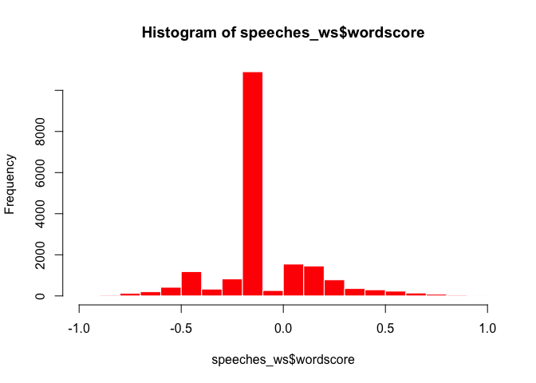
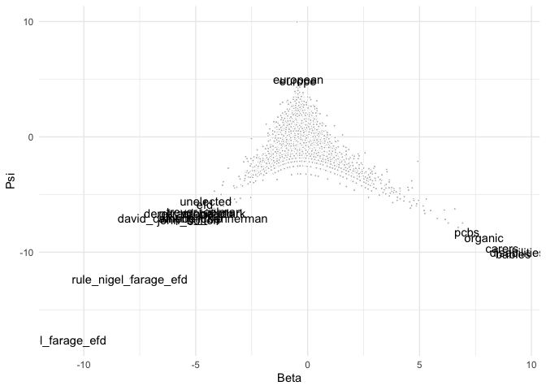

This document walks you through an example of supervised machine
learning to predict which UK prime minister delivered a speech. For this
we’ll use UK prime minister speeches from the
[EUSpeech](https://dataverse.harvard.edu/dataverse/euspeech) dataset.

For the supervised machine learning exercise you will need to install
the `quanteda.textmodels`, `quanteda.textplots` and the
`quanteda.textstat` libraries We will also use the `tidyverse` library
to create training and test sets. Furthermore, we will use the `caret`
library to produce a confusion matrix. This library requires some
dependencies (i.e., functions from other libraries), so if you are
working from your computer will need install it like so:
`install.packages('caret', dependencies = TRUE)`.

``` r
#load libraries
library(quanteda)
library(quanteda.textmodels)
library(quanteda.textplots)
library(quanteda.textstats)
library(tidyverse)
library(caret)

#read in speeches
speeches <- read.csv(file = "speeches_uk.csv", 
                     header = TRUE, 
                     stringsAsFactors = FALSE, 
                     sep = ",", 
                     encoding = "UTF-8")

#construct a corpus
corpus_pm <- corpus(speeches)
#select speeches from Cameron and Brown
corpus_brown_cameron <- corpus_subset(corpus_pm, speaker != "T. Blair")
#turn the date variable in a date format instead of character format
docvars(corpus_brown_cameron, "date") <- as.Date(docvars(corpus_brown_cameron, "date"), "%d-%m-%Y")
```

Let’s tokenise this corpus and create a dfm

``` r
tokens_brown_cameron <- tokens(corpus_brown_cameron,
                            what = "word",
                            remove_punct = TRUE, 
                            remove_symbols = TRUE, 
                            remove_numbers = TRUE,
                            remove_url = TRUE,
                            remove_separators = TRUE,
                            split_hyphens = FALSE,
                            padding = FALSE
                            ) %>%
  tokens_remove(stopwords("en"))

#to make this dfm less sparse, we will only select features that appear in at least 2% of speeches
dfm_brown_cameron <- dfm(tokens_brown_cameron ) %>%
  dfm_trim(min_docfreq = 0.02, docfreq_type = "prop")
    

dim(dfm_brown_cameron)
```

    ## [1]  776 4375

We now have a dfm containing 776 speeches delivered by either Gordon
Brown or David Cameron and 4375 tokens.

## Naive Bayes

Let’s see if we can build a classifier to predict if a speech is
delivered by Cameron or Brown. First, we’ll generate a vector of 250
random numbers selected from the vector 1:776. We’ll also append an id
variable`id_numeric` to our dfm. **NB**: The `set.seed()` function makes
sure that you can reproduce your random samples.

``` r
#set.seed() allows us to reproduce randomly generated results 
set.seed(2)

#generate a sample of 250 numbers without replacement
id_train <- sample(1:nrow(dfm_brown_cameron), 250, replace = FALSE)
head(id_train, 10)
```

    ##  [1] 710 774 416 392 273 349 204 381 297 690

``` r
#create id variable
docvars(dfm_brown_cameron, "id_numeric") <- 1:ndoc(dfm_brown_cameron)

#take note of how many speeches were delivered by either Brown or Cameron
table(docvars(dfm_brown_cameron, "speaker"))
```

    ## 
    ## D. Cameron   G. Brown 
    ##        493        283

We then take a sample of 250 speeches as our training data and turn it
into a dfm. The `%in%` operator produces a logical vector of the same
length as id_numeric, and contains a TRUE if `id_numeric[i]` appears in
id_train and FALSE otherwise.

``` r
# create a training set: a dfm of 250 documents with row numbers included in id_train
train_dfm <- dfm_subset(dfm_brown_cameron, id_numeric %in% id_train)

#create a test set: a dfm of 100 documents whose row numbers are *not* included in id_train
test_dfm <- dfm_subset(dfm_brown_cameron, !id_numeric %in% id_train)
test_dfm <- dfm_sample(test_dfm, 100, replace = FALSE)

#check whether there is no overlap between the train set and the test set
which((docvars(train_dfm, "id_numeric")  %in% docvars(test_dfm, "id_numeric")))
```

    ## integer(0)

We can now train a Naive Bayes classifier on the training set using the
`textmodel_nb()` function

``` r
speaker_classifier_nb <- textmodel_nb(train_dfm, 
                                      y = docvars(train_dfm, "speaker"), 
                                      smooth = 1,
                                      prior = "docfreq",
                                      distribution = "multinomial")

summary(speaker_classifier_nb)
```

    ## 
    ## Call:
    ## textmodel_nb.dfm(x = train_dfm, y = docvars(train_dfm, "speaker"), 
    ##     smooth = 1, prior = "docfreq", distribution = "multinomial")
    ## 
    ## Class Priors:
    ## (showing first 2 elements)
    ## D. Cameron   G. Brown 
    ##        0.6        0.4 
    ## 
    ## Estimated Feature Scores:
    ##            european   council   focused   issues        uk migration    talked     last     night     come     back   shortly    first afternoon discussed
    ## D. Cameron 0.002210 0.0011438 0.0002535 0.001079 0.0017417 1.755e-04 0.0002535 0.002158 0.0003379 0.001989 0.002411 3.899e-05 0.003503 0.0002145 0.0004809
    ## G. Brown   0.001849 0.0006798 0.0001632 0.001795 0.0005846 3.399e-05 0.0007410 0.002624 0.0002311 0.002631 0.001883 6.798e-05 0.003617 0.0001768 0.0005099
    ##              ongoing    crisis    facing    winter    still     many  migrants   coming   europe   around  arriving       via   eastern mediterranean     route
    ## D. Cameron 6.499e-05 0.0004809 0.0002080 5.199e-05 0.001404 0.002846 5.849e-05 0.001228 0.002028 0.001495 5.199e-05 1.950e-05 1.300e-04     6.499e-05 0.0001430
    ## G. Brown   4.759e-05 0.0018015 0.0004555 2.719e-05 0.001006 0.002957 1.496e-04 0.001237 0.001414 0.001468 2.039e-05 3.399e-05 6.798e-05     6.798e-06 0.0001496

Let’s analyze if we can predict whether a speech in the test set is from
Cameron or Brown:

``` r
#Naive Bayes can only take features that occur both in the training set and the test set. We can make the features identical by passing train_dfm to dfm_match() as a pattern.

matched_dfm <- dfm_match(test_dfm, features = featnames(train_dfm))

#predict speaker 
pred_speaker_classifier_nb <- predict(speaker_classifier_nb, 
                                      newdata = matched_dfm, 
                                      type = "class")

head(pred_speaker_classifier_nb)
```

    ##    text121    text748    text629    text326    text722    text228 
    ## D. Cameron   G. Brown   G. Brown D. Cameron   G. Brown D. Cameron 
    ## Levels: D. Cameron G. Brown

We could also predict the probability the model assigns to each class.
We could use this to create an ROC curve.

``` r
#predict probability of speaker
pred_prob_classifier_nb <- predict(speaker_classifier_nb, 
                                   newdata = matched_dfm, 
                                   type = "probability")
```

Let’s see how well our classifier did by producing a confusion matrix

``` r
tab_class_nb <- table(predicted_speaker_nb = pred_speaker_classifier_nb, 
                      actual_speaker = docvars(test_dfm, "speaker"))

print(tab_class_nb)
```

    ##                     actual_speaker
    ## predicted_speaker_nb D. Cameron G. Brown
    ##           D. Cameron         57        1
    ##           G. Brown            9       33

So it appears we are somewhat successful at predicting whether a speech
is delivered by Cameron or Brown. Our accuracy is 90%.

Let’s have a look at the most predictive features for Cameron in the
complete corpus.

``` r
dfm_brown_cameron_grouped <- tokens_brown_cameron %>%
  tokens_group(groups = speaker) %>%
  dfm()

keyness <- textstat_keyness(dfm_brown_cameron_grouped, target = "D. Cameron")
textplot_keyness(keyness)
```

<!-- -->

We can also display the most occurring features for Brown and Cameron
but without account for their `keyness`:

``` r
topfeatures(dfm_brown_cameron, groups = speaker, n = 50)
```

    ## $`D. Cameron`
    ##      think     people        can       want       make       just       need    country    britain      going        one government        get      world 
    ##       5761       5752       5173       3279       3185       2976       2806       2795       2764       2674       2656       2510       2448       2403 
    ##       also       work        now        new      today       like      right        say         us       good        got  countries   minister      first 
    ##       2384       2348       2274       2213       2092       2085       2084       2053       2009       1970       1931       1927       1852       1851 
    ##       know    british        see     things       much      prime       take       well        way       time  important       said   european      years 
    ##       1783       1730       1713       1708       1707       1704       1653       1621       1616       1613       1554       1543       1525       1484 
    ##       sure       help      great   together       many         go       year   business 
    ##       1479       1468       1450       1449       1438       1430       1296       1283 
    ## 
    ## $`G. Brown`
    ##        people           can         world         think           now         prime     countries          also           new        global      minister 
    ##          4682          4360          2981          2823          2266          2218          2112          2067          2037          1999          1932 
    ##            us           got          want          just          make           one          need          time         going       economy         today 
    ##          1861          1838          1770          1746          1725          1599          1556          1542          1523          1518          1508 
    ##       country          work        future          know       believe international           get           say         first       britain    government 
    ##          1500          1461          1438          1386          1356          1350          1346          1325          1306          1271          1225 
    ##          help          take          next      together         years          must          year     financial         every           see          last 
    ##          1221          1221          1217          1204          1201          1174          1137          1127          1121          1103          1072 
    ##          said           way        system       support        change          come 
    ##          1048          1046          1036          1022          1014           992

As you can see, it seems predictive features mostly indicate different
topics.

In order to improve on our predictions, we may think of other ways to
represent our documents. A common approach is to produce a
feature-weighted dfm by calculating the term-frequency-inverse document
frequency (tfidf) for each token. The intuition behind this
transformation is that it gives a higher weight to tokens that occur
often in a particular document but not much in other documents,
comppared to tokens that occur often in a particular document but also
in other documents. Tf-idf weighting is done through `dfm_tfidf()`.

``` r
train_dfm_weighted <- dfm_tfidf(train_dfm)
matched_dfm_weighted <- dfm_tfidf(matched_dfm)

speaker_classifier_weighted_nb <- textmodel_nb(train_dfm_weighted, 
                                               y = docvars(train_dfm_weighted, "speaker"), 
                                               smooth = 1, #laplace smoothing as discussed in the lecture
                                               prior = "docfreq",
                                               distribution = "multinomial")

pred_speaker_classifier_weigthed_nb <- predict(speaker_classifier_weighted_nb, 
                                               newdata = matched_dfm_weighted, 
                                               type = "class")

tab_class_weighted_nb <- table(predicted_speaker_nb = pred_speaker_classifier_weigthed_nb, 
                               actual_speaker = docvars(test_dfm, "speaker"))

print(tab_class_weighted_nb)
```

    ##                     actual_speaker
    ## predicted_speaker_nb D. Cameron G. Brown
    ##           D. Cameron         55        2
    ##           G. Brown           11       32

We’ll, we actually did a bit worse this time.

## Logistic regression

Let’s try a different classifier, a logistic regression. This regression
is not any different a logistic regression you may have come across
estimating a regression model for a binary dependent variable, but this
time we use it solely for prediction

``` r
speaker_classifier_lr <- textmodel_lr(train_dfm, 
                                      y = docvars(train_dfm, "speaker"))

#predict speaker 
pred_speaker_classifier_lr <- predict(speaker_classifier_lr, 
                                   newdata = matched_dfm, 
                                   type = "class")

#confusion matrix
tab_class_lr <- table(predicted_speaker_lr = pred_speaker_classifier_lr, 
                       actual_speaker = docvars(test_dfm, "speaker"))
print(tab_class_lr)
```

    ##                     actual_speaker
    ## predicted_speaker_lr D. Cameron G. Brown
    ##           D. Cameron         64        7
    ##           G. Brown            2       27

We now need to decide which of these classifiers works best for us. As
discussed in class we would need to check precision, recall and F1
scores. The `confusionMatrix()` function in the `caret` package does
exactly that.

``` r
confusionMatrix(tab_class_nb, mode = "prec_recall")
```

    ## Confusion Matrix and Statistics
    ## 
    ##                     actual_speaker
    ## predicted_speaker_nb D. Cameron G. Brown
    ##           D. Cameron         57        1
    ##           G. Brown            9       33
    ##                                          
    ##                Accuracy : 0.9            
    ##                  95% CI : (0.8238, 0.951)
    ##     No Information Rate : 0.66           
    ##     P-Value [Acc > NIR] : 2.588e-08      
    ##                                          
    ##                   Kappa : 0.7892         
    ##                                          
    ##  Mcnemar's Test P-Value : 0.02686        
    ##                                          
    ##               Precision : 0.9828         
    ##                  Recall : 0.8636         
    ##                      F1 : 0.9194         
    ##              Prevalence : 0.6600         
    ##          Detection Rate : 0.5700         
    ##    Detection Prevalence : 0.5800         
    ##       Balanced Accuracy : 0.9171         
    ##                                          
    ##        'Positive' Class : D. Cameron     
    ## 

``` r
confusionMatrix(tab_class_lr, mode = "prec_recall")
```

    ## Confusion Matrix and Statistics
    ## 
    ##                     actual_speaker
    ## predicted_speaker_lr D. Cameron G. Brown
    ##           D. Cameron         64        7
    ##           G. Brown            2       27
    ##                                         
    ##                Accuracy : 0.91          
    ##                  95% CI : (0.836, 0.958)
    ##     No Information Rate : 0.66          
    ##     P-Value [Acc > NIR] : 5.368e-09     
    ##                                         
    ##                   Kappa : 0.7921        
    ##                                         
    ##  Mcnemar's Test P-Value : 0.1824        
    ##                                         
    ##               Precision : 0.9014        
    ##                  Recall : 0.9697        
    ##                      F1 : 0.9343        
    ##              Prevalence : 0.6600        
    ##          Detection Rate : 0.6400        
    ##    Detection Prevalence : 0.7100        
    ##       Balanced Accuracy : 0.8819        
    ##                                         
    ##        'Positive' Class : D. Cameron    
    ## 

Based on the F1 score, our logistic regression classifier is performing
slightly better than predictions from our Naive Bayes classifier, so,
all else equal we would go with logistic regression.

## Exercises

For this set of exercises we will use the `data_corpus_moviereviews`
corpus that is stored in **quanteda**. This dataset contains 2000 move
reviews which are labeled as positive or negative. We’ll try to predict
these labels using supervised machine learning.

Apply `table()` to the sentiment variable appended to
`data_corpus_moviereviews` to inspect how many reviews are labelled
positive and negative.

``` r
table(docvars(data_corpus_moviereviews, "sentiment"))
```

    ## 
    ##  neg  pos 
    ## 1000 1000

Check the distribution of the number of tokens across reviews by
applying `ntoken()` to the corpus and then produce a histogram using
`hist()` .

``` r
data_corpus_moviereviews %>% 
    ntoken() %>% 
    hist()
```

<!-- -->

Tokenise the corpus and save it as `tokens_reviews`.

``` r
tokens_reviews <- tokens(data_corpus_moviereviews,
                         what = "word",
                         remove_punct = TRUE, 
                         remove_symbols = TRUE, 
                         remove_numbers = TRUE,
                         remove_url = TRUE,
                         remove_separators = TRUE,
                         split_hyphens = FALSE,
                         padding = FALSE) %>%
  tokens_remove(stopwords("en"))
```

Create a document-feature matrix and call it `dfm_reviews`

``` r
dfm_reviews <- dfm(tokens_reviews)
```

Apply `topfeatures()` to this dfm and get the 50 most frequent features.

``` r
topfeatures(dfm_reviews, n = 50)
```

    ##       film        one      movie       like       just       even       good       time        can      story       much       also        get  character 
    ##       8869       5523       5444       3547       2901       2555       2321       2281       2233       2119       2024       1965       1923       1905 
    ## characters        two      first        see        way       well       make     really      films     little       life       plot     people        bad 
    ##       1859       1827       1769       1730       1669       1657       1592       1556       1522       1491       1470       1449       1422       1378 
    ##      scene      never       best        new        man       many     scenes       know     movies   director      great    another     action       love 
    ##       1375       1363       1302       1280       1271       1268       1265       1207       1191       1150       1139       1112       1099       1091 
    ##         go         us  something        end      still       back      seems       made 
    ##       1075       1070       1049       1048       1037       1034       1032       1027

**Optional** Repeat this step, but get the 25 most frequent features
from reviews labelled as “pos” and “neg”.

``` r
topfeatures(dfm_reviews, groups = sentiment, n = 25)
```

    ## $neg
    ##       film      movie        one       like       just       even       good       time        can        get        bad       much      story  character 
    ##       4002       3053       2616       1833       1562       1380       1129       1111       1084       1038       1021        998        905        892 
    ##       plot characters        two       make      first     really        see       also        way     little       well 
    ##        875        873        867        819        805        781        776        765        754        722        699 
    ## 
    ## $pos
    ##       film        one      movie       like       just      story       also       good       even       time        can       much  character characters 
    ##       4867       2907       2391       1714       1339       1214       1200       1192       1175       1170       1149       1026       1013        986 
    ##       life      first        two       well        see        way        get      films       best       many     really 
    ##        983        964        960        958        954        915        885        878        810        780        775

## Supervised Machine Learning

Set a seed (`set.seed()`) to ensure reproducibility.

``` r
set.seed(123)
```

Create a new dfm with a random sample of 1500 reviews. We will use this
dfm as a training set. Call it `train_movies_dfm`. Use the sampling code
we used above.

``` r
docvars(dfm_reviews, "id") <- 1:ndoc(data_corpus_moviereviews)
id_train <- sample(1:ndoc(data_corpus_moviereviews), 1500, replace = FALSE)

train_movies_dfm <- dfm_subset(dfm_reviews, id %in% id_train)
```

Create another dfm with the remaining 500 reviews. Call it
`test_movies_dfm`. This will be our test set.

``` r
test_movies_dfm <- dfm_subset(dfm_reviews, !id %in% id_train)
```

Apply `textmodel_nb()` to the dfm consisting of 1500 documents. Use
“sentiment” to train the classifier. Call the output `tmod_nb`

``` r
tmod_nb <- textmodel_nb(train_movies_dfm, 
                        y =train_movies_dfm$sentiment, 
                        smooth = 1,
                        prior = "docfreq",
                        distribution = "multinomial")
```

Predict the sentiment of the remaining 500 documents by using
`predict()`. Call the output `prediction`.

``` r
prediction <- predict(tmod_nb, newdata = test_movies_dfm, type = "class")
```

Create a cross-table/confusion matrix to assess the classification
performance using `table()`.

``` r
tab_nb <- table(prediction = prediction, 
                human = docvars(test_movies_dfm, "sentiment"))

print(tab_nb)
```

    ##           human
    ## prediction neg pos
    ##        neg 200  58
    ##        pos  47 195
