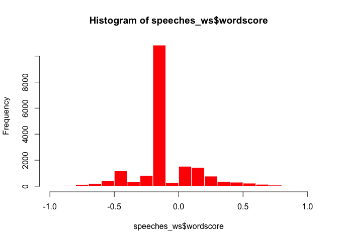
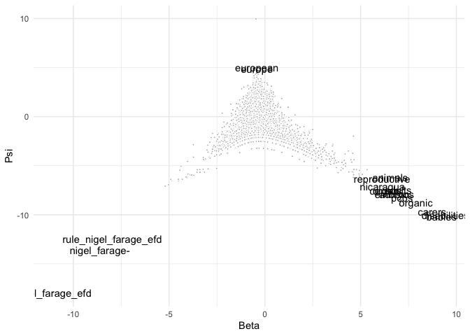
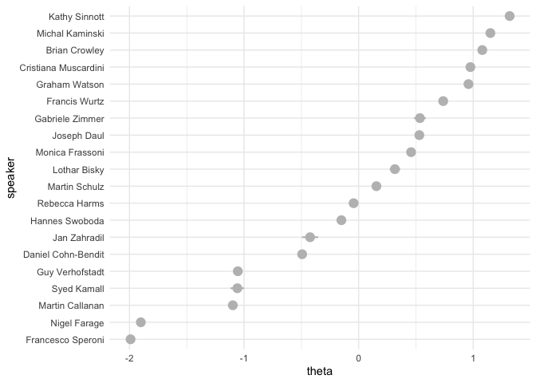
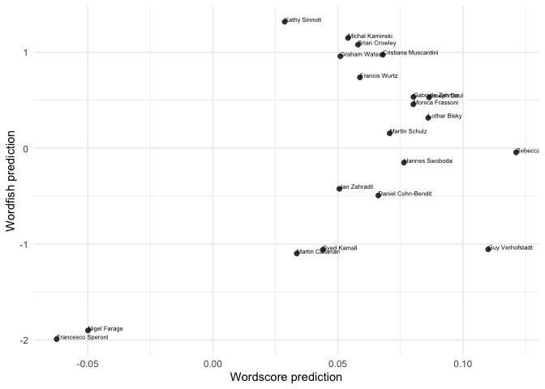
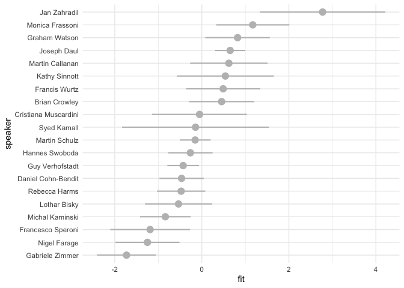

This document gives some examples of how to apply scaling methods
(Wordscores, Wordfish, LSS) in **quanteda**. For these examples, we use
the (English) speeches of EP group leaders that are part of the
[EUSpeech](https://dataverse.harvard.edu/dataverse/euspeech) dataset.
The **quanteda**, **quanteda.textmodels**, **quanteda.textstats**,
**quanteda.textplots**, **ggplot2** and **tidyverse** packages are
familiar at this point. The **quanteda.corpora** package can be
downloaded as follows:
`devtools::install_github("quanteda/quanteda.corpora")`. The **LSX**
package can be downloaded using `install.packages("LSX")`

``` r
#load libraries
library(quanteda)
library(quanteda.textmodels)
library(quanteda.textplots)
library(quanteda.corpora)
library(quanteda.textstats)
library(ggplot2)
library(tidyverse)
library(LSX)

#read in the EP speeches
speeches <- read.csv(file = "speeches_ep.csv", 
                     header = TRUE, 
                     stringsAsFactors = FALSE, 
                     sep = ",", 
                     encoding = "UTF-8")

#take a look at how many unique speakers there are in the dataset
unique(speeches$speaker)
```

    ##  [1] "Lothar Bisky"         "Martin Callanan"      "Daniel Cohn-Bendit"   "Brian Crowley"        "Joseph Daul"          "Nigel Farage"         "Monica Frassoni"      "Rebecca Harms"       
    ##  [9] "Syed Kamall"          "Michal Kaminski"      "Cristiana Muscardini" "Martin Schulz"        "Kathy Sinnott"        "Francesco Speroni"    "Hannes Swoboda"       "Guy Verhofstadt"     
    ## [17] "Graham Watson"        "Francis Wurtz"        "Jan Zahradil"         "Gabriele Zimmer"

Let’s first merge the speeches for each speaker using some tidyverse
data-wrangling.

``` r
#the `%>%` command is the pipe function and helps us with a chain of functions
#think of it as `then`:
#take the speeches dataframe, then
#group by speaker, then
#paste speeches together.

speeches <- speeches %>%
  group_by(speaker) %>%
  summarise(text = paste(text, collapse = " ")) %>%
  ungroup()

#confirm that you have a total of 20 (very long) concatenated speeches, 1 for each EP speaker
dim(speeches)
```

    ## [1] 20  2

Let’s first tokenise this corpus.

``` r
#create a corpus object
corpus_speeches <- corpus(speeches)

#tokenise the corpus

tokens_speeches <- tokens(corpus_speeches,
                          what = "word",
                          remove_punct = TRUE, 
                          remove_symbols = TRUE, 
                          remove_numbers = TRUE,
                          remove_url = TRUE,
                          remove_separators = TRUE,
                          split_hyphens = FALSE,
                          ) %>%
  tokens_remove(stopwords(source = "smart"), padding = TRUE)
```

MEP speeches are full of jargon and references to politicians. Let’s
append bigram collocations to our tokens object to account for this.

``` r
collocations <- tokens_speeches %>%
  tokens_sample(size = 10, replace = FALSE) %>%
  textstat_collocations(min_count = 20,
                        size = 2:3) %>%
  arrange(-lambda)

head(collocations, 20)
```

    ##                  collocation count count_nested length   lambda         z
    ## 171            michał tomasz   259          259      2 20.04087 10.015610
    ## 163          tomasz kamiński   259          259      2 18.94226 11.591340
    ## 165               van rompuy   157          156      2 16.59729 11.421679
    ## 86              kamiński ECR   257          257      2 14.19535 24.695372
    ## 155                 red tape    23            7      2 14.14308 14.982883
    ## 173             21st century    24            6      2 13.44709  9.346820
    ## 100          baroness ashton    59           27      2 12.93725 23.481669
    ## 175            nigel farage-    24           24      2 12.86896  8.972595
    ## 177              tax evasion    29           10      2 11.97773  8.387239
    ## 57                farage EFD    57           57      2 11.87882 29.095397
    ## 104 medium-sized enterprises    24            3      2 11.75431 23.315809
    ## 178    financial transaction    47           47      2 11.65910  8.196100
    ## 125     progressive alliance    29            0      2 11.49529 21.461543
    ## 158          transaction tax    46           46      2 11.43310 13.721238
    ## 45              nigel farage    61           61      2 11.34237 31.947909
    ## 87             death penalty    28            1      2 11.15408 24.565908
    ## 159           global warming    20            8      2 10.87077 12.781585
    ## 16            prime minister   222          152      2 10.82725 44.966012
    ## 33               middle east    66           16      2 10.74402 35.360437
    ## 76           rating agencies    24           15      2 10.70299 26.442222

If we want to add the most surprising collocations to our tokens object
we can do so using `tokens_compund`:

``` r
collocations <- collocations %>%
  filter(lambda > 5) %>%
  pull(collocation) %>%
  phrase()

tokens_speeches <- tokens_compound(tokens_speeches, collocations)
```

Create a dfm, and change the document names to the speaker names

``` r
dfm_speeches <- dfm(tokens_speeches)
docnames(dfm_speeches) <- docvars(dfm_speeches, "speaker")
```

## Wordscores

Let’s see if we can use Wordscores to locate these speakers on a
pro-anti EU dimension. We’ll first need to determine reference texts to
anchor this dimension. On the anti-EU side we’ll locate Francesco
Speroni and Nigel Farage, and on the pro-EU dimension we’ll locate Guy
Verhofstadt, leader of the liberal ALDE group, and a pro-EU voice, as
well as Rebecca Harms, the leader of the Greens:

``` r
#append an empty reference_score variable to the speeches_dfm docvars
docvars(dfm_speeches, "reference_score") <- NA

#locate which rows correspond with Guy Verhofstadt and Rebecca Harms (pro_eu) and Francesco Speroni and Nigel Farage (anti_eu)
pro_eu <- which(docvars(dfm_speeches) == "Guy Verhofstadt" | docvars(dfm_speeches) == "Rebecca Harms")
anti_eu <- which(docvars(dfm_speeches) == "Francesco Speroni" |
                 docvars(dfm_speeches) == "Nigel Farage" )

#assign reference scores to Guy Verhofstadt and Rebecca Harms (1) and Francesco Speroni and Nigel Farage (-1)
docvars(dfm_speeches, "reference_score")[pro_eu] <- 1
docvars(dfm_speeches, "reference_score")[anti_eu] <- -1

#inspects the reference.score variable:
docvars(dfm_speeches, "reference_score")
```

    ##  [1] NA NA NA -1 NA NA NA  1 NA NA NA NA NA NA NA NA NA -1  1 NA

``` r
#implement wordscores as per Laver, Benoit, Garry (2003)
speeches_ws <- textmodel_wordscores(dfm_speeches, 
                                    y = docvars(dfm_speeches, "reference_score"), 
                                    scale = c("linear"), 
                                    smooth = 1)
summary(speeches_ws, 10)
```

    ## 
    ## Call:
    ## textmodel_wordscores.dfm(x = dfm_speeches, y = docvars(dfm_speeches, 
    ##     "reference_score"), scale = c("linear"), smooth = 1)
    ## 
    ## Reference Document Statistics:
    ##                      score  total min   max   mean median
    ## Brian Crowley           NA  31975   0 19692 1.6758      0
    ## Cristiana Muscardini    NA  17315   0 10020 0.9075      0
    ## Daniel Cohn-Bendit      NA  44159   0 28977 2.3144      0
    ## Francesco Speroni       -1  35323   0 22696 1.8513      0
    ## Francis Wurtz           NA  23960   0 14093 1.2558      0
    ## Gabriele Zimmer         NA  12061   0  7486 0.6321      0
    ## Graham Watson           NA  33897   0 19170 1.7766      0
    ## Guy Verhofstadt          1 100689   0 65971 5.2772      0
    ## Hannes Swoboda          NA  77132   0 50473 4.0426      0
    ## Jan Zahradil            NA  12516   0  8069 0.6560      0
    ## Joseph Daul             NA  85180   0 51802 4.4644      0
    ## Kathy Sinnott           NA  29806   0 17591 1.5622      0
    ## Lothar Bisky            NA  19744   0 11716 1.0348      0
    ## Martin Callanan         NA  33897   0 21182 1.7766      0
    ## Martin Schulz           NA 126039   0 80213 6.6058      0
    ## Michal Kaminski         NA  41059   0 23806 2.1519      0
    ## Monica Frassoni         NA  24312   0 15369 1.2742      0
    ## Nigel Farage            -1  54792   0 35369 2.8717      0
    ## Rebecca Harms            1  41807   0 26841 2.1911      0
    ## Syed Kamall             NA  14284   0  8983 0.7486      0
    ## 
    ## Wordscores:
    ## (showing first 10 elements)
    ##                            mr_president president-in-office             council           president          commission     council_meeting               place               month 
    ##             0.05068            -0.02449             0.40435             0.87295            -0.05264             0.51597             0.42028            -0.33991            -0.32990 
    ##               focus 
    ##             0.74610

``` r
#sort most discriminant words:

#anti-EU words
head(sort(speeches_ws$wordscores), 10)
```

    ##       referendum     nation_state nigel_farage_efd             ukip              efd           anthem              gbp    nigel_farage-      referendums          frankly 
    ##       -0.9381890       -0.9330915       -0.9310340       -0.9307408       -0.9123677       -0.9095876       -0.9006492       -0.9004777       -0.9004503       -0.8960983

``` r
#pro-EU words
tail(sort(speeches_ws$wordscores), 10)
```

    ##        reforms  nuclear_power     copenhagen     discussion          japan        council     colleagues        finally           task responsibility 
    ##      0.8627946      0.8633894      0.8684764      0.8691435      0.8727115      0.8729466      0.8777859      0.8945814      0.8958752      0.9371099

``` r
#histogram of wordscores
hist(speeches_ws$wordscore, col = "red", border = 0)
```

<!-- -->

Let’s use the Wordscores model to predict the document scores of the
speeches of the remaining group leaders

``` r
speeches_wordscores_predict <- predict(speeches_ws,
                                       newdata = dfm_speeches, 
                                       se = TRUE)

#which speakers are most like Farage and Speroni
sort(speeches_wordscores_predict$fit, decreasing = FALSE)[1:5]
```

    ## Francesco Speroni      Nigel Farage     Kathy Sinnott   Martin Callanan       Syed Kamall 
    ##       -0.06243650       -0.04991176        0.02872044        0.03354073        0.04395952

``` r
#which speakers are most like Verhofstadt and Harms
sort(speeches_wordscores_predict$fit, decreasing = TRUE)[1:5]
```

    ##   Rebecca Harms Guy Verhofstadt     Joseph Daul    Lothar Bisky Gabriele Zimmer 
    ##      0.12122607      0.11007488      0.08644779      0.08609039      0.08019634

Visualize the document scores in a plot:

``` r
textplot_scale1d(speeches_wordscores_predict)
```

<!-- -->

## Wordfish

Estimate a Wordfish model and inspect its output. Using the argument
`dir=c(4,8)` set the direction of the dimension so that the document
score for Francesco Speroni (speaker 4) is smaller than the document
score for Guy Verhofdstadt (speaker 8)

``` r
speeches_wf <- textmodel_wordfish(dfm_speeches,
                                  dir = c(4,8))
summary(speeches_wf)
```

    ## 
    ## Call:
    ## textmodel_wordfish.dfm(x = dfm_speeches, dir = c(4, 8))
    ## 
    ## Estimated Document Positions:
    ##                         theta       se
    ## Brian Crowley         1.07939 0.009206
    ## Cristiana Muscardini  0.97545 0.014382
    ## Daniel Cohn-Bendit   -0.49302 0.019191
    ## Francesco Speroni    -1.99061 0.008169
    ## Francis Wurtz         0.73804 0.015759
    ## Gabriele Zimmer       0.53482 0.026123
    ## Graham Watson         0.95852 0.010496
    ## Guy Verhofstadt      -1.05445 0.011518
    ## Hannes Swoboda       -0.15042 0.013956
    ## Jan Zahradil         -0.42366 0.035944
    ## Joseph Daul           0.52987 0.009867
    ## Kathy Sinnott         1.31785 0.006332
    ## Lothar Bisky          0.31655 0.023297
    ## Martin Callanan      -1.09791 0.019508
    ## Martin Schulz         0.15520 0.009933
    ## Michal Kaminski       1.14985 0.007301
    ## Monica Frassoni       0.45776 0.019367
    ## Nigel Farage         -1.90083 0.007717
    ## Rebecca Harms        -0.04393 0.018459
    ## Syed Kamall          -1.05845 0.030522
    ## 
    ## Estimated Feature Scores:
    ##              mr_president president-in-office council president commission council_meeting   place   month   focus economic affairs european_union proposals created  return economy previous
    ## beta -0.4636      -0.4976              0.5212 -0.3724   -0.5102    -0.4834         -0.3910 -0.3902 -0.6995 0.04877  -0.4246 -0.2849        -0.4158   -0.3616 -0.3284 -0.3434  -0.258  -0.2817
    ## psi   9.9712       4.2268              2.0836  4.2392    3.8275     4.3089          0.8239  2.9012  0.9778 1.65546   3.7304  1.8087         4.1719    2.3701  1.3382  1.6436   2.616   1.1793
    ##        state implemented immediately restart   today    speak  future  europe  people   claim     care situation
    ## beta -0.4385     -0.2444     -0.4596 -0.2157 -0.5598 -0.01446 -0.1799 -0.4165 -0.6101 -0.3933 -0.09753   -0.2563
    ## psi   3.3512      1.0745      1.2842 -1.2714  3.8917  2.22051  3.3096  4.8973  4.4404  0.6308  1.17760    3.2093

Let’s take out the word level parameters beta and psi

``` r
wordfish_word_data <- data.frame(beta = speeches_wf$beta,
                            psi = speeches_wf$psi,
                            features = speeches_wf$features)

dim(wordfish_word_data)
```

    ## [1] 19080     3

``` r
head(wordfish_word_data)
```

    ##         beta      psi            features
    ## 1 -0.4635933 9.971233                    
    ## 2 -0.4975803 4.226843        mr_president
    ## 3  0.5211689 2.083625 president-in-office
    ## 4 -0.3724055 4.239236             council
    ## 5 -0.5101596 3.827485           president
    ## 6 -0.4834188 4.308858          commission

``` r
word_plot <- ggplot(data = wordfish_word_data, aes(x = beta, y = psi)) +
    geom_point(pch = 21, fill = "gray", color = "white", size = 0.75) +
  labs(x = "Beta", y = "Psi") + guides(size = "none", color = guide_legend("")) + 
  theme_minimal() +
  geom_text(data=subset(wordfish_word_data, beta > 6 | beta < -6 | psi > 4.5),  
            aes(x = beta, y = psi, label = features))

print(word_plot)
```

<!-- -->

Plot the document positions generated by Wordfish:

``` r
#generate a dataframe with document level alpha beta and omega
wordfish_document_data <- data.frame(alpha = speeches_wf$alpha,
                                     theta = speeches_wf$theta,
                                     se = speeches_wf$se.theta,
                                     speaker = speeches_wf$docs)

#order the speaker factor by theta
wordfish_document_data$speaker <- reorder(wordfish_document_data$speaker, 
                                           wordfish_document_data$theta)


#plot wordfish results using ggplot2
wordfish_plot <- ggplot(wordfish_document_data, 
                        aes(x= speaker, 
                            y = theta,
                            ymin = theta -1.96*se,
                            ymax = theta + 1.96*se)) +
  geom_pointrange(pch = 21, fill = "gray", color = "gray", size = 0.75) +
  theme_minimal() + coord_flip()
print(wordfish_plot)
```

<!-- -->

Both Wordscores and Wordfish are scaling models and if they pick up on
the same dimension they should give us similar results. Let’s see if
this indeed the case.

``` r
scaling_data <- rbind(data.frame(speeches_wordscores_predict, wordfish_document_data))

scaling_plot <- ggplot(scaling_data, aes(x = fit, 
                                         y = theta, 
                                         label = speaker)) +
  geom_point(pch = 21, fill = "gray25", color = "white", size = 2.5) +
  scale_x_continuous(name = "Wordscore prediction") +
  scale_y_continuous(name = "Wordfish prediction") +
  theme_minimal() + geom_text(aes(label=speaker), 
                                        hjust=0, 
                                        vjust=0, 
                                        size = 2)
  
print(scaling_plot)
```

<!-- -->

``` r
correlation <- cor.test(x=scaling_data$fit, 
                        y=scaling_data$theta,
                        method = 'pearson')
print(correlation)
```

    ## 
    ##  Pearson's product-moment correlation
    ## 
    ## data:  scaling_data$fit and scaling_data$theta
    ## t = 2.5282, df = 18, p-value = 0.02104
    ## alternative hypothesis: true correlation is not equal to 0
    ## 95 percent confidence interval:
    ##  0.08970643 0.77815267
    ## sample estimates:
    ##       cor 
    ## 0.5119061

## Latent semantic scaling (LSS)

In order to apply LSS to the corpus we first need to transform the
corpus at the sentence level and create tokenize it

``` r
corpus_speeches_sent <- corpus_reshape(corpus_speeches, to =  "sentences")

tokens_speeches_sent <- tokens(corpus_speeches_sent,
                               what = "word",
                               remove_punct = TRUE, 
                               remove_symbols = TRUE, 
                               remove_numbers = TRUE,
                               remove_url = TRUE,
                               remove_separators = TRUE,
                               split_hyphens = FALSE,
                          ) %>%
  tokens_remove(stopwords(source = "smart"), padding = FALSE)

dfmat_speeches_sent <- tokens_speeches_sent %>% 
  dfm()

topfeatures(dfmat_speeches_sent, 20)
```

    ##   european         mr  president     europe      union     people commission parliament    council     states     crisis  countries     member       time      group         eu      today 
    ##       5686       5518       3495       3393       2515       2310       1880       1872       1789       1537       1409       1394       1379       1359       1325       1317       1257 
    ##   economic       make   applause 
    ##       1198       1174       1030

In this case we rely on the short list of sentiment words as a seed list

``` r
seed <- as.seedwords(data_dictionary_sentiment)
print(seed)
```

    ##        good        nice   excellent    positive   fortunate     correct    superior         bad       nasty        poor    negative unfortunate       wrong    inferior 
    ##           1           1           1           1           1           1           1          -1          -1          -1          -1          -1          -1          -1

Using the seed words, LSS computes polarity of words frequent in the
context of `member*` (which in this example should denote how positive
or negative words are around references of membership)

``` r
# identify context words 
member <- char_context(tokens_speeches_sent, pattern = "member", p = 0.05)

# run LSS model
tmod_lss <- textmodel_lss(dfmat_speeches_sent, seeds = seed,
                          terms = member, k = 300, cache = TRUE)
```

Most positive words that appear in the context of membership

``` r
head(coef(tmod_lss), 20)
```

    ##     eurozone  authorities  cooperation       treaty      matters        debts      efforts       fiscal coordination  institution       remain      calling     finances  responsible    budgetary 
    ##   0.14151591   0.08922524   0.07567853   0.07054489   0.05667283   0.04988397   0.04715189   0.04709963   0.04318136   0.03363462   0.03355033   0.03224830   0.03132627   0.02801387   0.02605932 
    ## ratification       public      parties         call     research 
    ##   0.01966671   0.01959890   0.01903235   0.01811252   0.01796307

Most negative words that appear in the context of membership

``` r
tail(coef(tmod_lss), 20)
```

    ##     national           eu        party      respect        level    guarantee        hands   competence        leave       fellow       scheme       number    austerity     spending      million 
    ## -0.006912693 -0.007535232 -0.007601462 -0.008582923 -0.008894367 -0.009549818 -0.009851739 -0.010309000 -0.011360525 -0.015417567 -0.016332625 -0.017963135 -0.020164473 -0.022913084 -0.025669113 
    ##      quickly     refugees      account      britain   individual 
    ## -0.034902343 -0.036621408 -0.042908138 -0.063590600 -0.065164828

To obtain document-level scores, we use the `dfm_group()` to re-assemble
the sentence-level dfm back at the document-level. We then use
`predict()` to make document level LSS predictions.

``` r
dfmat_doc <- dfm_group(dfmat_speeches_sent)
dat <- docvars(dfmat_doc)
dat$fit <- unlist(predict(tmod_lss, newdata = dfmat_doc, se = TRUE)[1])
dat$se <- unlist(predict(tmod_lss, newdata = dfmat_doc, se = TRUE)[2])
```

We then plot these predictions, ordering speakers from most positive to
most negative on membership.

``` r
dat$speaker <- with(dat, reorder(speaker, fit))


lss_plot <- ggplot(arrange(dat, fit), 
                        aes(x= speaker, 
                            y = fit,
                            ymin = fit -1.96*se,
                            ymax = fit + 1.96*se)) +
  geom_pointrange(pch = 21, fill = "gray", color = "gray", size = 0.75) +
  theme_minimal() + coord_flip()
print(lss_plot)
```

<!-- -->

## Exercises

For this set of exercises we will use `data_corpus_irishbudget2010` a
corpus that consists of 2010 budget speeches in Ireland. The dataset is
included in the quanteda package.

1.  Tokenize `data_corpus_irishbudget2010`, remove stopwords,
    punctuation characters, and create a dfm called `dfm_budget_debates`

2.  Create a variable `ref_score` that equals 1 if the speaker’s name is
    “Lenihan” (i.e., the Minister of Finance at the time) and -1 if the
    speaker’s name is “Kenny” (Enda Kenny was leader of the opposition
    at the time). For all other speakers, assign the value NA.

3.  Apply a Wordscores model for this document-feature matrix using
    `ref_score` as the value for `y`.

4.  Explore the scores for all words in the dfm using
    `textplot_scale1d()`. Note: set margin to “features”. Why are some
    terms clustered around -1 and +1?

5.  Use `predict()` for predicting the document-level word scores for
    all documents in the dfm. Set `se = TRUE` to add 95% confidence
    intervals.

6.  Apply `textplot_scale1d()` to the object created in question 5. Does
    this method distinguish between government (FF and Green) and
    oppoisiton parties?

7.  Use the `dfm_budget_debates`. Create a new dfm object that only
    keeps terms that appear in at least three documents and that appear
    at least three times. Call the resulting dfm
    `dfm_budget_debates_trimmed`

8.  Run a Wordfish model on this dfm.

9.  Use `textplot_scale1d()` to plot (1) document-positions, and scores
    for each word. You can achieve this by adjusting the `margin`
    argument.
