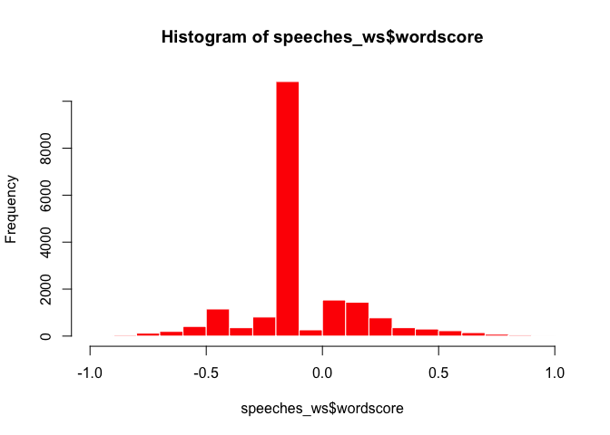
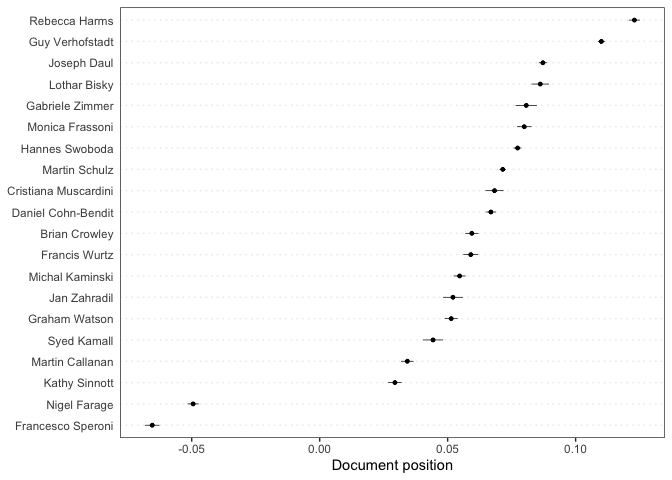
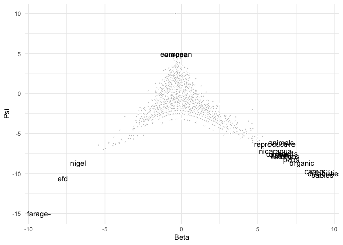
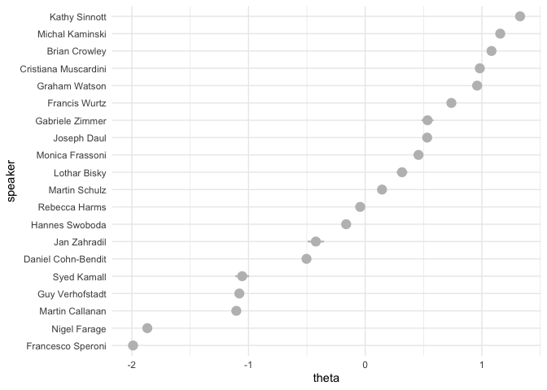
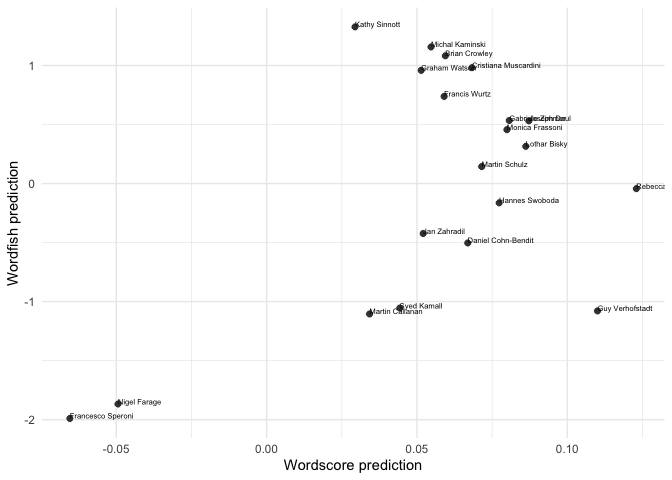
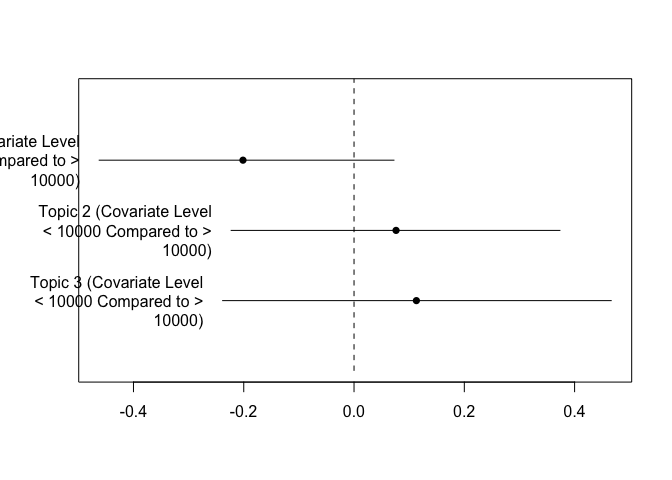
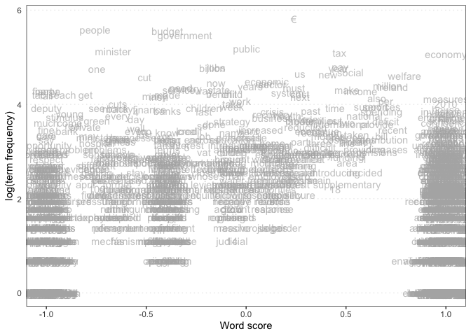
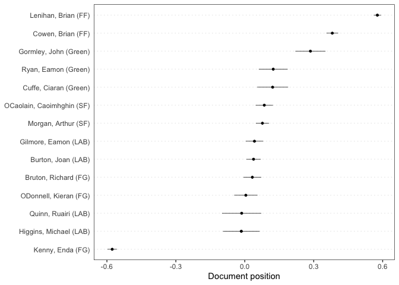
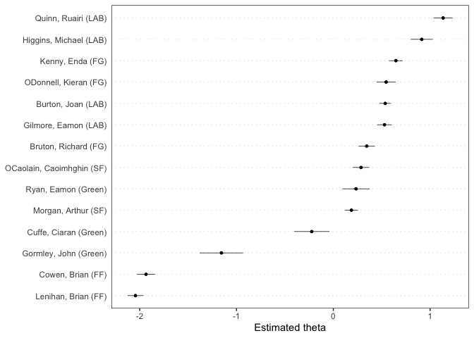
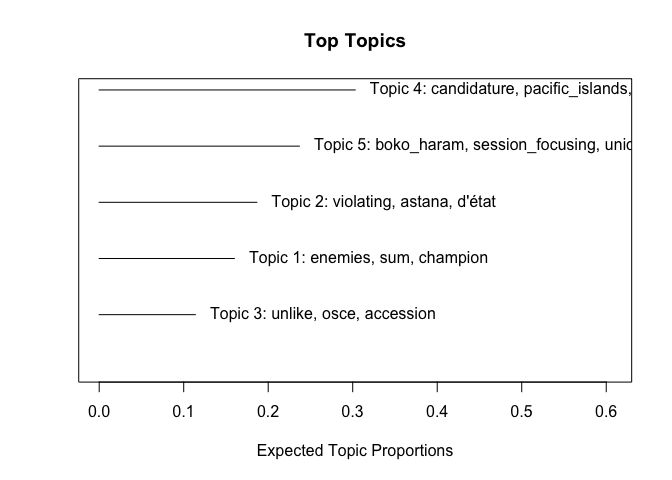

This document gives some examples of how to apply scaling methods
(Wordscores, Wordfish, LSS) in **quanteda**. For these examples, we use
the (English) speeches of EP group leaders that are part of the
[EUSpeech](https://dataverse.harvard.edu/dataverse/euspeech) dataset.
The **quanteda**, **quanteda.textmodels**, **quanteda.textstats**,
**quanteda.textplots**, **ggplot2** and **tidyverse** packages are
familiar at this point. The **quanteda.corpora** package can be
downloaded as follows:
`devtools::install_github("quanteda/quanteda.corpora")`. The **LSX**
package can be downloaded using `install.packages("LSX")`

``` r
#load libraries
library(quanteda)
library(quanteda.textmodels)
library(quanteda.textplots)
library(quanteda.corpora)
library(quanteda.textstats)
library(ggplot2)
library(tidyverse)
library(LSX)

#read in the EP speeches
speeches <- read.csv(file = "speeches_ep.csv", 
                     header = TRUE, 
                     stringsAsFactors = FALSE, 
                     sep = ",", 
                     encoding = "UTF-8")

#take a look at how many unique speakers there are in the dataset
unique(speeches$speaker)
```

    ##  [1] "Lothar Bisky"         "Martin Callanan"      "Daniel Cohn-Bendit"   "Brian Crowley"        "Joseph Daul"          "Nigel Farage"         "Monica Frassoni"      "Rebecca Harms"       
    ##  [9] "Syed Kamall"          "Michal Kaminski"      "Cristiana Muscardini" "Martin Schulz"        "Kathy Sinnott"        "Francesco Speroni"    "Hannes Swoboda"       "Guy Verhofstadt"     
    ## [17] "Graham Watson"        "Francis Wurtz"        "Jan Zahradil"         "Gabriele Zimmer"

Let’s first merge the speeches for each speaker using some tidyverse
data-wrangling.

``` r
#the `%>%` command is the pipe function and helps us with a chain of functions
#think of it as `then`:
#take the speeches dataframe, then
#group by speaker, then
#paste speeches together.

speeches <- speeches %>%
  group_by(speaker) %>%
  summarise(text = paste(text, collapse = " ")) %>%
  ungroup()

#confirm that you have a total of 20 (very long) concatenated speeches, 1 for each EP speaker
dim(speeches)
```

    ## [1] 20  2

Let’s first tokenise this corpus.

``` r
#create a corpus object
corpus_speeches <- corpus(speeches)

#tokenise the corpus

tokens_speeches <- tokens(corpus_speeches,
                          what = "word",
                          remove_punct = TRUE, 
                          remove_symbols = TRUE, 
                          remove_numbers = TRUE,
                          remove_url = TRUE,
                          remove_separators = TRUE,
                          split_hyphens = FALSE,
                          ) %>%
  tokens_remove(stopwords(source = "smart"), padding = TRUE)
```

MEP speeches are full of jargon and references to politicians. Let’s
append bigram collocations to our tokens object to account for this.

``` r
collocations <- tokens_speeches %>%
  tokens_sample(size = 10, replace = FALSE) %>%
  textstat_collocations(min_count = 20,
                        size = 2:3) %>%
  arrange(-lambda)

head(collocations, 20)
```

    ##                  collocation count count_nested length    lambda         z
    ## 193            michał tomasz   259          259      2 20.143528 10.066914
    ## 194          tomasz kamiński   259          259      2 20.143528 10.066914
    ## 189               van rompuy   124          122      2 16.190429 11.204425
    ## 138             kamiński ECR   257          257      2 14.351906 21.768949
    ## 176                 red tape    34            9      2 13.731672 15.651457
    ## 196             21st century    31            9      2 13.592452  9.481185
    ## 118          baroness ashton    51           19      2 12.437642 23.402443
    ## 110 medium-sized enterprises    23            3      2 11.662239 24.068901
    ## 185          transaction tax    39           39      2 11.653249 13.927480
    ## 22            prime minister   246          169      2 11.202235 44.232863
    ## 100            death penalty    32            1      2 11.124199 25.315642
    ## 168           united kingdom    48            7      2 10.800106 16.560679
    ## 187           global warming    20            7      2 10.786431 12.694256
    ## 47               middle east    47            9      2 10.617355 31.974479
    ## 76           rating agencies    25           16      2 10.549335 27.746651
    ## 157          redemption fund    34            8      2 10.459638 18.453936
    ## 89             latin america    23            5      2 10.380119 26.425173
    ## 27       christian democrats   106           99      2 10.109521 40.602462
    ## 21            speaker agreed   102            0      2  9.980578 44.294921
    ## 73             david cameron    28           12      2  9.929610 27.843252

If we want to add the most surprising collocations to our tokens object
we can do so using `tokens_compund`:

``` r
collocations <- collocations %>%
  filter(lambda > 5) %>%
  pull(collocation) %>%
  phrase()

tokens_speeches <- tokens_compound(tokens_speeches, collocations)
```

Create a dfm, and change the document names to the speaker names

``` r
dfm_speeches <- dfm(tokens_speeches)
docnames(dfm_speeches) <- docvars(dfm_speeches, "speaker")
```

## Wordscores

Let’s see if we can use Wordscores to locate these speakers on a
pro-anti EU dimension. We’ll first need to determine reference texts to
anchor this dimension. On the anti-EU side we’ll locate Francesco
Speroni and Nigel Farage, and on the pro-EU dimension we’ll locate Guy
Verhofstadt, leader of the liberal ALDE group, and a pro-EU voice, as
well as Rebecca Harms, the leader of the Greens:

``` r
#append an empty reference_score variable to the speeches_dfm docvars
docvars(dfm_speeches, "reference_score") <- NA

#locate which rows correspond with Guy Verhofstadt and Rebecca Harms (pro_eu) and Francesco Speroni and Nigel Farage (anti_eu)
pro_eu <- which(docvars(dfm_speeches) == "Guy Verhofstadt" | docvars(dfm_speeches) == "Rebecca Harms")
anti_eu <- which(docvars(dfm_speeches) == "Francesco Speroni" |
                 docvars(dfm_speeches) == "Nigel Farage" )

#assign reference scores to Guy Verhofstadt and Rebecca Harms (1) and Francesco Speroni and Nigel Farage (-1)
docvars(dfm_speeches, "reference_score")[pro_eu] <- 1
docvars(dfm_speeches, "reference_score")[anti_eu] <- -1

#inspects the reference.score variable:
docvars(dfm_speeches, "reference_score")
```

    ##  [1] NA NA NA -1 NA NA NA  1 NA NA NA NA NA NA NA NA NA -1  1 NA

``` r
#implement wordscores as per Laver, Benoit, Garry (2003)
speeches_ws <- textmodel_wordscores(dfm_speeches, 
                                    y = docvars(dfm_speeches, "reference_score"), 
                                    scale = c("linear"), 
                                    smooth = 1)
summary(speeches_ws, 10)
```

    ## 
    ## Call:
    ## textmodel_wordscores.dfm(x = dfm_speeches, y = docvars(dfm_speeches, 
    ##     "reference_score"), scale = c("linear"), smooth = 1)
    ## 
    ## Reference Document Statistics:
    ##                      score  total min   max   mean median
    ## Brian Crowley           NA  31991   0 19692 1.6756      0
    ## Cristiana Muscardini    NA  17298   0 10020 0.9060      0
    ## Daniel Cohn-Bendit      NA  44141   0 28977 2.3120      0
    ## Francesco Speroni       -1  35430   0 22696 1.8558      0
    ## Francis Wurtz           NA  23931   0 14093 1.2535      0
    ## Gabriele Zimmer         NA  12052   0  7486 0.6313      0
    ## Graham Watson           NA  33890   0 19170 1.7751      0
    ## Guy Verhofstadt          1 100366   0 65971 5.2570      0
    ## Hannes Swoboda          NA  77191   0 50473 4.0431      0
    ## Jan Zahradil            NA  12531   0  8069 0.6563      0
    ## Joseph Daul             NA  85157   0 51802 4.4603      0
    ## Kathy Sinnott           NA  29799   0 17591 1.5608      0
    ## Lothar Bisky            NA  19697   0 11716 1.0317      0
    ## Martin Callanan         NA  33855   0 21182 1.7733      0
    ## Martin Schulz           NA 126029   0 80213 6.6011      0
    ## Michal Kaminski         NA  41046   0 23806 2.1499      0
    ## Monica Frassoni         NA  24232   0 15369 1.2692      0
    ## Nigel Farage            -1  54713   0 35369 2.8658      0
    ## Rebecca Harms            1  41859   0 26841 2.1925      0
    ## Syed Kamall             NA  14274   0  8983 0.7476      0
    ## 
    ## Wordscores:
    ## (showing first 10 elements)
    ##                            mr_president president-in-office             council           president          commission             meeting               place               month 
    ##             0.05144            -0.02360             0.40441             0.86058            -0.05174             0.51679             0.65395            -0.33956            -0.32888 
    ##               focus 
    ##             0.74603

``` r
#sort most discriminant words:

#anti-EU words
head(sort(speeches_ws$wordscores), 10)
```

    ##          efd   referendum nation_state         ukip        nigel       anthem       farage          gbp  referendums      farage- 
    ##   -0.9692338   -0.9380671   -0.9330255   -0.9306039   -0.9293429   -0.9095285   -0.9046846   -0.9005593   -0.9003940   -0.9002621

``` r
#pro-EU words
tail(sort(speeches_ws$wordscores), 10)
```

    ##        council        reforms  nuclear_power     copenhagen     discussion          japan     colleagues        finally           task responsibility 
    ##      0.8605797      0.8631849      0.8633756      0.8685620      0.8693752      0.8727755      0.8780719      0.8948340      0.8960957      0.9371803

``` r
#histogram of wordscores
hist(speeches_ws$wordscore, col = "red", border = 0)
```

<!-- -->

Let’s use the Wordscores model to predict the document scores of the
speeches of the remaining group leaders

``` r
speeches_wordscores_predict <- predict(speeches_ws,
                                       newdata = dfm_speeches, 
                                       se = TRUE)

#which speakers are most like Farage and Speroni
sort(speeches_wordscores_predict$fit, decreasing = FALSE)[1:5]
```

    ## Francesco Speroni      Nigel Farage     Kathy Sinnott   Martin Callanan       Syed Kamall 
    ##       -0.06542605       -0.04943531        0.02939617        0.03424327        0.04428909

``` r
#which speakers are most like Verhofstadt and Harms
sort(speeches_wordscores_predict$fit, decreasing = TRUE)[1:5]
```

    ##   Rebecca Harms Guy Verhofstadt     Joseph Daul    Lothar Bisky Gabriele Zimmer 
    ##      0.12296067      0.11004505      0.08720288      0.08618760      0.08070439

Visualize the document scores in a plot:

``` r
textplot_scale1d(speeches_wordscores_predict)
```

<!-- -->

## Wordfish

Estimate a Wordfish model and inspect its output. Using the argument
`dir=c(4,8)` set the direction of the dimension so that the document
score for Francesco Speroni (speaker 4) is smaller than the document
score for Guy Verhofdstadt (speaker 8)

``` r
speeches_wf <- textmodel_wordfish(dfm_speeches,
                                  dir = c(4,8))
summary(speeches_wf)
```

    ## 
    ## Call:
    ## textmodel_wordfish.dfm(x = dfm_speeches, dir = c(4, 8))
    ## 
    ## Estimated Document Positions:
    ##                         theta       se
    ## Brian Crowley         1.08240 0.009345
    ## Cristiana Muscardini  0.98198 0.014514
    ## Daniel Cohn-Bendit   -0.50312 0.019160
    ## Francesco Speroni    -1.98968 0.007387
    ## Francis Wurtz         0.73837 0.015945
    ## Gabriele Zimmer       0.53412 0.026359
    ## Graham Watson         0.95917 0.010661
    ## Guy Verhofstadt      -1.07876 0.011294
    ## Hannes Swoboda       -0.16326 0.014004
    ## Jan Zahradil         -0.42314 0.035881
    ## Joseph Daul           0.53072 0.009942
    ## Kathy Sinnott         1.32728 0.006392
    ## Lothar Bisky          0.31551 0.023463
    ## Martin Callanan      -1.10461 0.019222
    ## Martin Schulz         0.14402 0.010015
    ## Michal Kaminski       1.15715 0.007378
    ## Monica Frassoni       0.45672 0.019549
    ## Nigel Farage         -1.86741 0.007391
    ## Rebecca Harms        -0.04302 0.018481
    ## Syed Kamall          -1.05443 0.030247
    ## 
    ## Estimated Feature Scores:
    ##              mr_president president-in-office council president commission meeting   place   month  focus economic affairs european_union proposals created  return economy previous   state
    ## beta -0.3939      -0.4275              0.5798 -0.3098   -0.4421    -0.4182 -0.3187 -0.3166 -0.6276 0.1177  -0.3547 -0.2192        -0.3454   -0.2972 -0.2639 -0.2725 -0.1872  -0.2085 -0.3511
    ## psi   9.9711       4.2267              2.0900  4.2713    3.8269     4.3079  2.1565  2.9017  0.9777 1.6569   3.7304  1.6374         4.1720    2.3700  1.3383  1.6439  2.6169   1.1798  3.3162
    ##      implemented immediately restart   today   speak future  europe  people   claim    care situation
    ## beta     -0.1811     -0.3977 -0.1536 -0.4923 0.05365 -0.111 -0.3503 -0.5369 -0.3190 -0.0177    -0.189
    ## psi       1.0753      1.2830 -1.2703  3.8908 2.22194  3.310  4.9077  4.4407  0.6313  1.1771     3.210

Let’s take out the word level parameters beta and psi

``` r
wordfish_word_data <- data.frame(beta = speeches_wf$beta,
                            psi = speeches_wf$psi,
                            features = speeches_wf$features)

dim(wordfish_word_data)
```

    ## [1] 19092     3

``` r
head(wordfish_word_data)
```

    ##         beta      psi            features
    ## 1 -0.3938543 9.971119                    
    ## 2 -0.4275325 4.226669        mr_president
    ## 3  0.5798396 2.089979 president-in-office
    ## 4 -0.3097681 4.271298             council
    ## 5 -0.4420618 3.826911           president
    ## 6 -0.4182134 4.307936          commission

``` r
word_plot <- ggplot(data = wordfish_word_data, aes(x = beta, y = psi)) +
    geom_point(pch = 21, fill = "gray", color = "white", size = 0.75) +
  labs(x = "Beta", y = "Psi") + guides(size = "none", color = guide_legend("")) + 
  theme_minimal() +
  geom_text(data=subset(wordfish_word_data, beta > 6 | beta < -6 | psi > 4.5),  
            aes(x = beta, y = psi, label = features))

print(word_plot)
```

<!-- -->

Plot the document positions generated by Wordfish:

``` r
#generate a dataframe with document level alpha beta and omega
wordfish_document_data <- data.frame(alpha = speeches_wf$alpha,
                                     theta = speeches_wf$theta,
                                     se = speeches_wf$se.theta,
                                     speaker = speeches_wf$docs)

#order the speaker factor by theta
wordfish_document_data$speaker <- reorder(wordfish_document_data$speaker, 
                                           wordfish_document_data$theta)


#plot wordfish results using ggplot2
wordfish_plot <- ggplot(wordfish_document_data, 
                        aes(x= speaker, 
                            y = theta,
                            ymin = theta -1.96*se,
                            ymax = theta + 1.96*se)) +
  geom_pointrange(pch = 21, fill = "gray", color = "gray", size = 0.75) +
  theme_minimal() + coord_flip()
print(wordfish_plot)
```

<!-- -->

Both Wordscores and Wordfish are scaling models and if they pick up on
the same dimension they should give us similar results. Let’s see if
this indeed the case.

``` r
scaling_data <- rbind(data.frame(speeches_wordscores_predict, wordfish_document_data))

scaling_plot <- ggplot(scaling_data, aes(x = fit, 
                                         y = theta, 
                                         label = speaker)) +
  geom_point(pch = 21, fill = "gray25", color = "white", size = 2.5) +
  scale_x_continuous(name = "Wordscore prediction") +
  scale_y_continuous(name = "Wordfish prediction") +
  theme_minimal() + geom_text(aes(label=speaker), 
                                        hjust=0, 
                                        vjust=0, 
                                        size = 2)
  
print(scaling_plot)
```

<!-- -->

``` r
correlation <- cor.test(x=scaling_data$fit, 
                        y=scaling_data$theta,
                        method = 'pearson')
print(correlation)
```

    ## 
    ##  Pearson's product-moment correlation
    ## 
    ## data:  scaling_data$fit and scaling_data$theta
    ## t = 2.5032, df = 18, p-value = 0.02216
    ## alternative hypothesis: true correlation is not equal to 0
    ## 95 percent confidence interval:
    ##  0.08468124 0.77614726
    ## sample estimates:
    ##       cor 
    ## 0.5081597

## Latent semantic scaling (LSS)

In order to apply LSS to the corpus we first need to transform the
corpus at the sentence level and create tokenize it

``` r
corpus_speeches_sent <- corpus_reshape(corpus_speeches, to =  "sentences")

tokens_speeches_sent <- tokens(corpus_speeches_sent,
                               what = "word",
                               remove_punct = TRUE, 
                               remove_symbols = TRUE, 
                               remove_numbers = TRUE,
                               remove_url = TRUE,
                               remove_separators = TRUE,
                               split_hyphens = FALSE,
                          ) %>%
  tokens_remove(stopwords(source = "smart"), padding = FALSE)

dfmat_speeches_sent <- tokens_speeches_sent %>% 
  dfm()

topfeatures(dfmat_speeches_sent, 20)
```

    ##   european         mr  president     europe      union     people commission parliament    council     states     crisis  countries     member       time      group         eu      today 
    ##       5686       5518       3495       3393       2515       2310       1880       1872       1789       1537       1409       1394       1379       1359       1325       1317       1257 
    ##   economic       make   applause 
    ##       1198       1174       1030

In this case we rely on the short list of sentiment words as a seed list

``` r
seed <- as.seedwords(data_dictionary_sentiment)
print(seed)
```

    ##        good        nice   excellent    positive   fortunate     correct    superior         bad       nasty        poor    negative unfortunate       wrong    inferior 
    ##           1           1           1           1           1           1           1          -1          -1          -1          -1          -1          -1          -1

Using the seed words, LSS computes polarity of words frequent in the
context of `member*` (which in this example should denote how positive
or negative words are around references of membership)

``` r
# identify context words 
member <- char_context(tokens_speeches_sent, pattern = "member", p = 0.05)

# run LSS model
tmod_lss <- textmodel_lss(dfmat_speeches_sent, seeds = seed,
                          terms = member, k = 300, cache = TRUE)
```

Most positive words that appear in the context of membership

``` r
head(coef(tmod_lss), 20)
```

    ##     eurozone  authorities  cooperation       treaty      matters        debts      efforts       fiscal coordination  institution       remain      calling     finances  responsible    budgetary 
    ##   0.14151591   0.08922524   0.07567853   0.07054489   0.05667283   0.04988397   0.04715189   0.04709963   0.04318136   0.03363462   0.03355033   0.03224830   0.03132627   0.02801387   0.02605932 
    ## ratification       public      parties         call     research 
    ##   0.01966671   0.01959890   0.01903235   0.01811252   0.01796307

Most negative words that appear in the context of membership

``` r
tail(coef(tmod_lss), 20)
```

    ##     national           eu        party      respect        level    guarantee        hands   competence        leave       fellow       scheme       number    austerity     spending      million 
    ## -0.006912693 -0.007535232 -0.007601462 -0.008582923 -0.008894367 -0.009549818 -0.009851739 -0.010309000 -0.011360525 -0.015417567 -0.016332625 -0.017963135 -0.020164473 -0.022913084 -0.025669113 
    ##      quickly     refugees      account      britain   individual 
    ## -0.034902343 -0.036621408 -0.042908138 -0.063590600 -0.065164828

To obtain document-level scores, we use the `dfm_group()` to re-assemble
the sentence-level dfm back at the document-level. We then use
`predict()` to make document level LSS predictions.

``` r
dfmat_doc <- dfm_group(dfmat_speeches_sent)
dat <- docvars(dfmat_doc)
dat$fit <- unlist(predict(tmod_lss, newdata = dfmat_doc, se = TRUE)[1])
dat$se <- unlist(predict(tmod_lss, newdata = dfmat_doc, se = TRUE)[2])
```

We then plot these predictions, ordering speakers from most positive to
most negative on membership.

``` r
dat$speaker <- with(dat, reorder(speaker, fit))


lss_plot <- ggplot(arrange(dat, fit), 
                        aes(x= speaker, 
                            y = fit,
                            ymin = fit -1.96*se,
                            ymax = fit + 1.96*se)) +
  geom_pointrange(pch = 21, fill = "gray", color = "gray", size = 0.75) +
  theme_minimal() + coord_flip()
print(lss_plot)
```

<!-- -->

## Exercises

For this set of exercises we will use `data_corpus_irishbudget2010` a
corpus that consists of 2010 budget speeches in Ireland. The dataset is
included in the quanteda package.

1.  Tokenize `data_corpus_irishbudget2010`, remove stopwords,
    punctuation characters, and create a dfm called `dfm_budget_debates`

``` r
dfm_budget_debates <- data_corpus_irishbudget2010 %>%
  tokens(remove_punct = TRUE) %>% 
  tokens_remove(pattern = stopwords("en")) %>% 
  dfm()
```

2.  Create a binary variable `ref_score` that equals 1 if the speaker’s
    name is “Lenihan” (i.e., the Minister of Finance at the time) and -1
    if the speaker’s name is “Kenny” (Enda Kenny was leader of the
    opposition at the time). For all other speakers, assign the value
    NA.

``` r
ref_score <- rep(NA, nrow(dfm_budget_debates))

government <- which(docvars(dfm_budget_debates, "name") == "Lenihan")
opposition <- which(docvars(dfm_budget_debates, "name") == "Kenny")

ref_score[government] = 1
ref_score[opposition] = -1
```

3.  Apply a Wordscores model for this document-feature matrix using
    `ref_score` as the value for `y`.

``` r
budget_debates_ws <- textmodel_wordscores(dfm_budget_debates, 
                                          y = ref_score)
```

4.  Explore the scores for all words in the dfm using
    `textplot_scale1d()`. Note: set margin to “features”. Why are some
    terms clustered around -1 and +1?

``` r
textplot_scale1d(budget_debates_ws, margin = "features")
```

<!-- -->

5.  Use `predict()` for predicting the document-level word scores for
    all documents in the dfm. Set `se = TRUE` to add 95% confidence
    intervals.

``` r
pred_ws <- predict(budget_debates_ws, 
                   newdata = dfm_budget_debates, 
                   se = TRUE)
```

    ## Warning: 2833 features in newdata not used in prediction.

6.  Apply `textplot_scale1d()` to the object created in question 5. Does
    this method distinguish between government (FF and Green) and
    oppoisiton parties?

``` r
textplot_scale1d(pred_ws)
```

<!-- -->

Use the `dfm_budget_debates`. Create a new dfm object that only keeps
terms that appear in at least three documents and that appear at least
three times. Call the resulting dfm `dfm_budget_debates_trimmed`

``` r
dfm_budget_debates_trimmed <- dfm_budget_debates %>% 
  dfm_trim(min_termfreq = 3, min_docfreq = 3)
```

Run a Wordfish model on this dfm.

``` r
tmod_wf <- textmodel_wordfish(dfm_budget_debates_trimmed)
```

Use `textplot_scale1d()` to plot (1) document-positions, and scores for
each word. You can achieve this by adjusting the `margin` argument.

``` r
textplot_scale1d(tmod_wf, margin = "documents")
```

<!-- -->

``` r
textplot_scale1d(tmod_wf, margin = "features")
```

<!-- -->
