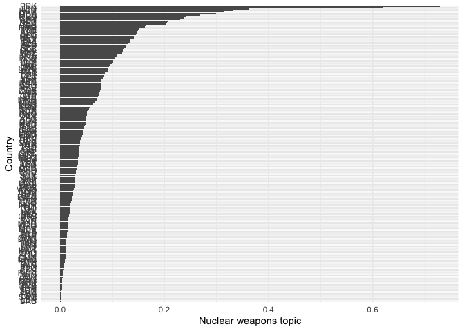
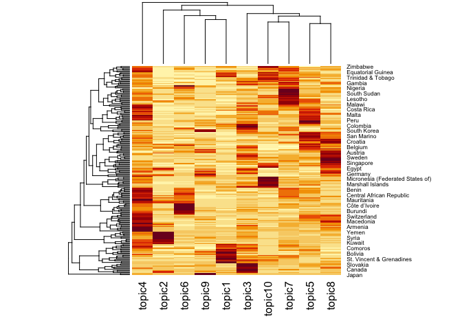

QTA Day 7: Topic models
================
16 July, 2024

This document gives some examples of how to estimate LDA, STM and
semisupervised topic models in `R`. For these examples, we will use the
corpus `data_corpus_ungd2017` which contains the speeches from the UN
General Assembly in 2017 and is available in **quanteda.corpora**.

Let’s load necessary libraries first. We will estimate LDA topic models
using the **seededlda** library and structural topic models using the
**stm** library.

``` r
#load libraries
library(quanteda)
library(quanteda.textmodels)
library(quanteda.textplots)
library(quanteda.corpora)
library(quanteda.textstats)
library(seededlda)
library(stm)
library(ggplot2)
library(tidyverse)

corpus_speeches <- data_corpus_ungd2017

summary(corpus_speeches, n = 10)
```

    ## Corpus consisting of 196 documents, showing 10 documents:
    ## 
    ##                  Text Types Tokens Sentences country_iso un_session year
    ##           Afghanistan   781   2063        86         AFG         72 2017
    ##                Angola   681   1939        59         AGO         72 2017
    ##               Albania   838   2277        88         ALB         72 2017
    ##               Andorra   888   2818        90         AND         72 2017
    ##  United Arab Emirates   758   2368        78         ARE         72 2017
    ##             Argentina   835   2454        90         ARG         72 2017
    ##               Armenia   684   1846        78         ARM         72 2017
    ##     Antigua & Barbuda   894   2585       103         ATG         72 2017
    ##             Australia   695   1849        92         AUS         72 2017
    ##               Austria   543   1461        75         AUT         72 2017
    ##               country continent          gdp gdp_per_capita
    ##           Afghanistan      Asia 1.954398e+10            550
    ##                Angola    Africa 1.221238e+11           4100
    ##               Albania    Europe 1.303854e+10           4538
    ##               Andorra    Europe 3.012914e+09          39147
    ##  United Arab Emirates      Asia 3.825751e+11          40699
    ##             Argentina  Americas 6.374303e+11          14398
    ##               Armenia      Asia 1.153659e+10           3937
    ##     Antigua & Barbuda  Americas 1.510085e+09          14803
    ##             Australia   Oceania 1.323421e+12          53800
    ##               Austria    Europe 4.165957e+11          47291

As you can see the corpus contains 196 speeches, one from each UN member
state. Let’s tokenise this corpus.

``` r
#tokenise the corpus

tokens_speeches <- tokens(corpus_speeches,
                          what = "word",
                          remove_punct = TRUE, 
                          remove_symbols = TRUE, 
                          remove_numbers = TRUE,
                          remove_url = TRUE,
                          remove_separators = TRUE,
                          split_hyphens = FALSE,
                          ) %>%
  tokens_remove(stopwords(source = "smart"), padding = TRUE)
```

Let’s append collocations that occur 10 times or more

``` r
collocations <- tokens_speeches %>%
  textstat_collocations(min_count = 10,
                        size = 2:3) %>%
  arrange(-lambda)

head(collocations, 50)
```

    ##                  collocation count count_nested length   lambda         z
    ## 504              addis ababa    21           17      2 17.34646  8.623235
    ## 505            côte d'ivoire    18           12      2 17.19618  8.540575
    ## 506              puerto rico    18           11      2 17.19618  8.540575
    ## 511             burkina faso    13           12      2 16.88111  8.363469
    ## 513         nagorno karabakh    12           10      2 16.80415  8.319293
    ## 489                 viet nam    17           14      2 16.04200  9.720082
    ## 494               boko haram    11            4      2 15.62216  9.414313
    ## 490             saudi arabia    13            4      2 15.27167  9.709122
    ## 491               inter alia    12           12      2 15.19471  9.648646
    ## 483               costa rica    22           16      2 15.19468 10.092471
    ## 427             pope francis    21           16      2 15.14923 12.896590
    ## 492    correspondent banking    11           11      2 15.11133  9.582271
    ## 485              el salvador    15            6      2 15.07334  9.832276
    ## 488               cabo verde    14           10      2 15.00665  9.779522
    ## 481             sierra leone    26           13      2 14.99057 10.126026
    ## 487               san marino    20           13      2 14.35437  9.780399
    ## 159            peter thomson    78           78      2 14.04622 21.757298
    ## 495              ban ki-moon    17           17      2 13.70659  9.410037
    ## 341         antónio guterres    81           81      2 13.16130 15.696760
    ## 500             donald trump    13           13      2 13.07439  8.982665
    ## 499         ethnic cleansing    15            7      2 13.04890  8.999767
    ## 502              saint kitts    12            7      2 12.87227  8.842339
    ## 234          legally binding    20           20      2 12.51968 18.618926
    ## 90           miroslav lajčák    61           61      2 12.47037 26.025375
    ## 390                lake chad    19           17      2 12.30000 14.104390
    ## 508               status quo    17            7      2 12.25010  8.509921
    ## 510       ezulwini consensus    15            3      2 12.17491  8.441242
    ## 514        high commissioner    21           19      2 11.92122  8.315350
    ## 515            arab emirates    16           16      2 11.89417  8.263461
    ## 331       russian federation    13            4      2 11.83764 16.130026
    ## 516          solomon islands    18           10      2 11.77980  8.201513
    ## 407                g-5 sahel    18           15      2 11.58659 13.444625
    ## 211     twenty-first century    32            5      2 11.28098 19.404126
    ## 517    seventy-first session    33            4      2 11.26844  7.903450
    ## 434 greenhouse-gas emissions    10            7      2 11.26842 12.677354
    ## 521           virgin islands    10            9      2 11.14471  7.684105
    ## 69            prime minister    47           29      2 11.12416 28.344312
    ## 135                 road map    36           20      2 11.01175 22.851742
    ## 438      secretary general's    13           12      2 11.00323 12.641959
    ## 417       two-state solution    38           11      2 10.95784 13.113272
    ## 56     territorial integrity    51           13      2 10.95368 30.237348
    ## 44          korean peninsula    78           14      2 10.86343 33.811222
    ## 442          north-east asia    15            2      2 10.81449 12.543598
    ## 350         non-state actors    14            6      2 10.81041 15.435989
    ## 149   seventy-second session   128           14      2 10.74385 22.205583
    ## 523             human beings    41           13      2 10.65028  7.483550
    ## 161       ballistic missiles    14            8      2 10.61215 21.739997
    ## 85            western sahara    33            9      2 10.54059 26.778138
    ## 41               middle east    86           28      2 10.51431 35.073343
    ## 166         domestic product    27           27      2 10.44959 21.529506

``` r
tokens_speeches <- tokens_compound(tokens_speeches, collocations)
```

Let’s include only those tokens that appear in the speeches of at least
5 countries and maximum 150 countries

``` r
dfm_speeches <- dfm(tokens_speeches) %>%
     dfm_trim(min_docfreq = 5, 
             max_docfreq = 150) 

#check the number of documents and features
dim(dfm_speeches)
```

    ## [1]  196 4535

## Estimating an LDA topic model

Let’s estimate a topic model with 10 topics. This may take a few
minutes, depending on your system. *k* refers to the number of topics to
be estimated; this is a parameter determined by the researcher. The
$\aplha$ parameter is a hyperparameter has an impact on the topic
distribution in each document (more on that in the exercises). In order
to make the results reproducible, we’ll use `set.seed()` function. We’ll
set the maximum number of iterations at 1000 to speed up estimation (the
argument defaults to 2000 iterations).

``` r
set.seed(123)

lda_10 <- textmodel_lda(dfm_speeches, 
                       k = 10,
                       alpha = 1,
                       max_iter = 1000)
```

Take a look at the output of the topic model with 10 topics. For
example, we can take a look at the 10 highest-loading terms for each of
*k* topics using the terms() function.

``` r
terms(lda_10, 10)
```

    ##       topic1          topic2                    topic3          
    ##  [1,] "united_states" "terrorism"               "nations"       
    ##  [2,] "caribbean"     "state"                   "future"        
    ##  [3,] "government"    "syria"                   "history"       
    ##  [4,] "mexico"        "israel"                  "make"          
    ##  [5,] "solidarity"    "iraq"                    "responsibility"
    ##  [6,] "peoples"       "region"                  "years"         
    ##  [7,] "cuba"          "iran"                    "live"          
    ##  [8,] "destruction"   "international_community" "great"         
    ##  [9,] "president"     "states"                  "war"           
    ## [10,] "venezuela"     "yemen"                   "citizens"      
    ##       topic4                    topic5                    topic6            
    ##  [1,] "regard"                  "human_rights"            "africa"          
    ##  [2,] "implementation"          "agenda"                  "security_council"
    ##  [3,] "dialogue"                "terrorism"               "african"         
    ##  [4,] "president"               "commitment"              "african_union"   
    ##  [5,] "cooperation"             "law"                     "organization"    
    ##  [6,] "national"                "rights"                  "force"           
    ##  [7,] "region"                  "nuclear_weapons"         "mali"            
    ##  [8,] "important"               "women"                   "fight"           
    ##  [9,] "states"                  "committed"               "terrorism"       
    ## [10,] "sustainable_development" "sustainable_development" "reform"          
    ##       topic7               topic8         topic9            
    ##  [1,] "government"         "global"       "nuclear"         
    ##  [2,] "decent_life"        "conflict"     "united_states"   
    ##  [3,] "cent"               "cooperation"  "korea"           
    ##  [4,] "sustainable_planet" "important"    "north_korea"     
    ##  [5,] "commitment"         "stability"    "military"        
    ##  [6,] "environment"        "reform"       "nuclear_weapons" 
    ##  [7,] "end"                "conflicts"    "threat"          
    ##  [8,] "poverty"            "strong"       "security_council"
    ##  [9,] "peaceful"           "organization" "president"       
    ## [10,] "economy"            "europe"       "sovereignty"     
    ##       topic10                  
    ##  [1,] "global"                 
    ##  [2,] "agenda"                 
    ##  [3,] "action"                 
    ##  [4,] "sustainable_development"
    ##  [5,] "focus"                  
    ##  [6,] "sustainable"            
    ##  [7,] "pacific"                
    ##  [8,] "resources"              
    ##  [9,] "including"              
    ## [10,] "threats"

In order to obtain the topic that loads highest on each document, we can
use the `topics` function. We can append this as a variable to our
`docvars`

``` r
head(topics(lda_10), 10)
```

    ##          Afghanistan               Angola              Albania 
    ##               topic3               topic4               topic8 
    ##              Andorra United Arab Emirates            Argentina 
    ##               topic5               topic2               topic4 
    ##              Armenia    Antigua & Barbuda            Australia 
    ##               topic4               topic1               topic8 
    ##              Austria 
    ##               topic8 
    ## 10 Levels: topic1 topic2 topic3 topic4 topic5 topic6 topic7 topic8 ... topic10

``` r
docvars(dfm_speeches, "topic") <- topics(lda_10)

# cross-table of the topic frequency
table(docvars(dfm_speeches, "topic"))
```

    ## 
    ##  topic1  topic2  topic3  topic4  topic5  topic6  topic7  topic8  topic9 topic10 
    ##      16      14      21      44      18      14      21      21       9      18

The topic proportions in each document are stored in an object called
theta ($\theta$)

``` r
head(lda_10$theta, 10)
```

    ##                           topic1      topic2      topic3      topic4
    ## Afghanistan          0.021875000 0.070312500 0.268750000 0.032812500
    ## Angola               0.088888889 0.034920635 0.001587302 0.300000000
    ## Albania              0.007204611 0.027377522 0.276657061 0.121037464
    ## Andorra              0.038318912 0.002472188 0.144622991 0.265760198
    ## United Arab Emirates 0.044389642 0.432799014 0.106041924 0.212083847
    ## Argentina            0.099496222 0.027707809 0.152392947 0.285894207
    ## Armenia              0.009140768 0.182815356 0.140767824 0.314442413
    ## Antigua & Barbuda    0.575360419 0.011795544 0.213630406 0.053735256
    ## Australia            0.001618123 0.053398058 0.186084142 0.008090615
    ## Austria              0.028571429 0.074725275 0.068131868 0.004395604
    ##                           topic5      topic6     topic7      topic8     topic9
    ## Afghanistan          0.076562500 0.067187500 0.10312500 0.267187500 0.05000000
    ## Angola               0.122222222 0.157142857 0.16984127 0.058730159 0.01111111
    ## Albania              0.061959654 0.008645533 0.09510086 0.328530259 0.01296830
    ## Andorra              0.297898640 0.007416564 0.06922126 0.069221261 0.03708282
    ## United Arab Emirates 0.004932182 0.019728730 0.03822441 0.107274969 0.01233046
    ## Argentina            0.229219144 0.018891688 0.06045340 0.061712846 0.01007557
    ## Armenia              0.071297989 0.042047532 0.09323583 0.074954296 0.05850091
    ## Antigua & Barbuda    0.002621232 0.009174312 0.06684142 0.003931848 0.01441678
    ## Australia            0.098705502 0.006472492 0.10194175 0.373786408 0.10194175
    ## Austria              0.134065934 0.127472527 0.02857143 0.283516484 0.23076923
    ##                         topic10
    ## Afghanistan          0.04218750
    ## Angola               0.05555556
    ## Albania              0.06051873
    ## Andorra              0.06798517
    ## United Arab Emirates 0.02219482
    ## Argentina            0.05415617
    ## Armenia              0.01279707
    ## Antigua & Barbuda    0.04849279
    ## Australia            0.06796117
    ## Austria              0.01978022

Let’s confirm that column sums of $\theta$ add up to one.

``` r
head(rowSums(lda_10$theta), 10)
```

    ##          Afghanistan               Angola              Albania 
    ##                    1                    1                    1 
    ##              Andorra United Arab Emirates            Argentina 
    ##                    1                    1                    1 
    ##              Armenia    Antigua & Barbuda            Australia 
    ##                    1                    1                    1 
    ##              Austria 
    ##                    1

## Visualizing a LDA topic model

Let’s say we are interested in topic 9 which deals (in my case) with
nuclear weapons, treaties, North Korea, etc. We can store the document
proportions for this topic in the docvars of our dfm, and call it
\`nuclear_weapons_topic’

``` r
docvars(dfm_speeches, 'nuclear_weapons_topic') <- lda_10$theta[, 9]
```

Let’s plot the nuclear weapons topic

``` r
topic_plot <- ggplot(docvars(dfm_speeches), aes(y = reorder(country_iso, nuclear_weapons_topic), 
                               x = nuclear_weapons_topic)) + 
  geom_bar(stat = "identity") + theme_minimal() + scale_x_continuous("Nuclear weapons topic") +
  scale_y_discrete("Country") 

print(topic_plot)
```

<!-- -->

Take a look at topic proportions for each country

``` r
#append the topic proportions

topic_probabilities <- lda_10$theta
rownames(topic_probabilities) <- rownames(dfm_speeches)

heatmap(as.matrix(topic_probabilities[]))
```

<!-- -->

In a heatmap, darker colors correspond with higher proportions, whereas
lighter colors denote lower proportions. In addition, it displays a
clustering of countries and topics?

## Estimating a Structural topic model

Structural topic models allow us to model topical content and topical
prevalence as a function of metadata. We can estimate an stm using the
`stm()` function in the **stm** library. Let’s first estimate an stm
without any metadata and 3 topics (NB: estimating an **stm** is a bit
slow, hence the small number of topics). init.type = “Spectral” is a
good starting point for large datasets, and leads to more reliable
results.

``` r
stm_3 <- stm(dfm_speeches, 
              data = docvars(dfm_speeches),
              seed = 123,
              K = 3,
              verbose = FALSE,
             init.type = "Spectral")
```

We can inspect the estimated topics using the `labelTopics()` function
in the **stm** library. FREX prioritizes words that are both frequent in
a specific topic and relatively unique to that topic; lift refers to the
relative frequency of a term in a topic compared to its overall
frequency in the corpus.

``` r
labelTopics(stm_3)
```

    ## Topic 1 Top Words:
    ##       Highest Prob: nations, united_states, government, global, years, make, caribbean 
    ##       FREX: canada, barbuda, caribbean, venezuela, haiti, indigenous_peoples, colombia 
    ##       Lift: caicos, turks, barbuda, lose, antigua, hemisphere, saint 
    ##       Score: lose, canada, barbuda, indigenous_peoples, saint, antigua, bahamas 
    ## Topic 2 Top Words:
    ##       Highest Prob: terrorism, state, region, states, syria, international_community, stability 
    ##       FREX: arab, iran, azerbaijan, ukraine, israel, da'esh, occupation 
    ##       Lift: coup, d'état, sectarian, turkish, violating, yemeni_people, azerbaijan 
    ##       Score: azerbaijan, kuwait, arab, iran, turkish, occupied, israeli 
    ## Topic 3 Top Words:
    ##       Highest Prob: agenda, sustainable_development, global, government, commitment, human_rights, implementation 
    ##       FREX: sustainable_development, agenda, african_union, implementation, south_sudan, africa, sids 
    ##       Lift: adjust, complemented, leverage, samoa, indonesia, achieving_sustainable_development, expedite 
    ##       Score: indonesia, sids, samoa, asean, pacific, agenda, kenya

We can also plot this model using `plot()`

``` r
plot(stm_3)
```

<!-- -->

`findThoughts()` returns the topic documents associated with a topic

``` r
findThoughts(stm_3,texts = as.character(corpus_speeches), n = 1, topics = c(1))
```

    ## 
    ##  Topic 1: 
    ##       On 6 September, my small, two-island State, Antigua and Barbuda, was the victim of the ferocity of Hurricane Irma, the largest storm endured in the Atlantic in human history. The island of Barbuda was decimated, its entire population left homeless and its buildings reduced to empty shells.
    ## Fortunately, Antigua and Barbuda was spared the full blast of Hurricane Maria just nine days later, although sustained winds of up to 60 miles per hour gave us a troubling awareness of the agony visited on the nearby islands of Dominica, Guadeloupe and Puerto Rico. Antigua and Barbuda continued to stay resilient. Having witnessed the devastation of Barbuda and the desolation of its inhabitants after the ravages of Irma, my heart bleeds for the people of the countries that have now been brutalized by Maria, and those that will suffer its cruelty in the coming days.
    ## I have come to the General Assembly because I consider it to be important to speak to the world's representatives and to do so collectively in order to share the experience of my country, as well as the huge challenges faced by the Caribbean islands in general. Barbuda and its inhabitants were among the worst affected by Hurricane Irma in the region. Barbuda has a surface of 62 square miles. When Irma thundered over the island, it was 375 miles wide, with gale force winds of 220 miles per hour. Barbuda did not stand the faintest chance against such size, such ferocity and such intensity. The island was completely destroyed, and my Government was compelled to evacuate all of the inhabitants to Antigua.
    ## For the first time in over 300 years, there are now no permanent residents on Barbuda. The footprints of an entire civilization have been erased by the brutality and magnitude of Irma. Everything that meant anything to the inhabitants had to be left behind - their homes, their possessions, their history, indeed, everything that defines them as a society and as a people. Mercifully, Antigua, the larger of the two islands, suffered no major damage, and it could begin to function normally within 48 hours.
    ## Had that not been the case, how we would have coped is simply beyond imagination. Overnight, Antigua's population increased by almost 3 per cent. I know of no country that could easily cope with such an unplanned, unexpected and unscheduled increase in its population.
    ## In addition to providing shelter, accommodation and basic necessities to the evacuated residents of Barbuda, the social services on Antigua are now under great strain. They struggle to provide school places for an additional 600 students, medical services for the elderly and a means of earning an income for the able-bodied. Naturally, the residents of Barbuda are anxious to return to their homeland. But, as I speak to the Assembly, the island remains unfit for human habitation. There is no electricity or potable water, and 95 per cent of the buildings have been destroyed or severely damaged.
    ## Preliminary estimates have placed the cost of rebuilding Barbuda at about $250 million. That figure represents 15 per cent or more of my country's gross domestic product of approximately $1.5 billion. It is simply a stretch beyond our reach.
    ## The President took the Chair.
    ## Antigua and Barbuda urgently requires the assistance of the international community, including the international development and finance institutions, to accomplish the vital task of rebuilding Barbuda. And I should say that we have not outstretched the palm of our hand because we simply crave; we plead because we need.
    ## Barbuda is not only a natural disaster; it is a humanitarian crisis that now consumes Antigua. Even as my Government and people look forward to the assistance of the better-off nations of the world, I thank those nations and persons who were first responders, particularly the Government and the people of the Bolivarian Republic of Venezuela, who went beyond the call of duty to assist. I also acknowledge the commitment of and contributions from the Government and the people of the People's Republic of China, the Governments of Cuba, the United Arab Emirates, Qatar, Canada, the Dominican Republic and sister States of the Caribbean Community, who gave generously from the little they have. That includes Dominica, which, in one wretched night, lost a significant number of precious lives and years of hard-earned development under the unrelenting battering of Hurricane Maria.
    ## On Antigua, Barbudans are being cared for as best we can with our very limited resources. But as the period of care lengthens, not only do the conditions worsen but the cost also increases, forcing my Government to borrow money on commercial terms at high interest rates and swelling our already burdensome national debt.
    ## The present international financial architecture is leaving small States such as mine behind. Whatever position on climate change a nation may take, the evidence of global warming is now irrefutably stronger. Two Category 5 hurricanes within 12 days, which unrelentingly pounded so many countries, can no longer be dismissed as vagaries of the weather, nor can they be explained as Nature's doing. Hurricanes are stronger and bigger because they are absorbing moisture from seas that are increasingly warmer as a result of global warming.
    ## And that is a man-made phenomenon, attributable to those nations that consume 80 per cent or more of the world's primary energy, emitting dangerous levels of pollution into the atmosphere. All 14 Caribbean Community countries together produce less than 0.1 per cent of global emissions. We are the least of the polluters but the largest of the casualties. The unfairness, injustice and inequality of the situation are painfully obvious.
    ## If such frequent and brutal storms are to be withstood, Caribbean islands and certain parts of the United States need to construct more resilient buildings and infrastructure than now exists. That means that the international development and financial institutions need to provide financing at concessionary rates without artificial impediments. If that does not happen, the subsequent cost in lives and property is too frightening to contemplate.
    ## Increasingly, States such as mine are victims of an international economic and financial system that regards us merely as a numerical statistic or a mere nuisance. We are measured by the level of our income, even though it is an insufficient and unreasonable criterion for establishing vulnerability, poverty and need. Like many other small island States, my developing country is categorized as high-income, thus denying it access to concessional financing and grant funding from international financial institutions and donor Governments.
    ## It is patently obvious that the per-capita income criterion is a skewed and flawed determinant. It should be eliminated and eliminated immediately. Because we are small economies with inadequate domestic capital formation, our countries open our doors to foreign investment, granting significant tax concessions so as to attract investments and help provide jobs to curb poverty. The consequence is that a small percentage of persons in our community, mostly expatriates, at the top end of businesses earn the largest percentage of high incomes and the mass of the population earns considerably less. In addition, Government tax revenues are significantly reduced owing to the investment concessions granted. It is time that those who control the levers of power in the economic and financial international community acknowledged that the per-capita system of measurement is discriminatory and resolved to change it. It is time that that particular swamp be drained, and now is the time for action.
    ## In the United States, where the United Nations is located and the Assembly is gathered today, one of its early leaders, Abraham Lincoln, declared at a critical time in its history that this country could not survive "half slave and half free". He may have been speaking specifically of America and of the disunity that gripped it at the time, but he was talking about more than immorality. He was also talking about social and economic justice. Lincoln's observation is compellingly relevant to social and economic justice in the world today. Injustice and inequality breed instability. The world cannot survive with the wealthy few controlling 90 per cent of global resources. If so, its centre will not hold. Its centre will not hold if the inequality between rich and poor nations increases. It will not be stable until social and economic justice prevails.
    ## My country and citizens do not want to beg for a living. We want to work for it. We want to earn our way, but we cannot do so if the international system refuses to provide us with the means and the tools to build our future. Access to concessional financing represents an imperative need that would give us a great leap forward. It would take us out of the spiral of debt that we are incurring owing to our repeated need to rebuild after disasters with high-cost commercial money. Where is the justice in that? In large wealthy countries borrowing occurs in capital markets at 3 per cent per annum while the so-called high-income small island States are forced to borrow commercially at 12 per cent per annum to repeatedly rebuild infrastructure damaged by hurricanes. Where is the justice in that? It is irrational and punitive to graduate a small island State that cannot pay its debts to high-income status, thereby precluding it from much-needed development financing.
    ## The theme of the Assembly's general debate is "Focusing on people: Striving for peace and a decent life for all on a sustainable planet". That is all my people and the people of small island States want - peace and a decent life on a planet that is sustainable. We deserve nothing less, and we expect nothing less. It is in that connection that I draw attention to the fact that even in the midst of our present crisis, Antigua and Barbuda is faced with demands from a Paris Club group of wealthy countries for the settlement of $130 million in debts incurred four decades ago because concessional financing was and is still denied to us. It would be of enormous help in dealing with the plight that we now face and the daunting task of rebuilding Barbuda at a cost upwards of $250 million if those wealthy Paris Club countries would forgive or at least reduce significantly the debt that now weighs so heavily on our shoulders. It should be noted that the amount outstanding constitutes primarily accrued interest. Such a step would provide us with the fiscal space to borrow as we seek to garner every cent to recover and rebuild from Hurricane Irma and to give our people a chance to achieve a decent life in keeping with the Sustainable Development Goals.
    ## In that same context, my small country won a trade dispute with the United States in 2004 before the World Trade Organization. That trade violation led to significant revenue losses to my country and to greater unemployment among my people. It has been 13 long years since that judgement and seven years since the final appeal by the United States resulted in a final ruling in my country's favour, and yet the United States has failed to settle. The loss of trade revenues to my small country has risen to more than $200 million. Our Government has laboured unsuccessfully for more than 13 years to reach an amicable and reasonable settlement with the United States. That is a classic case where might is right and where the rights of a small, powerless State have been trampled on.
    ## I should mention that over the past 13 years the United States has enjoyed a trade surplus with my small country of more than $2 billion - I repeat, $2 billion. I am well aware that the prolongation of a settlement of the judgement in question is not the making of the present United States Administration, which inherited it. But in the interest of fairness, justice and good conscience, it would be beneficial to my nation in this hour of great need for the United States Government to settle that case.
    ## In this very Hall two days ago, President Trump said of the United States,
    ## "[W]e can no longer be taken advantage of or enter into a one-sided deal where the United States gets nothing in return" (A/72/PV.3, p. 11).
    ## His observation, which I welcome, is equally true for the relationship with Antigua and Barbuda. Honouring its obligations to Antigua and Barbuda is not a one-sided deal in which the United States gets nothing in return, because ultimately 90 per cent of the settlement proceeds will be spent in the United States economy, as our primary source market. The United States is the greatest beneficiary of trade with my country and has been so year after year for many decades. Settling with us for more than 13 years of trade losses would take less than one year of the trade surplus that the United States' $20 trillion economy has with Antigua and Barbuda's mere $1 billion economy.
    ## In the past few days the experience of the Caribbean islands has shown that entire ancient communities can be snuffed out overnight and the quality of their life suddenly and irreversibly set back. I remind members that for the first time in more than 300 years there is no permanent human resident on Barbuda. But my Government is determined to rebuild Barbuda, however long it takes and with whatever resources we can muster. We are determined that no Caribbean society will be extinguished and that the Caribbean nations will remain firmly on the global map. But even as we resolve, with limited means, to keep our societies alive and vibrant, we call on the international community to acknowledge its obligation to humankind and all peoples, without whom its own societies cannot prosper and will not thrive. In the words of the poet John Donne,
    ## "Any man's death diminishes me, because I am involved in mankind, and therefore never send to know for whom the bell tolls; it tolls for thee".
    ## As citizens of planet Earth, let us acknowledge our common humanity and work in harmony to make our world a better place.

Let’s now estimate an stm but this time we include metadata. To this end
we will first create a dummy variable that denotes whether a country’s
gdp per capita is smaller than 10000 dollar. We will use `ifelse()` for
this. For some countries we do not have data on GDP. In order for stm
with metadata to work, we’ll remove those from our dfm.

``` r
docvars(dfm_speeches, "gdp_dummy") <- ifelse(docvars(dfm_speeches, "gdp_per_capita") < 10000, 1, 0)

dfm_speeches <- dfm_subset(dfm_speeches, !is.na(gdp_dummy))
```

Let’s investigate if the content of estimated topics is dependent on a
country’s income by estimating an stm with 3 topics and modeling topical
content as a function of our gdp_dummy variable. To speed up estimation,
we will only focus on European countries, and we let the maximum number
of EM (expectation maximization) steps to be no more than 50. Still,
estimating this topic model may take a few minutes.

``` r
dfm_speeches_europe <- dfm_subset(dfm_speeches, continent == "Europe")
table(docvars(dfm_speeches_europe, "gdp_dummy"))
```

    ## 
    ##  0  1 
    ## 32  9

``` r
stm_3_metadata <- stm(dfm_speeches_europe, 
                      data = docvars(dfm_speeches_europe),
                      seed = 123,
                      content = ~ gdp_dummy,
                      K = 3,
                      max.em.its = 50,
                      verbose = TRUE,
                      init.type = "Spectral")
```

    ## Beginning Spectral Initialization 
    ##   Calculating the gram matrix...
    ##   Finding anchor words...
    ##      ...
    ##   Recovering initialization...
    ##      ......................................
    ## Initialization complete.
    ## .........................................
    ## Completed E-Step (0 seconds). 
    ## .....................................................................................................
    ## Completed M-Step (3 seconds). 
    ## Completing Iteration 1 (approx. per word bound = -7.596) 
    ## .........................................
    ## Completed E-Step (0 seconds). 
    ## .....................................................................................................
    ## Completed M-Step (3 seconds). 
    ## Completing Iteration 2 (approx. per word bound = -7.549, relative change = 6.227e-03) 
    ## .........................................
    ## Completed E-Step (0 seconds). 
    ## .....................................................................................................
    ## Completed M-Step (3 seconds). 
    ## Completing Iteration 3 (approx. per word bound = -7.508, relative change = 5.411e-03) 
    ## .........................................
    ## Completed E-Step (0 seconds). 
    ## .....................................................................................................
    ## Completed M-Step (3 seconds). 
    ## Completing Iteration 4 (approx. per word bound = -7.486, relative change = 2.876e-03) 
    ## .........................................
    ## Completed E-Step (0 seconds). 
    ## .....................................................................................................
    ## Completed M-Step (3 seconds). 
    ## Completing Iteration 5 (approx. per word bound = -7.479, relative change = 9.354e-04) 
    ## Topic 1: adopt, repeat, disaster, connection, scenario 
    ##  Topic 2: russia, arsenal, russia's, killed, absolutely 
    ##  Topic 3: republic, inclusion, mediation, treated, implications 
    ## Aspect 1: press, primarily, recent_weeks, resolving, traffickers 
    ##  Aspect 2: annex, communiqué, delegations, divided, guidelines 
    ## .........................................
    ## Completed E-Step (0 seconds). 
    ## .....................................................................................................
    ## Completed M-Step (3 seconds). 
    ## Completing Iteration 6 (approx. per word bound = -7.476, relative change = 4.367e-04) 
    ## .........................................
    ## Completed E-Step (0 seconds). 
    ## .....................................................................................................
    ## Completed M-Step (3 seconds). 
    ## Completing Iteration 7 (approx. per word bound = -7.474, relative change = 2.470e-04) 
    ## .........................................
    ## Completed E-Step (0 seconds). 
    ## .....................................................................................................
    ## Completed M-Step (3 seconds). 
    ## Completing Iteration 8 (approx. per word bound = -7.473, relative change = 1.321e-04) 
    ## .........................................
    ## Completed E-Step (0 seconds). 
    ## .....................................................................................................
    ## Completed M-Step (3 seconds). 
    ## Completing Iteration 9 (approx. per word bound = -7.472, relative change = 9.958e-05) 
    ## .........................................
    ## Completed E-Step (0 seconds). 
    ## .....................................................................................................
    ## Completed M-Step (3 seconds). 
    ## Completing Iteration 10 (approx. per word bound = -7.472, relative change = 1.881e-05) 
    ## Topic 1: adopt, connection, disaster, repeat, greatest 
    ##  Topic 2: russia, killed, ceasefire, arsenal, russia's 
    ##  Topic 3: inclusion, republic, mediation, treated, political_solution 
    ## Aspect 1: pressure, recent_weeks, primarily, resolving, traffickers 
    ##  Aspect 2: annex, communiqué, delegations, divided, guidelines 
    ## .........................................
    ## Completed E-Step (0 seconds). 
    ## .....................................................................................................
    ## Completed M-Step (3 seconds). 
    ## Model Converged

Using `estimateEffect()` we estimate a regression where documents are
the units, the outcome is the proportion of each document about a topic
in an STM model and the covariates are document-meta data. This allows
us to compare topic proportions for both groups of countries (i.e., rich
and poor)

``` r
eff_gdp <- estimateEffect(
  1:3 ~ gdp_dummy, 
  stmobj = stm_3_metadata, 
  meta = docvars(dfm_speeches_europe))
```

Let’s plot these topic proportions

``` r
plot(eff_gdp, "gdp_dummy",
     cov.value1 = "< 10000",
     cov.value2 = "> 10000",
     method = "difference")
```

<!-- -->
We don’t see any noticeable differences here but keep in mind that we
estimated this model on only a small number

## Seeded LDA

In a last step, let’s estimate a seeded topic model. This topic model is
semi-supervised, and requires a set of dictionary words to structure
each topic. We’ll use a very short dictionary of four topics.

``` r
dictionary <- dictionary(list(terrorism = c("terroris*"), 
                              environment = c("sustainable_development", "global_warming"),
                              migration = c("migra*", "refugee"),
                              economy = c("econo*", "development")))
```

Now let’s run the `seededlda()` function and inspect the model output.
If `auto_iter = TRUE`, then the models stops updating if it has
converged before the maximum number of iterations. batch_size splits the
corpus into smaller batches to speed up computing.

``` r
lda_seed <- textmodel_seededlda(dfm_speeches, 
                                dictionary, 
                                batch_size = 0.25, 
                                auto_iter = TRUE,
                                verbose = FALSE)

terms(lda_seed)
```

    ##       terrorism    environment               migration          economy        
    ##  [1,] "terrorism"  "sustainable_development" "migration"        "government"   
    ##  [2,] "state"      "agenda"                  "human_rights"     "nations"      
    ##  [3,] "region"     "implementation"          "conflicts"        "global"       
    ##  [4,] "states"     "commitment"              "nuclear_weapons"  "economy"      
    ##  [5,] "terrorist"  "regard"                  "migrants"         "year"         
    ##  [6,] "stability"  "africa"                  "global"           "years"        
    ##  [7,] "terrorists" "international_community" "states"           "future"       
    ##  [8,] "military"   "call"                    "security_council" "united_states"
    ##  [9,] "crisis"     "organization"            "effective"        "life"         
    ## [10,] "israel"     "cooperation"             "dialogue"         "women"

``` r
head(lda_seed$theta, 10)
```

    ##                       terrorism environment   migration   economy
    ## Afghanistan          0.20332278 0.070411392 0.160601266 0.5656646
    ## Angola               0.12942122 0.481511254 0.158360129 0.2307074
    ## Albania              0.11734694 0.085276968 0.293731778 0.5036443
    ## Andorra              0.02184769 0.217852684 0.357677903 0.4026217
    ## United Arab Emirates 0.54234122 0.121419676 0.080323786 0.2559153
    ## Argentina            0.06933842 0.246183206 0.116412214 0.5680662
    ## Armenia              0.34601113 0.271799629 0.112244898 0.2699443
    ## Antigua & Barbuda    0.07218543 0.009933775 0.007284768 0.9105960
    ## Australia            0.11885246 0.074590164 0.410655738 0.3959016
    ## Austria              0.20246085 0.005592841 0.605145414 0.1868009

The `seededlda()` package also allows for unseeded topics. If we want to
include 6 unseeded topics, we add the argument `residual = 6`

``` r
lda_seed_res <- textmodel_seededlda(dfm_speeches, 
                                    dictionary, 
                                    residual = 6, 
                                    batch_size = 0.25, 
                                    auto_iter = TRUE,
                                    verbose = FALSE)

terms(lda_seed_res)
```

    ##       terrorism                 environment               migration         
    ##  [1,] "terrorism"               "sustainable_development" "migration"       
    ##  [2,] "state"                   "implementation"          "africa"          
    ##  [3,] "region"                  "agenda"                  "migrants"        
    ##  [4,] "terrorist"               "regard"                  "african"         
    ##  [5,] "terrorists"              "important"               "organization"    
    ##  [6,] "iraq"                    "international_community" "african_union"   
    ##  [7,] "stability"               "dialogue"                "security_council"
    ##  [8,] "syria"                   "ensure"                  "mali"            
    ##  [9,] "international_community" "republic"                "refugee"         
    ## [10,] "yemen"                   "commitment"              "fight"           
    ##       economy                other1          other2             
    ##  [1,] "economy"              "caribbean"     "global"           
    ##  [2,] "government"           "mexico"        "agenda"           
    ##  [3,] "cent"                 "government"    "human_rights"     
    ##  [4,] "years"                "united_states" "reform"           
    ##  [5,] "economic_growth"      "global"        "security_council" 
    ##  [6,] "state"                "resources"     "effective"        
    ##  [7,] "democracy"            "provide"       "conflicts"        
    ##  [8,] "economic_development" "victims"       "nuclear_weapons"  
    ##  [9,] "economies"            "destruction"   "organization"     
    ## [10,] "president"            "year"          "secretary-general"
    ##       other3            other4           other5          other6         
    ##  [1,] "pacific"         "future"         "states"        "nations"      
    ##  [2,] "sustainable"     "make"           "sovereignty"   "war"          
    ##  [3,] "including"       "global"         "united_states" "north_korea"  
    ##  [4,] "oceans"          "history"        "government"    "years"        
    ##  [5,] "action"          "responsibility" "peoples"       "iran"         
    ##  [6,] "ocean"           "life"           "military"      "nuclear"      
    ##  [7,] "nations"         "face"           "peaceful"      "united_states"
    ##  [8,] "global"          "part"           "including"     "dialogue"     
    ##  [9,] "decent_life"     "live"           "human_rights"  "regime"       
    ## [10,] "paris_agreement" "past"           "respect"       "israel"

``` r
head(lda_seed_res$theta, 10)
```

    ##                        terrorism  environment    migration    economy
    ## Afghanistan          0.180314961 0.0165354331 0.0007874016 0.18346457
    ## Angola               0.028000000 0.3576000000 0.1816000000 0.07600000
    ## Albania              0.087808418 0.1240928882 0.0036284470 0.15021771
    ## Andorra              0.001865672 0.4508706468 0.0192786070 0.10758706
    ## United Arab Emirates 0.446029777 0.1767990074 0.0006203474 0.05397022
    ## Argentina            0.031051965 0.4759188847 0.0006337136 0.15906210
    ## Armenia              0.205719557 0.2961254613 0.0193726937 0.07472325
    ## Antigua & Barbuda    0.013852243 0.0006596306 0.0098944591 0.14841689
    ## Australia            0.167210440 0.0106035889 0.0008156607 0.04486134
    ## Austria              0.245555556 0.0277777778 0.1388888889 0.01888889
    ##                            other1       other2       other3     other4
    ## Afghanistan          0.0228346457 0.0874015748 0.0606299213 0.27007874
    ## Angola               0.0280000000 0.1512000000 0.0392000000 0.01680000
    ## Albania              0.0123367199 0.1560232221 0.0181422351 0.38243832
    ## Andorra              0.0230099502 0.1237562189 0.0118159204 0.23445274
    ## United Arab Emirates 0.0341191067 0.0676178660 0.0006203474 0.09987593
    ## Argentina            0.0842839037 0.0019011407 0.0133079848 0.17046895
    ## Armenia              0.0175276753 0.0230627306 0.0101476015 0.14667897
    ## Antigua & Barbuda    0.6576517150 0.0006596306 0.0112137203 0.08905013
    ## Australia            0.0008156607 0.4298531811 0.0350734095 0.24551387
    ## Austria              0.0011111111 0.3122222222 0.0011111111 0.12111111
    ##                            other5      other6
    ## Afghanistan          0.0590551181 0.118897638
    ## Angola               0.1208000000 0.000800000
    ## Albania              0.0007256894 0.064586357
    ## Andorra              0.0192786070 0.008084577
    ## United Arab Emirates 0.1085607940 0.011786600
    ## Argentina            0.0373891001 0.025982256
    ## Armenia              0.1928044280 0.013837638
    ## Antigua & Barbuda    0.0244063325 0.044195251
    ## Australia            0.0073409462 0.057911909
    ## Austria              0.0011111111 0.132222222

## Exercises

Estimate an LDA model with 5 topics on `dfm_speeches` and alpha = 1.
Call the model `lda_5`

``` r
lda_5 <- textmodel_lda(dfm_speeches, 
                       k = 5,
                       alpha = 1)
```

Display the 10 highest loading terms for each topic

``` r
terms(lda_5, 10)
```

    ##       topic1       topic2          topic3                   
    ##  [1,] "government" "government"    "agenda"                 
    ##  [2,] "regard"     "caribbean"     "sustainable_development"
    ##  [3,] "republic"   "united_states" "human_rights"           
    ##  [4,] "social"     "peoples"       "global"                 
    ##  [5,] "commitment" "resources"     "cooperation"            
    ##  [6,] "africa"     "small"         "important"              
    ##  [7,] "dialogue"   "call"          "including"              
    ##  [8,] "call"       "year"          "secretary-general"      
    ##  [9,] "solidarity" "planet"        "effective"              
    ## [10,] "state"      "nation"        "security_council"       
    ##       topic4                    topic5    
    ##  [1,] "terrorism"               "future"  
    ##  [2,] "region"                  "nations" 
    ##  [3,] "state"                   "years"   
    ##  [4,] "states"                  "make"    
    ##  [5,] "military"                "citizens"
    ##  [6,] "syria"                   "history" 
    ##  [7,] "iraq"                    "face"    
    ##  [8,] "israel"                  "past"    
    ##  [9,] "including"               "rights"  
    ## [10,] "international_community" "war"

Show the topic distributions of `lda_5` in the first 20 documents.

``` r
head(lda_5$theta, 20)
```

    ##                          topic1      topic2      topic3     topic4     topic5
    ## Afghanistan          0.14488189 0.085039370 0.168503937 0.17795276 0.42362205
    ## Angola               0.49120000 0.100800000 0.312000000 0.04000000 0.05600000
    ## Albania              0.13352685 0.075471698 0.288824383 0.10449927 0.39767779
    ## Andorra              0.22761194 0.029850746 0.431592040 0.03109453 0.27985075
    ## United Arab Emirates 0.13895782 0.033498759 0.194789082 0.49751861 0.13523573
    ## Argentina            0.40684411 0.088719899 0.235741445 0.04055767 0.22813688
    ## Armenia              0.32656827 0.046125461 0.154981550 0.28413284 0.18819188
    ## Antigua & Barbuda    0.10686016 0.600263852 0.005277045 0.03825858 0.24934037
    ## Australia            0.03588907 0.057096248 0.384991843 0.14681892 0.37520392
    ## Austria              0.08444444 0.024444444 0.275555556 0.29333333 0.32222222
    ## Azerbaijan           0.12074303 0.015479876 0.061919505 0.58513932 0.21671827
    ## Burundi              0.37216828 0.053398058 0.195792880 0.20711974 0.17152104
    ## Belgium              0.26833073 0.057722309 0.224648986 0.14664587 0.30265211
    ## Benin                0.52319588 0.118556701 0.283505155 0.02061856 0.05412371
    ## Burkina Faso         0.54307692 0.030769231 0.269230769 0.07538462 0.08153846
    ## Bangladesh           0.14791988 0.169491525 0.311248074 0.20493066 0.16640986
    ## Bulgaria             0.24888889 0.004444444 0.582222222 0.13185185 0.03259259
    ## Bahrain              0.24088146 0.015197568 0.181610942 0.47948328 0.08282675
    ## Bahamas              0.16742597 0.396355353 0.291571754 0.01822323 0.12642369
    ## Bosnia & Herzegovina 0.20159151 0.061007958 0.326259947 0.12201592 0.28912467

Estimate another model with 5 topics, but this time with an alpha
parameter equal to 10. Call it `lda_5_alpha_10`

``` r
lda_5_alpha_10 <- textmodel_lda(dfm_speeches, 
                               k = 5,
                               alpha = 10)
```

Show the topic distributions of `lda_5_alpha_10` in the first 20
documents. How do these topic distributions compare to those in `lda_5`.
What do you think the alpha parameter has.

``` r
head(lda_5_alpha_10$theta, 20)
```

    ##                          topic1     topic2     topic3     topic4     topic5
    ## Afghanistan          0.08676471 0.28676471 0.19852941 0.19852941 0.22941176
    ## Angola               0.39104478 0.14626866 0.23283582 0.16119403 0.06865672
    ## Albania              0.10899183 0.18528610 0.15803815 0.31607629 0.23160763
    ## Andorra              0.17667845 0.07773852 0.22379270 0.39693757 0.12485277
    ## United Arab Emirates 0.14453584 0.50646298 0.10693302 0.13160987 0.11045828
    ## Argentina            0.23501199 0.08273381 0.18465228 0.30215827 0.19544365
    ## Armenia              0.27427598 0.23679727 0.11073254 0.23509370 0.14310051
    ## Antigua & Barbuda    0.07845579 0.07098381 0.06724782 0.16064757 0.62266501
    ## Australia            0.05167173 0.25531915 0.38601824 0.13221884 0.17477204
    ## Austria              0.06262626 0.43030303 0.22424242 0.18989899 0.09292929
    ## Azerbaijan           0.05065123 0.47467438 0.04486252 0.30246020 0.12735166
    ## Burundi              0.36349925 0.23529412 0.09803922 0.13876320 0.16440422
    ## Belgium              0.20408163 0.23032070 0.16472303 0.24927114 0.15160350
    ## Benin                0.46651270 0.07159353 0.17321016 0.16166282 0.12702079
    ## Burkina Faso         0.50071942 0.12661871 0.16690647 0.13381295 0.07194245
    ## Bangladesh           0.10374640 0.26368876 0.25072046 0.24351585 0.13832853
    ## Bulgaria             0.22083333 0.17500000 0.39027778 0.16944444 0.04444444
    ## Bahrain              0.28288024 0.46289493 0.09992652 0.07567965 0.07861866
    ## Bahamas              0.15709642 0.06175515 0.27735645 0.16359697 0.34019502
    ## Bosnia & Herzegovina 0.21151439 0.16145181 0.22152691 0.24405507 0.16145181

## Optional

Estimate an stm with 5 topics, using the `europe` variable as metadata.
Call it `stm_5_europe`. NB: You can create a binary variable of `europe`
using the `continent` variable in document level metadata and the
`ifelse()` function.

``` r
docvars(dfm_speeches, "europe") <- ifelse(docvars(dfm_speeches, "continent") == "Europe", 1, 0)
```

We’ll set the maximum number of iterations at 50 so as to speed up the
process.

``` r
stm_5_metadata <- stm(dfm_speeches,
                     data = docvars(dfm_speeches),
                     seed = 123,
                     content = ~ europe,
                     K = 5,
                     max.em.its = 50,
                     verbose = FALSE)
```

Plot these topics

``` r
plot(stm_5_metadata)
```

<!-- -->

Using `estimateEffect()` we estimate a regression where documents are
the units, the outcome is the proportion of each document about a topic
in an STM model and the covariate is the europe variable. Call the
output `eff_europe`.

``` r
eff_europe <- estimateEffect(
  1:5 ~ europe,
  stmobj = stm_5_metadata,
  meta = docvars(dfm_speeches))
```

Let’s plot these topic proportions

``` r
plot(eff_europe, "europe",
    cov.value1 = "Europe",
    cov.value2 = "Other",
    method = "difference")
```

<!-- -->
