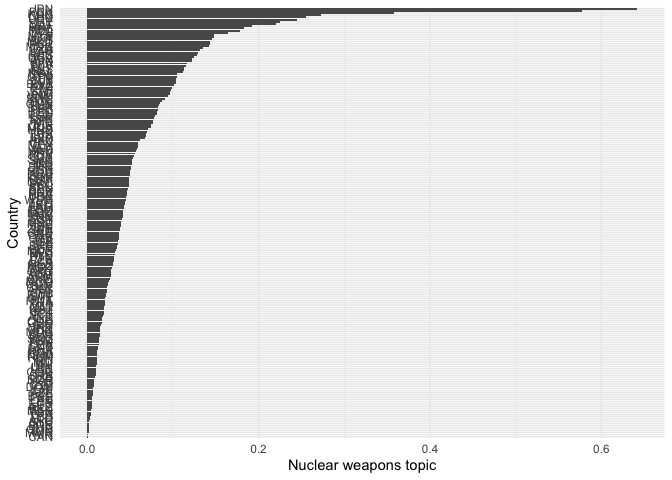
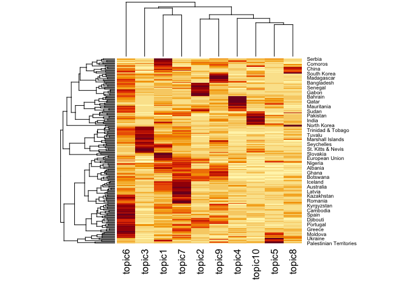
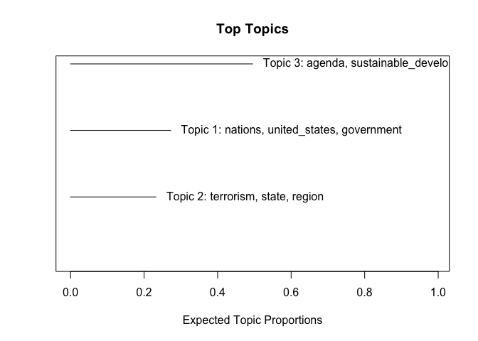
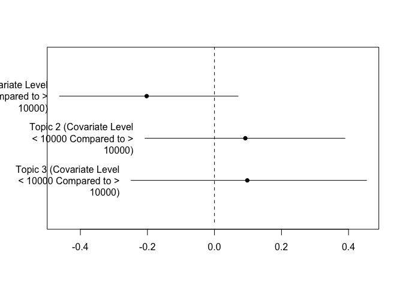

This document gives some examples of how to estimate LDA, STM and
semisupervised topic models in `R`. For these examples, we will use the
corpus `data_corpus_ungd2017` which contains the speeches from the UN
General Assembly in 2017 and is available in **quanteda.corpora**.

Let’s load necessary libraries first. We will estimate LDA topic models
using the **seededlda** library and structural topic models using the
**stm** library.

``` r
#load libraries
library(quanteda)
library(quanteda.textmodels)
library(quanteda.textplots)
library(quanteda.corpora)
library(quanteda.textstats)
library(seededlda)
library(stm)
library(ggplot2)
library(tidyverse)

corpus_speeches <- data_corpus_ungd2017

summary(corpus_speeches, n = 10)
```

    ## Corpus consisting of 196 documents, showing 10 documents:
    ## 
    ##                  Text Types Tokens Sentences country_iso un_session year              country continent          gdp
    ##           Afghanistan   781   2059        86         AFG         72 2017          Afghanistan      Asia 1.954398e+10
    ##                Angola   681   1938        59         AGO         72 2017               Angola    Africa 1.221238e+11
    ##               Albania   838   2277        88         ALB         72 2017              Albania    Europe 1.303854e+10
    ##               Andorra   888   2816        90         AND         72 2017              Andorra    Europe 3.012914e+09
    ##  United Arab Emirates   759   2367        78         ARE         72 2017 United Arab Emirates      Asia 3.825751e+11
    ##             Argentina   834   2450        90         ARG         72 2017            Argentina  Americas 6.374303e+11
    ##               Armenia   685   1844        78         ARM         72 2017              Armenia      Asia 1.153659e+10
    ##     Antigua & Barbuda   894   2585       103         ATG         72 2017    Antigua & Barbuda  Americas 1.510085e+09
    ##             Australia   694   1848        92         AUS         72 2017            Australia   Oceania 1.323421e+12
    ##               Austria   544   1460        75         AUT         72 2017              Austria    Europe 4.165957e+11
    ##  gdp_per_capita
    ##             550
    ##            4100
    ##            4538
    ##           39147
    ##           40699
    ##           14398
    ##            3937
    ##           14803
    ##           53800
    ##           47291

.As you can see the corpus contains 196 speeches, one from each UN
member state. Let’s tokenise this corpus.

``` r
#tokenise the corpus

tokens_speeches <- tokens(corpus_speeches,
                          what = "word",
                          remove_punct = TRUE, 
                          remove_symbols = TRUE, 
                          remove_numbers = TRUE,
                          remove_url = TRUE,
                          remove_separators = TRUE,
                          split_hyphens = FALSE,
                          ) %>%
  tokens_remove(stopwords(source = "smart"), padding = TRUE)
```

Let’s append collocations that occur 10 times or more

``` r
collocations <- tokens_speeches %>%
 # tokens_sample(size = 100, replace = FALSE) %>%
  textstat_collocations(min_count = 10,
                        size = 2:3) %>%
  arrange(-lambda)

head(collocations, 50)
```

    ##                  collocation count count_nested length   lambda         z
    ## 501              addis ababa    21           17      2 17.34648  8.623247
    ## 502            côte d'ivoire    18           12      2 17.19621  8.540587
    ## 503              puerto rico    18           11      2 17.19621  8.540587
    ## 509             burkina faso    13           12      2 16.88114  8.363482
    ## 511               inter alia    12           12      2 16.80418  8.319306
    ## 512         nagorno karabakh    12           10      2 16.80418  8.319306
    ## 487                 viet nam    17           14      2 16.04202  9.720097
    ## 491               boko haram    11            4      2 15.62219  9.414328
    ## 488             saudi arabia    13            4      2 15.27169  9.709138
    ## 481               costa rica    22           16      2 15.19471 10.092488
    ## 426             pope francis    21           16      2 15.14925 12.896612
    ## 489    correspondent banking    11           11      2 15.11136  9.582287
    ## 483              el salvador    15            6      2 15.07337  9.832292
    ## 486               cabo verde    14           10      2 15.00668  9.779538
    ## 479             sierra leone    26           13      2 14.99060 10.126043
    ## 485               san marino    20           13      2 14.35439  9.780416
    ## 158            peter thomson    78           78      2 14.04624 21.757337
    ## 492              ban ki-moon    17           17      2 13.70661  9.410054
    ## 339         antónio guterres    81           81      2 13.16132 15.696790
    ## 497             donald trump    13           13      2 13.07442  8.982682
    ## 496         ethnic cleansing    15            7      2 13.04893  8.999785
    ## 499              saint kitts    12            7      2 12.87229  8.842356
    ## 234          legally binding    20           20      2 12.51970 18.618964
    ## 90           miroslav lajčák    61           61      2 12.47039 26.025428
    ## 388                lake chad    19           17      2 12.30003 14.104419
    ## 505               status quo    17            7      2 12.25012  8.509938
    ## 506       ezulwini consensus    15            3      2 12.20695  8.462409
    ## 508        high commissioner    21           19      2 12.01350  8.377984
    ## 513            arab emirates    16           16      2 11.90543  8.271035
    ## 329       russian federation    13            4      2 11.83767 16.130060
    ## 514          solomon islands    18           10      2 11.77982  8.201531
    ## 405                g-5 sahel    18           15      2 11.58662 13.444654
    ## 211     twenty-first century    32            5      2 11.28101 19.404169
    ## 515    seventy-first session    33            4      2 11.26847  7.903468
    ## 433 greenhouse-gas emissions    10            7      2 11.26845 12.677382
    ## 519           virgin islands    10            9      2 11.14473  7.684123
    ## 69            prime minister    47           29      2 11.12419 28.344376
    ## 432     secretary- general's    13           12      2 11.07285 12.711799
    ## 135                 road map    36           20      2 11.01178 22.851794
    ## 415       two-state solution    38           11      2 10.95786 13.113302
    ## 56     territorial integrity    51           13      2 10.95371 30.237418
    ## 44          korean peninsula    78           14      2 10.86346 33.811300
    ## 440          north-east asia    15            2      2 10.81452 12.543627
    ## 348         non-state actors    14            6      2 10.81044 15.436025
    ## 148   seventy-second session   128           14      2 10.74388 22.205636
    ## 163       ballistic missiles    14            8      2 10.68914 21.630398
    ## 43               middle east    86           28      2 10.66141 33.962015
    ## 521             human beings    41           13      2 10.65159  7.484469
    ## 84            western sahara    33            9      2 10.54062 26.778202
    ## 165         domestic product    27           27      2 10.44962 21.529558

``` r
tokens_speeches <- tokens_compound(tokens_speeches, collocations)
```

Let’s include only those tokens that appear in the speeches of at least
5 countries and maximum 150 countries

``` r
dfm_speeches <- dfm(tokens_speeches) %>%
     dfm_trim(min_docfreq = 5, 
             max_docfreq = 150) 

#check the number of documents and features
dim(dfm_speeches)
```

    ## [1]  196 4541

## Estimating an LDA topic model

Let’s estimate a topic model with 10 topics. This may take a few
minutes, depending on your system. *k* refers to the number of topics to
be estimated; this is a parameter determined by the researcher. The
$\aplha$ parameter has an impact on the topic distribution in each
document (more on that in the exercises). In order to make the results
reproducible, we’ll use `set.seed()`. We’ll set the maximum number of
iterations at 1000 to speed up estimation (the argument defaults to 2000
iterations).

``` r
set.seed(123)

lda_10 <- textmodel_lda(dfm_speeches, 
                       k = 10,
                       alpha = 1,
                       max_iter = 1000)
```

Take a look at the output of the topic model with 10 topics. For
example, we can take a look at the 10 highest-loading terms for each of
*k* topics.

``` r
terms(lda_10, 10)
```

    ##       topic1           topic2             topic3        topic4         topic5             topic6                   
    ##  [1,] "future"         "africa"           "caribbean"   "terrorism"    "state"            "agenda"                 
    ##  [2,] "make"           "regard"           "government"  "syria"        "israel"           "human_rights"           
    ##  [3,] "responsibility" "organization"     "peoples"     "region"       "europe"           "states"                 
    ##  [4,] "common"         "security_council" "pacific"     "iraq"         "palestine"        "sustainable_development"
    ##  [5,] "life"           "african_union"    "call"        "stability"    "territory"        "national"               
    ##  [6,] "means"          "african"          "small"       "crisis"       "ukraine"          "implementation"         
    ##  [7,] "women"          "resources"        "ocean"       "humanitarian" "occupation"       "commitment"             
    ##  [8,] "live"           "mali"             "lives"       "yemen"        "security_council" "important"              
    ##  [9,] "children"       "end"              "sustainable" "based"        "borders"          "dialogue"               
    ## [10,] "protect"        "call"             "global"      "arab"         "military"         "regard"                 
    ##       topic7                    topic8                         topic9       topic10        
    ##  [1,] "global"                  "nuclear_weapons"              "government" "nations"      
    ##  [2,] "agenda"                  "nuclear"                      "cent"       "united_states"
    ##  [3,] "secretary-general"       "korea"                        "democracy"  "president"    
    ##  [4,] "sustainable_development" "north_korea"                  "years"      "war"          
    ##  [5,] "conflicts"               "weapons"                      "economy"    "solidarity"   
    ##  [6,] "including"               "treaty"                       "social"     "peoples"      
    ##  [7,] "reform"                  "democratic_people's_republic" "state"      "sovereignty"  
    ##  [8,] "cooperation"             "united_states"                "justice"    "great"        
    ##  [9,] "regional"                "republic"                     "assembly"   "mexico"       
    ## [10,] "role"                    "make"                         "made"       "venezuela"

In order to obtain the topic that loads highest on each document, we can
use the `topics` function. We can append this as a variable to our
`docvars`

``` r
head(topics(lda_10), 10)
```

    ##          Afghanistan               Angola              Albania              Andorra United Arab Emirates            Argentina 
    ##              topic10               topic6               topic1               topic6               topic4               topic6 
    ##              Armenia    Antigua & Barbuda            Australia              Austria 
    ##               topic5               topic3               topic7               topic5 
    ## Levels: topic1 topic2 topic3 topic4 topic5 topic6 topic7 topic8 topic9 topic10

``` r
docvars(dfm_speeches, "topic") <- topics(lda_10)

# cross-table of the topic frequency
table(docvars(dfm_speeches, "topic"))
```

    ## 
    ##  topic1  topic2  topic3  topic4  topic5  topic6  topic7  topic8  topic9 topic10 
    ##      22      21      26      12       7      41      31       7      16      13

The topic proportions in each document are stored in an object called
theta ($\theta$)

``` r
head(lda_10$theta, 10)
```

    ##                          topic1     topic2      topic3      topic4     topic5      topic6      topic7      topic8     topic9
    ## Afghanistan          0.20937500 0.02812500 0.031250000 0.092187500 0.00468750 0.062500000 0.189062500 0.028125000 0.08906250
    ## Angola               0.04285714 0.21111111 0.053968254 0.026984127 0.01904762 0.325396825 0.139682540 0.028571429 0.07777778
    ## Albania              0.34293948 0.01152738 0.020172911 0.046109510 0.06916427 0.090778098 0.201729107 0.057636888 0.13544669
    ## Andorra              0.23209877 0.05185185 0.012345679 0.001234568 0.00617284 0.307407407 0.154320988 0.018518519 0.16666667
    ## United Arab Emirates 0.07654321 0.01975309 0.013580247 0.472839506 0.01975309 0.137037037 0.100000000 0.049382716 0.03209877
    ## Argentina            0.18158890 0.00630517 0.059268600 0.010088272 0.02648172 0.368221942 0.031525851 0.022698613 0.19167718
    ## Armenia              0.11700183 0.04570384 0.005484461 0.049360146 0.27056673 0.255941499 0.051188300 0.027422303 0.13528336
    ## Antigua & Barbuda    0.13892529 0.01965924 0.411533421 0.011795544 0.01703801 0.002621232 0.001310616 0.002621232 0.25557012
    ## Australia            0.22815534 0.01779935 0.025889968 0.084142395 0.03559871 0.014563107 0.402912621 0.113268608 0.03398058
    ## Austria              0.16079295 0.09471366 0.002202643 0.121145374 0.19383260 0.055066079 0.176211454 0.145374449 0.01321586
    ##                         topic10
    ## Afghanistan          0.26562500
    ## Angola               0.07460317
    ## Albania              0.02449568
    ## Andorra              0.04938272
    ## United Arab Emirates 0.07901235
    ## Argentina            0.10214376
    ## Armenia              0.04204753
    ## Antigua & Barbuda    0.13892529
    ## Australia            0.04368932
    ## Austria              0.03744493

Let’s confirm that column sums of $\theta$ add up to one.

``` r
head(rowSums(lda_10$theta), 10)
```

    ##          Afghanistan               Angola              Albania              Andorra United Arab Emirates            Argentina 
    ##                    1                    1                    1                    1                    1                    1 
    ##              Armenia    Antigua & Barbuda            Australia              Austria 
    ##                    1                    1                    1                    1

## Visualizing a LDA topic model

Let’s say we are interested in topic 8 which deals (in my case) with
nuclear weapons, treaties, north korea, etc. We can store the document
proportions for this topic in the docvars of our dfm, and call it
\`nuclear_weapons_topic’

``` r
docvars(dfm_speeches, 'nuclear_weapons_topic') <- lda_10$theta[, 8]
```

Let’s plot the nuclear weapons topic

``` r
topic_plot <- ggplot(docvars(dfm_speeches), aes(y = reorder(country_iso, nuclear_weapons_topic), 
                               x = nuclear_weapons_topic)) + 
  geom_bar(stat = "identity") + theme_minimal() + scale_x_continuous("Nuclear weapons topic") +
  scale_y_discrete("Country") +
  theme(axis.text.y = element_text(angle = 0), size = 0.1) + theme_minimal()

print(topic_plot)
```

<!-- -->

Take a look at topic proportions for each country

``` r
#append the topic proportions

topic_probabilities <- lda_10$theta
rownames(topic_probabilities) <- rownames(dfm_speeches)

heatmap(as.matrix(topic_probabilities[]))
```

<!-- -->

In a heatmap, darker colors correspond with higher proportions, whereas
lighter colors denote lower proportions. In addition, it displays a
clustering of countries and topics?

## Estimating a Structural topic model

Structural topic models allow us to model topical content and topical
prevalence as a function of metadata. We can estimate an stm using the
`stm()` function in the **stm** library. Let’s first estimate an stm
without any metadata and 3 topics (NB: estimating an **stm** is a bit
slow, hence the small number of topics)

``` r
stm_3 <- stm(dfm_speeches, 
              data = docvars(dfm_speeches),
              seed = 123,
              K = 3,
              verbose = FALSE,
             init.type = "Spectral")
```

We can inspect the estimated topics using the `labelTopics()` function
in the **stm** library

``` r
labelTopics(stm_3)
```

    ## Topic 1 Top Words:
    ##       Highest Prob: nations, united_states, government, global, years, make, caribbean 
    ##       FREX: canada, barbuda, caribbean, venezuela, haiti, indigenous_peoples, colombia 
    ##       Lift: barbuda, caicos, hemisphere, lose, storm, turks, virgin_islands 
    ##       Score: lose, canada, barbuda, indigenous_peoples, saint, antigua, bahamas 
    ## Topic 2 Top Words:
    ##       Highest Prob: terrorism, state, region, states, syria, international_community, stability 
    ##       FREX: arab, iran, azerbaijan, ukraine, israel, occupation, da'esh 
    ##       Lift: coup, d'état, violating, azerbaijan, israeli, kuwait, osce 
    ##       Score: azerbaijan, kuwait, arab, israeli, iran, turkish, occupied 
    ## Topic 3 Top Words:
    ##       Highest Prob: agenda, sustainable_development, global, government, commitment, human_rights, implementation 
    ##       FREX: sustainable_development, agenda, african_union, implementation, south_sudan, africa, sids 
    ##       Lift: achieving_sustainable_development, adjust, complemented, expedite, global_development, high-level_meeting, indonesia 
    ##       Score: indonesia, sids, samoa, pacific, agenda, asean, ocean

We can also plot this model using `plot()`

``` r
plot(stm_3)
```

<!-- -->

`findThoughts()` returns the topic documents associated with a topic

``` r
findThoughts(stm_3,texts = as.character(corpus_speeches), n = 1, topics = c(1))
```

    ## 
    ##  Topic 1: 
    ##       On 6 September, my small, two-island State, Antigua and Barbuda, was the victim of the ferocity of Hurricane Irma, the largest storm endured in the Atlantic in human history. The island of Barbuda was decimated, its entire population left homeless and its buildings reduced to empty shells.
    ## Fortunately, Antigua and Barbuda was spared the full blast of Hurricane Maria just nine days later, although sustained winds of up to 60 miles per hour gave us a troubling awareness of the agony visited on the nearby islands of Dominica, Guadeloupe and Puerto Rico. Antigua and Barbuda continued to stay resilient. Having witnessed the devastation of Barbuda and the desolation of its inhabitants after the ravages of Irma, my heart bleeds for the people of the countries that have now been brutalized by Maria, and those that will suffer its cruelty in the coming days.
    ## I have come to the General Assembly because I consider it to be important to speak to the world's representatives and to do so collectively in order to share the experience of my country, as well as the huge challenges faced by the Caribbean islands in general. Barbuda and its inhabitants were among the worst affected by Hurricane Irma in the region. Barbuda has a surface of 62 square miles. When Irma thundered over the island, it was 375 miles wide, with gale force winds of 220 miles per hour. Barbuda did not stand the faintest chance against such size, such ferocity and such intensity. The island was completely destroyed, and my Government was compelled to evacuate all of the inhabitants to Antigua.
    ## For the first time in over 300 years, there are now no permanent residents on Barbuda. The footprints of an entire civilization have been erased by the brutality and magnitude of Irma. Everything that meant anything to the inhabitants had to be left behind - their homes, their possessions, their history, indeed, everything that defines them as a society and as a people. Mercifully, Antigua, the larger of the two islands, suffered no major damage, and it could begin to function normally within 48 hours.
    ## Had that not been the case, how we would have coped is simply beyond imagination. Overnight, Antigua's population increased by almost 3 per cent. I know of no country that could easily cope with such an unplanned, unexpected and unscheduled increase in its population.
    ## In addition to providing shelter, accommodation and basic necessities to the evacuated residents of Barbuda, the social services on Antigua are now under great strain. They struggle to provide school places for an additional 600 students, medical services for the elderly and a means of earning an income for the able-bodied. Naturally, the residents of Barbuda are anxious to return to their homeland. But, as I speak to the Assembly, the island remains unfit for human habitation. There is no electricity or potable water, and 95 per cent of the buildings have been destroyed or severely damaged.
    ## Preliminary estimates have placed the cost of rebuilding Barbuda at about $250 million. That figure represents 15 per cent or more of my country's gross domestic product of approximately $1.5 billion. It is simply a stretch beyond our reach.
    ## The President took the Chair.
    ## Antigua and Barbuda urgently requires the assistance of the international community, including the international development and finance institutions, to accomplish the vital task of rebuilding Barbuda. And I should say that we have not outstretched the palm of our hand because we simply crave; we plead because we need.
    ## Barbuda is not only a natural disaster; it is a humanitarian crisis that now consumes Antigua. Even as my Government and people look forward to the assistance of the better-off nations of the world, I thank those nations and persons who were first responders, particularly the Government and the people of the Bolivarian Republic of Venezuela, who went beyond the call of duty to assist. I also acknowledge the commitment of and contributions from the Government and the people of the People's Republic of China, the Governments of Cuba, the United Arab Emirates, Qatar, Canada, the Dominican Republic and sister States of the Caribbean Community, who gave generously from the little they have. That includes Dominica, which, in one wretched night, lost a significant number of precious lives and years of hard-earned development under the unrelenting battering of Hurricane Maria.
    ## On Antigua, Barbudans are being cared for as best we can with our very limited resources. But as the period of care lengthens, not only do the conditions worsen but the cost also increases, forcing my Government to borrow money on commercial terms at high interest rates and swelling our already burdensome national debt.
    ## The present international financial architecture is leaving small States such as mine behind. Whatever position on climate change a nation may take, the evidence of global warming is now irrefutably stronger. Two Category 5 hurricanes within 12 days, which unrelentingly pounded so many countries, can no longer be dismissed as vagaries of the weather, nor can they be explained as Nature's doing. Hurricanes are stronger and bigger because they are absorbing moisture from seas that are increasingly warmer as a result of global warming.
    ## And that is a man-made phenomenon, attributable to those nations that consume 80 per cent or more of the world's primary energy, emitting dangerous levels of pollution into the atmosphere. All 14 Caribbean Community countries together produce less than 0.1 per cent of global emissions. We are the least of the polluters but the largest of the casualties. The unfairness, injustice and inequality of the situation are painfully obvious.
    ## If such frequent and brutal storms are to be withstood, Caribbean islands and certain parts of the United States need to construct more resilient buildings and infrastructure than now exists. That means that the international development and financial institutions need to provide financing at concessionary rates without artificial impediments. If that does not happen, the subsequent cost in lives and property is too frightening to contemplate.
    ## Increasingly, States such as mine are victims of an international economic and financial system that regards us merely as a numerical statistic or a mere nuisance. We are measured by the level of our income, even though it is an insufficient and unreasonable criterion for establishing vulnerability, poverty and need. Like many other small island States, my developing country is categorized as high-income, thus denying it access to concessional financing and grant funding from international financial institutions and donor Governments.
    ## It is patently obvious that the per-capita income criterion is a skewed and flawed determinant. It should be eliminated and eliminated immediately. Because we are small economies with inadequate domestic capital formation, our countries open our doors to foreign investment, granting significant tax concessions so as to attract investments and help provide jobs to curb poverty. The consequence is that a small percentage of persons in our community, mostly expatriates, at the top end of businesses earn the largest percentage of high incomes and the mass of the population earns considerably less. In addition, Government tax revenues are significantly reduced owing to the investment concessions granted. It is time that those who control the levers of power in the economic and financial international community acknowledged that the per-capita system of measurement is discriminatory and resolved to change it. It is time that that particular swamp be drained, and now is the time for action.
    ## In the United States, where the United Nations is located and the Assembly is gathered today, one of its early leaders, Abraham Lincoln, declared at a critical time in its history that this country could not survive "half slave and half free". He may have been speaking specifically of America and of the disunity that gripped it at the time, but he was talking about more than immorality. He was also talking about social and economic justice. Lincoln's observation is compellingly relevant to social and economic justice in the world today. Injustice and inequality breed instability. The world cannot survive with the wealthy few controlling 90 per cent of global resources. If so, its centre will not hold. Its centre will not hold if the inequality between rich and poor nations increases. It will not be stable until social and economic justice prevails.
    ## My country and citizens do not want to beg for a living. We want to work for it. We want to earn our way, but we cannot do so if the international system refuses to provide us with the means and the tools to build our future. Access to concessional financing represents an imperative need that would give us a great leap forward. It would take us out of the spiral of debt that we are incurring owing to our repeated need to rebuild after disasters with high-cost commercial money. Where is the justice in that? In large wealthy countries borrowing occurs in capital markets at 3 per cent per annum while the so-called high-income small island States are forced to borrow commercially at 12 per cent per annum to repeatedly rebuild infrastructure damaged by hurricanes. Where is the justice in that? It is irrational and punitive to graduate a small island State that cannot pay its debts to high-income status, thereby precluding it from much-needed development financing.
    ## The theme of the Assembly's general debate is "Focusing on people: Striving for peace and a decent life for all on a sustainable planet". That is all my people and the people of small island States want - peace and a decent life on a planet that is sustainable. We deserve nothing less, and we expect nothing less. It is in that connection that I draw attention to the fact that even in the midst of our present crisis, Antigua and Barbuda is faced with demands from a Paris Club group of wealthy countries for the settlement of $130 million in debts incurred four decades ago because concessional financing was and is still denied to us. It would be of enormous help in dealing with the plight that we now face and the daunting task of rebuilding Barbuda at a cost upwards of $250 million if those wealthy Paris Club countries would forgive or at least reduce significantly the debt that now weighs so heavily on our shoulders. It should be noted that the amount outstanding constitutes primarily accrued interest. Such a step would provide us with the fiscal space to borrow as we seek to garner every cent to recover and rebuild from Hurricane Irma and to give our people a chance to achieve a decent life in keeping with the Sustainable Development Goals.
    ## In that same context, my small country won a trade dispute with the United States in 2004 before the World Trade Organization. That trade violation led to significant revenue losses to my country and to greater unemployment among my people. It has been 13 long years since that judgement and seven years since the final appeal by the United States resulted in a final ruling in my country's favour, and yet the United States has failed to settle. The loss of trade revenues to my small country has risen to more than $200 million. Our Government has laboured unsuccessfully for more than 13 years to reach an amicable and reasonable settlement with the United States. That is a classic case where might is right and where the rights of a small, powerless State have been trampled on.
    ## I should mention that over the past 13 years the United States has enjoyed a trade surplus with my small country of more than $2 billion - I repeat, $2 billion. I am well aware that the prolongation of a settlement of the judgement in question is not the making of the present United States Administration, which inherited it. But in the interest of fairness, justice and good conscience, it would be beneficial to my nation in this hour of great need for the United States Government to settle that case.
    ## In this very Hall two days ago, President Trump said of the United States,
    ## "[W]e can no longer be taken advantage of or enter into a one-sided deal where the United States gets nothing in return" (A/72/PV.3, p. 11).
    ## His observation, which I welcome, is equally true for the relationship with Antigua and Barbuda. Honouring its obligations to Antigua and Barbuda is not a one-sided deal in which the United States gets nothing in return, because ultimately 90 per cent of the settlement proceeds will be spent in the United States economy, as our primary source market. The United States is the greatest beneficiary of trade with my country and has been so year after year for many decades. Settling with us for more than 13 years of trade losses would take less than one year of the trade surplus that the United States' $20 trillion economy has with Antigua and Barbuda's mere $1 billion economy.
    ## In the past few days the experience of the Caribbean islands has shown that entire ancient communities can be snuffed out overnight and the quality of their life suddenly and irreversibly set back. I remind members that for the first time in more than 300 years there is no permanent human resident on Barbuda. But my Government is determined to rebuild Barbuda, however long it takes and with whatever resources we can muster. We are determined that no Caribbean society will be extinguished and that the Caribbean nations will remain firmly on the global map. But even as we resolve, with limited means, to keep our societies alive and vibrant, we call on the international community to acknowledge its obligation to humankind and all peoples, without whom its own societies cannot prosper and will not thrive. In the words of the poet John Donne,
    ## "Any man's death diminishes me, because I am involved in mankind, and therefore never send to know for whom the bell tolls; it tolls for thee".
    ## As citizens of planet Earth, let us acknowledge our common humanity and work in harmony to make our world a better place.

Let’s now estimate an stm but this time we include metadata. To this end
we will first create a dummy variable that denotes whether a country’s
gdp per capita is smaller than 10000 dollar. We will use `ifelse()` for
this. For some countries we do not have data on GDP. In order for stm
with metadata to work, we’ll remove those from our dfm.

``` r
docvars(dfm_speeches, "gdp_dummy") <- ifelse(docvars(dfm_speeches, "gdp_per_capita") < 10000, 1, 0)

dfm_speeches <- dfm_subset(dfm_speeches, !is.na(gdp_dummy))
```

Let’s investigate if the content of estimated topics is dependent on a
country’s income by estimating an stm with 3 topics and modeling topical
content as a function of our gdp_dummy variable. To speed up estimation,
we will only focus on European countries, and we let the maximum number
of EM (expectation maximization) steps to be no more than 50. Still,
estimating this topic model may take a few minutes.

``` r
dfm_speeches_europe <- dfm_subset(dfm_speeches, continent == "Europe")
table(docvars(dfm_speeches_europe, "gdp_dummy"))
```

    ## 
    ##  0  1 
    ## 32  9

``` r
stm_3_metadata <- stm(dfm_speeches_europe, 
                      data = docvars(dfm_speeches_europe),
                      seed = 123,
                      content = ~ gdp_dummy,
                      K = 3,
                      max.em.its = 50,
                      verbose = TRUE,
                      init.type = "Spectral")
```

    ## Beginning Spectral Initialization 
    ##   Calculating the gram matrix...
    ##   Finding anchor words...
    ##      ...
    ##   Recovering initialization...
    ##      ......................................
    ## Initialization complete.
    ## .........................................
    ## Completed E-Step (0 seconds). 
    ## .....................................................................................................
    ## Completed M-Step (5 seconds). 
    ## Completing Iteration 1 (approx. per word bound = -7.596) 
    ## .........................................
    ## Completed E-Step (0 seconds). 
    ## .....................................................................................................
    ## Completed M-Step (5 seconds). 
    ## Completing Iteration 2 (approx. per word bound = -7.548, relative change = 6.302e-03) 
    ## .........................................
    ## Completed E-Step (0 seconds). 
    ## .....................................................................................................
    ## Completed M-Step (5 seconds). 
    ## Completing Iteration 3 (approx. per word bound = -7.508, relative change = 5.280e-03) 
    ## .........................................
    ## Completed E-Step (0 seconds). 
    ## .....................................................................................................
    ## Completed M-Step (5 seconds). 
    ## Completing Iteration 4 (approx. per word bound = -7.489, relative change = 2.630e-03) 
    ## .........................................
    ## Completed E-Step (0 seconds). 
    ## .....................................................................................................
    ## Completed M-Step (5 seconds). 
    ## Completing Iteration 5 (approx. per word bound = -7.479, relative change = 1.300e-03) 
    ## Topic 1: adopt, connection, repeat, disaster, greatest 
    ##  Topic 2: russia, arsenal, gave, imposing, suppression 
    ##  Topic 3: republic, inclusion, treated, mediation, political_solution 
    ## Aspect 1: press, primarily, resolving, recent_weeks, pressure 
    ##  Aspect 2: annex, communiqué, delegations, divided, guidelines 
    ## .........................................
    ## Completed E-Step (0 seconds). 
    ## .....................................................................................................
    ## Completed M-Step (5 seconds). 
    ## Completing Iteration 6 (approx. per word bound = -7.474, relative change = 6.204e-04) 
    ## .........................................
    ## Completed E-Step (0 seconds). 
    ## .....................................................................................................
    ## Completed M-Step (5 seconds). 
    ## Completing Iteration 7 (approx. per word bound = -7.472, relative change = 2.770e-04) 
    ## .........................................
    ## Completed E-Step (0 seconds). 
    ## .....................................................................................................
    ## Completed M-Step (5 seconds). 
    ## Completing Iteration 8 (approx. per word bound = -7.472, relative change = 6.030e-05) 
    ## .........................................
    ## Completed E-Step (0 seconds). 
    ## .....................................................................................................
    ## Completed M-Step (5 seconds). 
    ## Completing Iteration 9 (approx. per word bound = -7.471, relative change = 9.102e-05) 
    ## .........................................
    ## Completed E-Step (0 seconds). 
    ## .....................................................................................................
    ## Completed M-Step (5 seconds). 
    ## Model Converged

Using `estimateEffect()` we estimate a regression where documents are
the units, the outcome is the proportion of each document about a topic
in an STM model and the covariates are document-meta data. This allows
us to compare topic proportions for both groups of countries (i.e., rich
and poor)

``` r
eff_gdp <- estimateEffect(
  1:3 ~ gdp_dummy, 
  stmobj = stm_3_metadata, 
  meta = docvars(dfm_speeches_europe))
```

Let’s plot these topic proportions

``` r
plot(eff_gdp, "gdp_dummy",
     cov.value1 = "< 10000",
     cov.value2 = "> 10000",
     method = "difference")
```

<!-- -->
We don’t see any noticeable differences here but keep in mind that we
estimated this model on only a small number

## Seeded LDA

In a last step, let’s estimate a seeded topic model. This topic model is
semi-supervised, and requires a set of dictionary words to structure
each topic. We’ll use a very short dictionary of four topics.

``` r
dictionary <- dictionary(list(terrorism = c("terroris*"), 
                              environment = c("sustainable_development", "global_warming"),
                              migration = c("migra*", "refugee"),
                              economy = c("econo*", "development")))
```

Now let’s run the `seededlda()` function and inspect the model output

``` r
lda_seed <- textmodel_seededlda(dfm_speeches, 
                                dictionary, 
                                batch_size = 0.01, 
                                auto_iter = TRUE,
                                verbose = FALSE)

terms(lda_seed)
```

    ##       terrorism                 environment               migration    economy               
    ##  [1,] "terrorism"               "sustainable_development" "migration"  "economy"             
    ##  [2,] "terrorist"               "global_warming"          "migrants"   "economic_growth"     
    ##  [3,] "terrorists"              "agenda"                  "refugee"    "economies"           
    ##  [4,] "terrorist_groups"        "regard"                  "migrant"    "economic_development"
    ##  [5,] "terrorist_attacks"       "organization"            "migratory"  "economic_social"     
    ##  [6,] "terrorist_organizations" "commitment"              "migrations" "economic_community"  
    ##  [7,] "region"                  "human_rights"            "make"       "economic_commercial" 
    ##  [8,] "state"                   "implementation"          "future"     "economic_cooperation"
    ##  [9,] "states"                  "international_community" "global"     "economically"        
    ## [10,] "military"                "republic"                "years"      "economic_recovery"

``` r
head(lda_seed$theta, 10)
```

    ##                       terrorism environment migration     economy
    ## Afghanistan          0.24604430  0.15585443 0.4691456 0.128955696
    ## Angola               0.12620579  0.61816720 0.1197749 0.135852090
    ## Albania              0.13338192  0.26311953 0.4905248 0.112973761
    ## Andorra              0.02680798  0.56421446 0.3073566 0.101620948
    ## United Arab Emirates 0.50436409  0.25623441 0.1714464 0.067955112
    ## Argentina            0.08726115  0.43630573 0.3000000 0.176433121
    ## Armenia              0.34786642  0.36641929 0.2384045 0.047309833
    ## Antigua & Barbuda    0.04569536  0.08013245 0.1913907 0.682781457
    ## Australia            0.19590164  0.23360656 0.4827869 0.087704918
    ## Austria              0.28811659  0.29484305 0.4159193 0.001121076

The `seededlda()` package also allows for unseeded topics. If we want to
include 6 unseeded topics, we add the argument `residual = 6`

``` r
lda_seed_res <- textmodel_seededlda(dfm_speeches, 
                                    dictionary, 
                                    residual = 6, 
                                    batch_size = 0.01, 
                                    auto_iter = TRUE,
                                    verbose = FALSE)

terms(lda_seed_res)
```

    ##       terrorism                 environment               migration     economy                other1           other2          
    ##  [1,] "terrorism"               "sustainable_development" "migration"   "economy"              "human_rights"   "nations"       
    ##  [2,] "terrorist"               "global_warming"          "migrants"    "economic_growth"      "states"         "future"        
    ##  [3,] "terrorists"              "agenda"                  "refugee"     "economies"            "regard"         "history"       
    ##  [4,] "terrorist_groups"        "action"                  "migrant"     "economic_development" "agenda"         "responsibility"
    ##  [5,] "terrorist_attacks"       "global"                  "migratory"   "economic_social"      "republic"       "rights"        
    ##  [6,] "terrorist_organizations" "call"                    "migrations"  "economic_community"   "dialogue"       "make"          
    ##  [7,] "region"                  "peoples"                 "israel"      "economic_commercial"  "commitment"     "live"          
    ##  [8,] "state"                   "paris_agreement"         "north_korea" "economic_cooperation" "implementation" "citizens"      
    ##  [9,] "stability"               "sustainable"             "military"    "economically"         "national"       "respect"       
    ## [10,] "iraq"                    "recent"                  "europe"      "economic_recovery"    "president"      "great"         
    ##       other3     other4             other5              other6         
    ##  [1,] "state"    "africa"           "global"            "united_states"
    ##  [2,] "energy"   "african_union"    "security_council"  "caribbean"    
    ##  [3,] "citizens" "african"          "secretary-general" "cuba"         
    ##  [4,] "social"   "security_council" "effective"         "government"   
    ##  [5,] "public"   "mali"             "conflict"          "solidarity"   
    ##  [6,] "dialogue" "call"             "nuclear_weapons"   "mexico"       
    ##  [7,] "years"    "organization"     "reform"            "destruction"  
    ##  [8,] "year"     "situation"        "cooperation"       "peoples"      
    ##  [9,] "water"    "libya"            "organization"      "america"      
    ## [10,] "cent"     "force"            "multilateralism"   "damage"

``` r
head(lda_seed_res$theta, 10)
```

    ##                         terrorism  environment   migration     economy       other1     other2      other3      other4
    ## Afghanistan          0.1614173228 0.0590551181 0.003937008 0.107874016 0.0007874016 0.22598425 0.287401575 0.018110236
    ## Angola               0.0824000000 0.0824000000 0.000800000 0.143200000 0.3976000000 0.00080000 0.024800000 0.125600000
    ## Albania              0.0660377358 0.0224963716 0.038461538 0.156023222 0.1052249637 0.36937591 0.068940493 0.019593614
    ## Andorra              0.0093167702 0.0739130435 0.008074534 0.174534161 0.2975155280 0.14968944 0.101242236 0.000621118
    ## United Arab Emirates 0.4714285714 0.0180124224 0.068944099 0.077639752 0.2031055901 0.06397516 0.011801242 0.000621118
    ## Argentina            0.0196700508 0.0590101523 0.009517766 0.161802030 0.3381979695 0.13261421 0.152918782 0.001903553
    ## Armenia              0.0673431734 0.0009225092 0.218634686 0.189114391 0.3385608856 0.09870849 0.050738007 0.030442804
    ## Antigua & Barbuda    0.0006596306 0.0349604222 0.009894459 0.158970976 0.0006596306 0.12598945 0.140501319 0.004617414
    ## Australia            0.1199021207 0.0872756933 0.088907015 0.093800979 0.0367047308 0.18189233 0.008972268 0.015497553
    ## Austria              0.1280623608 0.0011135857 0.257238307 0.001113586 0.0612472160 0.14587973 0.001113586 0.099109131
    ##                           other5       other6
    ## Afghanistan          0.133070866 0.0023622047
    ## Angola               0.098400000 0.0440000000
    ## Albania              0.108127721 0.0457184325
    ## Andorra              0.184472050 0.0006211180
    ## United Arab Emirates 0.035403727 0.0490683230
    ## Argentina            0.022208122 0.1021573604
    ## Armenia              0.002767528 0.0027675277
    ## Antigua & Barbuda    0.005936675 0.5178100264
    ## Australia            0.366231648 0.0008156607
    ## Austria              0.295100223 0.0100222717

## Exercises

Estimate an LDA model with 5 topics on `dfm_speeches` and alpha = 1.
Call the model `lda_5`

Display the 10 highest loading terms for each topic

Show the topic distributions of `lda_5` in the first 20 documents.

Estimate another model with 5 topics, but this time with an alpha
parameter equal to 10. Call it `lda_5_alpha_10`

Show the topic distributions of `lda_5_alpha_10` in the first 20
documents. How do these topic distributions compare to those in `lda_5`.
What effect do you think the alpha parameter has.

## Optional

Estimate an stm with 5 topics, using the `europe` variable as metadata.
Call it `stm_5_europe`. NB: You can create a binary variable of `europe`
using the `continent` variable in document level metadata and the
`ifelse()` function.

Plot these topics

Using `estimateEffect()` we estimate a regression where documents are
the units, the outcome is the proportion of each document about a topic
in an STM model and the covariate is the europe variable. Call the
output `eff_europe`.

Let’s plot these topic proportions
