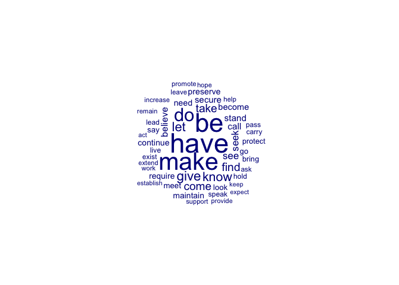
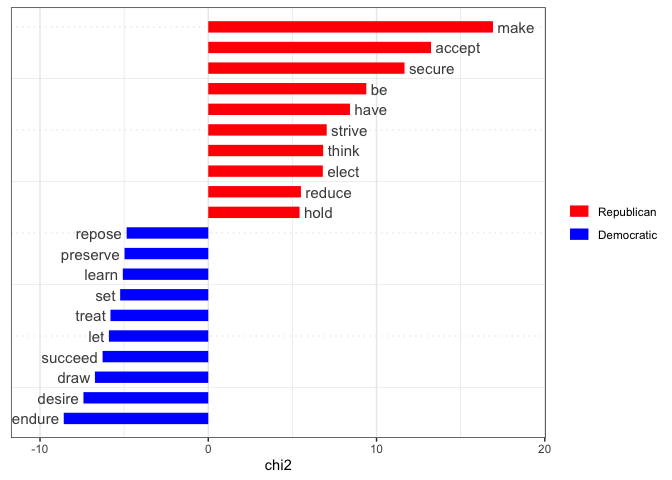
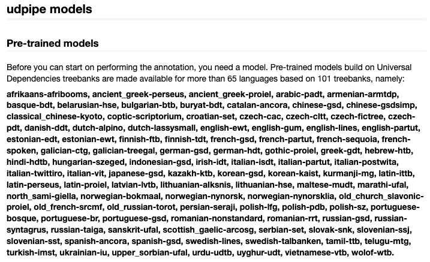

QTA Day 8: NLP processing in R
================
17 July, 2024

The goal of today’s lab session is to inspect the functionality of the
**udpipe** library. **UDPipe** (Wijffels, 2022) offers
‘language-agnostic tokenization, tagging, lemmatization and dependency
parsing of raw text’. We will focus on tagging and lemmatization in
particular and how these pre-processing steps may make further analysis
more precise. Lemmatizing generally works better than stemming,
especially for inflected languages such as German or French.
Part-of-Speech (POS) tags identify the type of word (noun, verb, etc) so
it can be used to e.g. analyse only the verbs (actions) or adjectives
and adverbs (descriptions).

Another library that was developed by the quanteda team and that has
similar functionality is **spacyr** (Benoit & Matsuo, 2020), an R
wrapper around the spaCy package in Python. See this
[link](https://spacyr.quanteda.io/articles/using_spacyr.html) for more
information on using **spacyr**.

Let’s load required libraries first.

``` r
#load libraries
library(tidyverse)
library(quanteda)
library(quanteda.textplots)
library(quanteda.textmodels)
library(quanteda.textstats)
library(quanteda.sentiment)
library(seededlda)
library(udpipe)
```

The primary challenges for our purposes is to communicate between
**udpipe** and **quanteda**. In the following code block we first turn
our corpus into a dataframe called `inaugural_speeches_df` and save the
speeches – which are now stored in `inaugural_speeches_df$text` – as a
character vector called txt. **udpipe** works with character vectors.

``` r
inaugural_speeches <- data_corpus_inaugural

inaugural_speeches_df <- convert(inaugural_speeches,
                                 to = "data.frame")

txt <- inaugural_speeches_df$text
str(txt)
```

    ##  chr [1:59] "Fellow-Citizens of the Senate and of the House of Representatives:\n\nAmong the vicissitudes incident to life n"| __truncated__ ...

Let’s apply the `udpipe` function to this `txt`. This function tags each
token in each speech, based on an English-language model which will be
downloaded into the working directory. We instruct `udpipe` to include
the doc_ids from our **quanteda** corpus object. This will help us later
on when we want to transform the output of our **udpipe** workflow back
into a corpus which we can inspect with **quanteda** functions.
As_tibble() is used to turn the output into a tibble, which is a more
user-friendly format than the default output of **udpipe**.

``` r
parsed_tokens <-  udpipe(txt, "english", 
                         doc_id = inaugural_speeches_df$doc_id) %>% 
  as_tibble()
```

Let’s inspect what’s inside parsed_tokens

``` r
head(parsed_tokens)
```

    ## # A tibble: 6 × 17
    ##   doc_id    paragraph_id sentence_id sentence start   end term_id token_id token
    ##   <chr>            <int>       <int> <chr>    <int> <int>   <int> <chr>    <chr>
    ## 1 1789-Was…            1           1 Fellow-…     1     6       1 1        Fell…
    ## 2 1789-Was…            1           1 Fellow-…     7     7       2 2        -    
    ## 3 1789-Was…            1           1 Fellow-…     8    15       3 3        Citi…
    ## 4 1789-Was…            1           1 Fellow-…    17    18       4 4        of   
    ## 5 1789-Was…            1           1 Fellow-…    20    22       5 5        the  
    ## 6 1789-Was…            1           1 Fellow-…    24    29       6 6        Sena…
    ## # ℹ 8 more variables: lemma <chr>, upos <chr>, xpos <chr>, feats <chr>,
    ## #   head_token_id <chr>, dep_rel <chr>, deps <chr>, misc <chr>

``` r
str(parsed_tokens)
```

    ## tibble [152,420 × 17] (S3: tbl_df/tbl/data.frame)
    ##  $ doc_id       : chr [1:152420] "1789-Washington" "1789-Washington" "1789-Washington" "1789-Washington" ...
    ##  $ paragraph_id : int [1:152420] 1 1 1 1 1 1 1 1 1 1 ...
    ##  $ sentence_id  : int [1:152420] 1 1 1 1 1 1 1 1 1 1 ...
    ##  $ sentence     : chr [1:152420] "Fellow-Citizens of the Senate and of the House of Representatives:" "Fellow-Citizens of the Senate and of the House of Representatives:" "Fellow-Citizens of the Senate and of the House of Representatives:" "Fellow-Citizens of the Senate and of the House of Representatives:" ...
    ##  $ start        : int [1:152420] 1 7 8 17 20 24 31 35 38 42 ...
    ##  $ end          : int [1:152420] 6 7 15 18 22 29 33 36 40 46 ...
    ##  $ term_id      : int [1:152420] 1 2 3 4 5 6 7 8 9 10 ...
    ##  $ token_id     : chr [1:152420] "1" "2" "3" "4" ...
    ##  $ token        : chr [1:152420] "Fellow" "-" "Citizens" "of" ...
    ##  $ lemma        : chr [1:152420] "fellow" "-" "citizen" "of" ...
    ##  $ upos         : chr [1:152420] "ADJ" "PUNCT" "NOUN" "ADP" ...
    ##  $ xpos         : chr [1:152420] "JJ" "HYPH" "NNS" "IN" ...
    ##  $ feats        : chr [1:152420] "Degree=Pos" NA "Number=Plur" NA ...
    ##  $ head_token_id: chr [1:152420] "3" "3" "0" "6" ...
    ##  $ dep_rel      : chr [1:152420] "amod" "punct" "root" "case" ...
    ##  $ deps         : chr [1:152420] NA NA NA NA ...
    ##  $ misc         : chr [1:152420] "SpaceAfter=No" "SpaceAfter=No" NA NA ...

As you can see, this object is a dataframe that consists of 152420 where
each row is a token, and each column is an annotation. For our purposes,
the most relevant variables are:

- `doc_id` contains the document in which the token appeared;
- `token` – contains the actual token;
- `lemma` – contains the lemmatized token;
- `upos` – contains the part of speech of the token, such as adjective,
  verb, noun, etc.;

Let’s select those variables for further analysis.

``` r
parsed_tokens <- parsed_tokens %>% 
  select(doc_id, token, upos, lemma)
```

Inspect how many nouns appear in the corpus

``` r
sum(parsed_tokens$upos == "NOUN")
```

    ## [1] 30639

Inspect how many verbs appear in the corpus

``` r
sum(parsed_tokens$upos == "VERB")
```

    ## [1] 14842

Inspect how many adjectives appear in the corpus

``` r
sum(parsed_tokens$upos == "ADJ")
```

    ## [1] 11640

We can also inspect all different POS tags in one go.

``` r
table(parsed_tokens$upos)
```

    ## 
    ##   ADJ   ADP   ADV   AUX CCONJ   DET  INTJ  NOUN   NUM  PART  PRON PROPN PUNCT 
    ## 11640 18998  6243  9365  6852 16562    38 30639   509  3680 13794  2480 14073 
    ## SCONJ   SYM  VERB     X 
    ##  2672    16 14842    17

An interesting tag is `PROPN`or proper noun that refers to the name (or
part of the name) of a unique entity, be it an individual, a place, or
an object. To get a feel for what entities we can filter out the proper
nouns and then count and sort their lemmas using `count()` from
**tidyverse**

``` r
propns <- parsed_tokens %>%
  filter(upos == "PROPN")

propns %>% count(lemma, sort = TRUE)
```

    ## # A tibble: 512 × 2
    ##    lemma         n
    ##    <chr>     <int>
    ##  1 States      310
    ##  2 America     237
    ##  3 United      170
    ##  4 Congress    126
    ##  5 God         107
    ##  6 President    88
    ##  7 Americans    75
    ##  8 Mr.          31
    ##  9 nation       29
    ## 10 Chief        27
    ## # ℹ 502 more rows

Say we are only interested in the nouns in those speeches

``` r
nouns <- parsed_tokens %>%
  filter(upos == "NOUN")
```

Let’s display their lemmas in a Wordcloud. We’ll first use the `split()`
function from base R to divide the nouns per speech in a list. We then
use `as.tokens()` in **quanteda** to turn that list into a tokens
object. We can create a `dfm` and take it from there.

``` r
nouns_dfm <- split(nouns$lemma, nouns$doc_id) %>% 
  as.tokens() %>% 
  dfm() 


textplot_wordcloud(nouns_dfm, max_words = 50)
```

<!-- -->

Let’s do the same for verbs

``` r
verbs <- parsed_tokens %>%
  filter(upos == "VERB")

verbs_dfm <- split(verbs$lemma, verbs$doc_id) %>% 
  as.tokens() %>% dfm()

textplot_wordcloud(verbs_dfm, max_words = 50)
```

<!-- -->

If we want to stitch back together the metadata to our newly created
`nouns_dfm` and `verbs_dfm` we can do this as follows:

``` r
docvars(nouns_dfm) <- inaugural_speeches_df %>% 
  select(Year, President, FirstName, Party)

docvars(verbs_dfm) <- inaugural_speeches_df %>%
  select(Year, President, FirstName, Party)
```

We are now in a position to inspect these dfms. For example, we may be
interested in what sort of verbs distinguish Republican presidents from
Democratic presidents.

``` r
verbs_dfm_grouped <- verbs_dfm %>% 
  dfm_group(groups = Party) %>%
  dfm_subset(Party == "Democratic" | Party == "Republican")

verb_keyness <- textstat_keyness(verbs_dfm_grouped, target = "Republican")

textplot_keyness(verb_keyness,
                 n = 10,
                 color = c("red", "blue"))
```

<!-- -->
Let’s apply a topic model to the nouns

``` r
lda_10 <- textmodel_lda(nouns_dfm, 
                       k = 10,
                       alpha = 1,
                       max_iter = 2000)
```

Let’s inspect this topic model

``` r
terms(lda_10, 10)
```

    ##       topic1       topic2         topic3        topic4       topic5     
    ##  [1,] "world"      "union"        "war"         "happiness"  "side"     
    ##  [2,] "people"     "constitution" "force"       "mind"       "call"     
    ##  [3,] "nation"     "territory"    "commerce"    "experiment" "price"    
    ##  [4,] "man"        "question"     "work"        "confidence" "tax"      
    ##  [5,] "freedom"    "law"          "power"       "order"      "sacrifice"
    ##  [6,] "life"       "object"       "defense"     "justice"    "burden"   
    ##  [7,] "peace"      "section"      "treaty"      "good"       "pledge"   
    ##  [8,] "government" "nature"       "sovereignty" "gratitude"  "struggle" 
    ##  [9,] "history"    "slavery"      "year"        "virtue"     "hour"     
    ## [10,] "year"       "case"         "principle"   "voice"      "action"   
    ##       topic6       topic7       topic8        topic9         topic10       
    ##  [1,] "government" "today"      "law"         "civilization" "power"       
    ##  [2,] "people"     "time"       "business"    "justice"      "spirit"      
    ##  [3,] "country"    "citizen"    "policy"      "service"      "constitution"
    ##  [4,] "power"      "nation"     "office"      "order"        "member"      
    ##  [5,] "citizen"    "generation" "condition"   "cooperation"  "character"   
    ##  [6,] "duty"       "work"       "question"    "ideal"        "instrument"  
    ##  [7,] "interest"   "day"        "legislation" "today"        "officer"     
    ##  [8,] "nation"     "child"      "race"        "republic"     "body"        
    ##  [9,] "party"      "century"    "tariff"      "leadership"   "feeling"     
    ## [10,] "rights"     "friend"     "citizenship" "standard"     "other"

``` r
head(lda_10$theta, 10)
```

    ##                     topic1     topic2      topic3     topic4      topic5
    ## 1789-Washington 0.05960265 0.06953642 0.009933775 0.28476821 0.023178808
    ## 1793-Washington 0.05714286 0.02857143 0.028571429 0.11428571 0.057142857
    ## 1797-Adams      0.10899654 0.01903114 0.025951557 0.27508651 0.003460208
    ## 1801-Jefferson  0.18491484 0.18734793 0.060827251 0.14355231 0.021897810
    ## 1805-Jefferson  0.09551657 0.12670565 0.048732943 0.21832359 0.007797271
    ## 1809-Madison    0.09558824 0.04044118 0.055147059 0.30882353 0.007352941
    ## 1813-Madison    0.12318841 0.03260870 0.250000000 0.04710145 0.097826087
    ## 1817-Monroe     0.03730273 0.06456241 0.226685796 0.03443329 0.004304161
    ## 1821-Monroe     0.02365591 0.05591398 0.301075269 0.01720430 0.002150538
    ## 1825-Adams      0.08743169 0.11202186 0.092896175 0.12158470 0.004098361
    ##                    topic6      topic7      topic8      topic9    topic10
    ## 1789-Washington 0.4304636 0.006622517 0.003311258 0.003311258 0.10927152
    ## 1793-Washington 0.4571429 0.085714286 0.085714286 0.057142857 0.02857143
    ## 1797-Adams      0.4740484 0.003460208 0.001730104 0.001730104 0.08650519
    ## 1801-Jefferson  0.3333333 0.007299270 0.004866180 0.017031630 0.03892944
    ## 1805-Jefferson  0.3742690 0.019493177 0.048732943 0.001949318 0.05847953
    ## 1809-Madison    0.4338235 0.007352941 0.011029412 0.011029412 0.02941176
    ## 1813-Madison    0.3405797 0.025362319 0.043478261 0.007246377 0.03260870
    ## 1817-Monroe     0.5939742 0.002869440 0.002869440 0.010043042 0.02295552
    ## 1821-Monroe     0.5376344 0.002150538 0.026881720 0.021505376 0.01182796
    ## 1825-Adams      0.4890710 0.019125683 0.020491803 0.015027322 0.03825137

## Other languages

**updipe** allows you to work with pre-trained language models build for
more than 65 languages

<figure>

<figcaption aria-hidden="true">Language models</figcaption>
</figure>

If you want to work with these models you first need to download them.
Let’s say I want to work with a Dutch corpus

``` r
udmodel_dutch <- udpipe_download_model(language = "dutch")

str(udmodel_dutch)
```

    ## 'data.frame':    1 obs. of  5 variables:
    ##  $ language        : chr "dutch-alpino"
    ##  $ file_model      : chr "/Users/hjms/Documents/Teaching/Essex/2024/Labs/Lab_8/dutch-alpino-ud-2.5-191206.udpipe"
    ##  $ url             : chr "https://raw.githubusercontent.com/jwijffels/udpipe.models.ud.2.5/master/inst/udpipe-ud-2.5-191206/dutch-alpino-"| __truncated__
    ##  $ download_failed : logi FALSE
    ##  $ download_message: chr "OK"

I can now start tagging with vector of Dutch documents

``` r
dutch_documents <- c(d1 = "AZ wordt kampioen dit jaar",
                     d2 = "Mark Rutte, de langstzittende premier van Nederland, is op weg naar de NAVO")

parsed_tokens_dutch <-  udpipe(dutch_documents, udmodel_dutch) %>% 
  as_tibble()

head(parsed_tokens_dutch)
```

    ## # A tibble: 6 × 17
    ##   doc_id paragraph_id sentence_id sentence    start   end term_id token_id token
    ##   <chr>         <int>       <int> <chr>       <int> <int>   <int> <chr>    <chr>
    ## 1 d1                1           1 AZ wordt k…     1     2       1 1        AZ   
    ## 2 d1                1           1 AZ wordt k…     4     8       2 2        wordt
    ## 3 d1                1           1 AZ wordt k…    10    17       3 3        kamp…
    ## 4 d1                1           1 AZ wordt k…    19    21       4 4        dit  
    ## 5 d1                1           1 AZ wordt k…    23    26       5 5        jaar 
    ## 6 d2                1           1 Mark Rutte…     1     4       1 1        Mark 
    ## # ℹ 8 more variables: lemma <chr>, upos <chr>, xpos <chr>, feats <chr>,
    ## #   head_token_id <chr>, dep_rel <chr>, deps <chr>, misc <chr>

If I have already downloaded the a language, I can load it as follows
(if the model is in the current working directory – otherwise I will
need to give it the full path to the file)

``` r
udmodel_dutch <- udpipe_load_model(file = "dutch-alpino-ud-2.5-191206.udpipe")
```

## Exercises

For these exercises we will work with the `parsed_tokens` dataframe that
we created in the above script.

1.  Create a dataframe `adjs` that contains all adjectives that appear
    in the corpus of inaugural speeches.

``` r
adjs <- parsed_tokens %>%
  filter(upos == "ADJ")
```

2.  Display the most occurring adjectives in the inaugural speeches
    using `count()`

``` r
adjs %>% count(lemma, sort = TRUE)
```

    ## # A tibble: 1,788 × 2
    ##    lemma        n
    ##    <chr>    <int>
    ##  1 great      334
    ##  2 other      268
    ##  3 new        245
    ##  4 own        244
    ##  5 public     217
    ##  6 free       182
    ##  7 american   163
    ##  8 fellow     151
    ##  9 such       147
    ## 10 national   141
    ## # ℹ 1,778 more rows

3.  Group the the adjectives by speech and turn them into a dataframe
    called `adjs_dfm`.

``` r
adjs_dfm <- split(adjs$lemma, adjs$doc_id) %>% 
  as.tokens() %>% dfm()
```

4.  Append Year, President, FirstName and Party from
    `inaugural_speeches_df` as docvars to `adjs_dfm`

``` r
docvars(adjs_dfm) <- inaugural_speeches_df %>%
  select(Year, President, FirstName, Party)
```

5.  Inspect `adjs_dfm` using the NRC Emotion Association Lexicon. If you
    don’t recall how to do this, have a look back at lab session 4. Call
    the output of `dfm_lookuop` as `dfm_inaugural_NRC`.

``` r
dfm_inaugural_NRC <- dfm_lookup(adjs_dfm, 
                                dictionary = data_dictionary_NRC)

head(dfm_inaugural_NRC)
```

    ## Document-feature matrix of: 6 documents, 10 features (6.67% sparse) and 4 docvars.
    ##                  features
    ## docs              anger anticipation disgust fear joy negative positive sadness
    ##   1789-Washington     1           13       4    1  11        7       43       5
    ##   1793-Washington     0            1       0    0   1        1        4       0
    ##   1797-Adams          4           24       5    7  22       16       64       3
    ##   1801-Jefferson      7           15       8   12  18       14       55       9
    ##   1805-Jefferson      8           26       7    5  12       14       54       6
    ##   1809-Madison        6           19       4    8  19       18       43       4
    ##                  features
    ## docs              surprise trust
    ##   1789-Washington        5    24
    ##   1793-Washington        1     4
    ##   1797-Adams             9    40
    ##   1801-Jefferson         6    29
    ##   1805-Jefferson         8    32
    ##   1809-Madison           6    20

6.  Add the count of fear words as a variable `fear` to the docvars of
    `adjs_dfm`

``` r
docvars(adjs_dfm, "fear") <- dfm_inaugural_NRC[,4]
```

**Advanced**

7.  Use tidyverse functions to display the mean number of fear words for
    Republican and Democratic presidents (NB: normally we would divide
    this number by the total number of tokens in a speech). Have a look
    at [this link](https://dplyr.tidyverse.org/reference/group_by.html)
    for more info.

``` r
data <- docvars(adjs_dfm)

data_by_party <- data %>%
  group_by(Party) %>%
  filter(Party == "Republican" | Party == "Democratic") %>%
  summarise(mean_fear = mean(fear))

data_by_party
```

    ## # A tibble: 2 × 2
    ##   Party      mean_fear
    ##   <fct>          <dbl>
    ## 1 Democratic      7.09
    ## 2 Republican      8.46

8.  Download a language model of your choice and inspect a vector of a
    few sentences using `udpipe`

``` r
udmodel_german <- udpipe_download_model(language = "german")


german_documents <- c(d1 = "Ich bin ein Berliner",
                      d2 = "Wie geht es dir")

parsed_tokens_german <-  udpipe(german_documents, udmodel_german) %>% 
  as_tibble()

head(parsed_tokens_german)
```

    ## # A tibble: 6 × 17
    ##   doc_id paragraph_id sentence_id sentence    start   end term_id token_id token
    ##   <chr>         <int>       <int> <chr>       <int> <int>   <int> <chr>    <chr>
    ## 1 d1                1           1 Ich bin ei…     1     3       1 1        Ich  
    ## 2 d1                1           1 Ich bin ei…     5     7       2 2        bin  
    ## 3 d1                1           1 Ich bin ei…     9    11       3 3        ein  
    ## 4 d1                1           1 Ich bin ei…    13    20       4 4        Berl…
    ## 5 d2                1           1 Wie geht e…     1     3       1 1        Wie  
    ## 6 d2                1           1 Wie geht e…     5     8       2 2        geht 
    ## # ℹ 8 more variables: lemma <chr>, upos <chr>, xpos <chr>, feats <chr>,
    ## #   head_token_id <chr>, dep_rel <chr>, deps <chr>, misc <chr>
