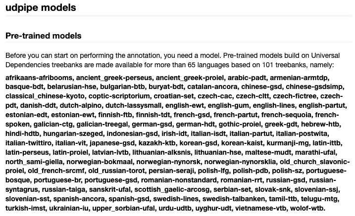

```{r setup, include=FALSE}
knitr::opts_chunk$set(echo = TRUE, results = TRUE, warning = FALSE)
```

The goal of today's lab session is to inspect the functionality of the **udpipe** library. **UDPipe** (Wijffels, 2022) offers 'language-agnostic tokenization, tagging, lemmatization and dependency parsing of raw text'. We will focus on tagging and lemmatization in particular and how these pre-processing steps may make further analysis more precise. Lemmatizing generally works better than stemming, especially for inflected languages such as German or French. Part-of-Speech (POS) tags identify the type of word (noun, verb, etc) so it can be used to e.g. analyse only the verbs (actions) or adjectives and adverbs (descriptions).

Another library that was developed by the quanteda team and that has similar functionality is **spacyr** (Benoit & Matsuo, 2020), an R wrapper around the spaCy package in Python. See this [link](https://spacyr.quanteda.io/articles/using_spacyr.html) for more information on using **spacyr**.

Let's load required libraries first.

```{r, echo = TRUE, results = 'verbatim', warning = FALSE, message = FALSE}

#load libraries
library(tidyverse)
library(quanteda)
library(quanteda.textplots)
library(quanteda.textmodels)
library(quanteda.textstats)
library(quanteda.sentiment)
library(seededlda)
library(udpipe)

```

The primary challenges for our purposes is to communicate between **udpipe** and **quanteda**. In the following code block we first turn our corpus into a dataframe called `inaugural_speeches_df` and save the speeches -- which are now stored in `inaugural_speeches_df$text` -- as a character vector called txt. **udpipe** works with character vectors. 

```{r, echo = TRUE, results = 'verbatim', message = FALSE}

inaugural_speeches <- data_corpus_inaugural

inaugural_speeches_df <- convert(inaugural_speeches,
                                 to = "data.frame")

txt <- inaugural_speeches_df$text
str(txt)

```

Let's apply the `udpipe` function to this `txt`. This function tags each token in each speech, based on an English-language model which will be downloaded into the working directory. We instruct `udpipe` to include the doc_ids from our **quanteda** corpus object. This will help us later on when we want to transform the output of our **udpipe** workflow back into a corpus which we can inspect with **quanteda** functions:

```{r, echo = TRUE, results = 'verbatim', message = FALSE}

parsed_tokens <-  udpipe(txt, "english", 
                         doc_id = inaugural_speeches_df$doc_id) %>% 
  as_tibble()

```

Let's inspect this object

```{r, echo = TRUE, results = 'verbatim', message = FALSE}

head(parsed_tokens)

str(parsed_tokens)

```

As you can see, this object is a dataframe that consists of 152420 where each row is a token, and each column is an annotation. For our purposes, the most relevant variables are:

 - `doc_id` contains the document in which the token appeared;
 - `token` -- contains the actual token;
 - `lemma` -- contains the lemmatized token;
 - `upos` -- contains the part of speech of the token, such as adjective, verb, noun, etc.;
 
Let's select those variables

```{r, echo = TRUE, results = 'verbatim', message = FALSE}

parsed_tokens <- parsed_tokens %>% 
  select(doc_id, token, upos, lemma)

```

Inspect how many nouns appear in the corpus

```{r, echo = TRUE, results = 'verbatim', message = FALSE}

sum(parsed_tokens$upos == "NOUN")

```

Inspect how many verbs appear in the corpus

```{r, echo = TRUE, results = 'verbatim', message = FALSE}

sum(parsed_tokens$upos == "VERB")

```

Inspect how many adjectives appear in the corpus

```{r, echo = TRUE, results = 'verbatim', message = FALSE}

sum(parsed_tokens$upos == "ADJ")

```

We can also inspect all different POS tags in one go. 

```{r, echo = TRUE, results = 'verbatim', message = FALSE}

table(parsed_tokens$upos)

```
An interesting tag is `PROPN`or proper noun that refers to the name (or part of the name) of a unique entity, be it an individual, a place, or an object. To get a feel for what entities we can filter out the proper nouns and then count and sort their lemmas using `count()` from **tidyverse**


```{r, echo = TRUE, results = 'verbatim', message = FALSE}

propns <- parsed_tokens %>%
  filter(upos == "PROPN")

propns %>% count(lemma, sort = TRUE)

```


Say we are only interested in the nouns in those speeches
```{r, echo = TRUE, results = 'verbatim', message = FALSE}

nouns <- parsed_tokens %>%
  filter(upos == "NOUN")

```

Let's display their lemmas in a Wordcloud. We'll first use the `split()` function from base R to divide the nouns per speech in a list. We then use `as.tokens()` in **quanteda** to turn that list into a tokens object. We can create a `dfm` and take it from there. 

```{r, echo = TRUE, results = 'verbatim', message = FALSE}

nouns_dfm <- split(nouns$lemma, nouns$doc_id) %>% 
  as.tokens() %>% 
  dfm() 


textplot_wordcloud(nouns_dfm, max_words = 50)

```


Let's do the same for verbs 

```{r, echo = TRUE, results = 'verbatim', message = FALSE}

verbs <- parsed_tokens %>%
  filter(upos == "VERB")

verbs_dfm <- split(verbs$lemma, verbs$doc_id) %>% 
  as.tokens() %>% dfm()

textplot_wordcloud(verbs_dfm, max_words = 50)

```

If we want to stitch back together the metadata to our newly created `nouns_dfm` and `verbs_dfm` we can do this as follows:

```{r, echo = TRUE, results = 'verbatim', message = FALSE}

docvars(nouns_dfm) <- inaugural_speeches_df %>% 
  select(Year, President, FirstName, Party)

docvars(verbs_dfm) <- inaugural_speeches_df %>%
  select(Year, President, FirstName, Party)

```

We are now in a position to inspect these dfms. For example, we may be interested in what sort of verbs distinguish Republican presidents from Democratic presidents.

```{r, echo = TRUE, results = 'verbatim', message = FALSE}

verbs_dfm_grouped <- verbs_dfm %>% 
  dfm_group(groups = Party) %>%
  dfm_subset(Party == "Democratic" | Party == "Republican")

verb_keyness <- textstat_keyness(verbs_dfm_grouped, target = "Republican")

textplot_keyness(verb_keyness,
                 n = 10,
                 color = c("red", "blue"))

```
Let's apply a topic model to the nouns

```{r, echo = TRUE, results = 'verbatim', message = FALSE}

lda_10 <- textmodel_lda(nouns_dfm, 
                       k = 10,
                       alpha = 1,
                       max_iter = 2000)

```

Let's inspect this topic model

```{r, echo = TRUE, results = 'verbatim', message = FALSE}

terms(lda_10, 10)
```

```{r, echo = TRUE, results = 'verbatim', message = FALSE}
head(lda_10$theta, 10)
```
## Other languages

**updipe** allows you to work with pre-trained language models build for more than 65 languages 

{ width=65% }


If you want to work with these models you first need to download them. Let's say I want to work with a Dutch corpus

```{r, echo = TRUE, results = 'verbatim', message = FALSE}
udmodel_dutch <- udpipe_download_model(language = "dutch")

str(udmodel_dutch)
```

I can now start tagging with vector of Dutch documents
```{r, echo = TRUE, results = 'verbatim', message = FALSE}

dutch_documents <- c(d1 = "AZ wordt kampioen dit jaar",
                     d2 = "Mark Rutte, premier van Nederland, is op weg naar Brussel")

parsed_tokens_dutch <-  udpipe(dutch_documents, udmodel_dutch) %>% 
  as_tibble()

head(parsed_tokens_dutch)

```


If I have already downloaded the a language, I can load it as follows (if the model is in the current working directory -- otherwise I will need to give it the full path to the file)

```{r, echo = TRUE, results = 'verbatim', message = FALSE}

udmodel_dutch <- udpipe_load_model(file = "dutch-alpino-ud-2.5-191206.udpipe")

```

## Exercises

For these exercises we will work with the `parsed_tokens` dataframe that we created in the above script.

1. Create a dataframe `adjs` that contains all adjectives that appear in the corpus of inaugural speeches.

```{r, echo = TRUE, results = 'verbatim', message = FALSE}

```

2. Display the most occurring adjectives in the inaugural speeches using `count()`

```{r, echo = TRUE, results = 'verbatim', message = FALSE}


```

3. Group the the adjectives by speech and turn them into a dataframe called `adjs_dfm`.

```{r, echo = TRUE, results = 'verbatim', message = FALSE}

```


4. Append Year, President, FirstName and Party from `inaugural_speeches_df`  as docvars to `adjs_dfm`

```{r, echo = TRUE, results = 'verbatim', message = FALSE}


```

5. Inspect `adjs_dfm` using the NRC Emotion Association Lexicon. If you don't recall how to do this, have a look back at lab session 4. Call the output of `dfm_lookuop` as `dfm_inaugural_NRC`.

```{r, echo = TRUE, results = 'verbatim', message = FALSE}

```


6. Add the count of fear words as a variable `fear` to the docvars of `adjs_dfm` 

```{r, echo = TRUE, results = 'verbatim', message = FALSE}


```

**Advanced**

7. Use tidyverse functions to display the mean number of fear words for Repulican and Democratic presidents  (NB: normally we would divide this number by the total number of tokens in a speech). Have a look at [this link](https://dplyr.tidyverse.org/reference/group_by.html) for more info.

```{r, echo = TRUE, results = 'verbatim', message = FALSE}

```


8. Download a language model of your choice and inspect a vector of a few sentences using `udpipe`

```{r, echo = TRUE, results = 'verbatim', message = FALSE}


```

